# 创建角色移动

本节演示如何在 UE5 中从零搭建角色移动控制：首先创建自定义 **游戏模式 (GameMode)** 与 **角色 (Character)** 蓝图，并将角色设为游戏模式的默认 Pawn 类，使运行时由该角色出场；接着在项目设置中绑定游戏模式，并在角色的事件图表里以 `BeginPlay` 作为入口启动输入逻辑；随后使用 **增强输入系统 (Enhanced Input)** 创建 **输入操作 (InputAction, IA)** 与 **输入映射上下文 (Input Mapping Context, IMC)**，分别绑定 WASD 按键与鼠标轴向；最后在蓝图里绑定输入映射上下文与输入操作，并完成角色旋转配置（移动时朝向移动方向 + 鼠标驱动视角旋转）。

整体绑定链路一览（方便对照后面每一步在做什么）：

> 项目设置（默认 GameMode）→ GameMode（默认 Pawn 类）→ Character 蓝图（输入逻辑）→ IA / IMC（按键映射）→ 移动 + 旋转

---

## 创建游戏模式

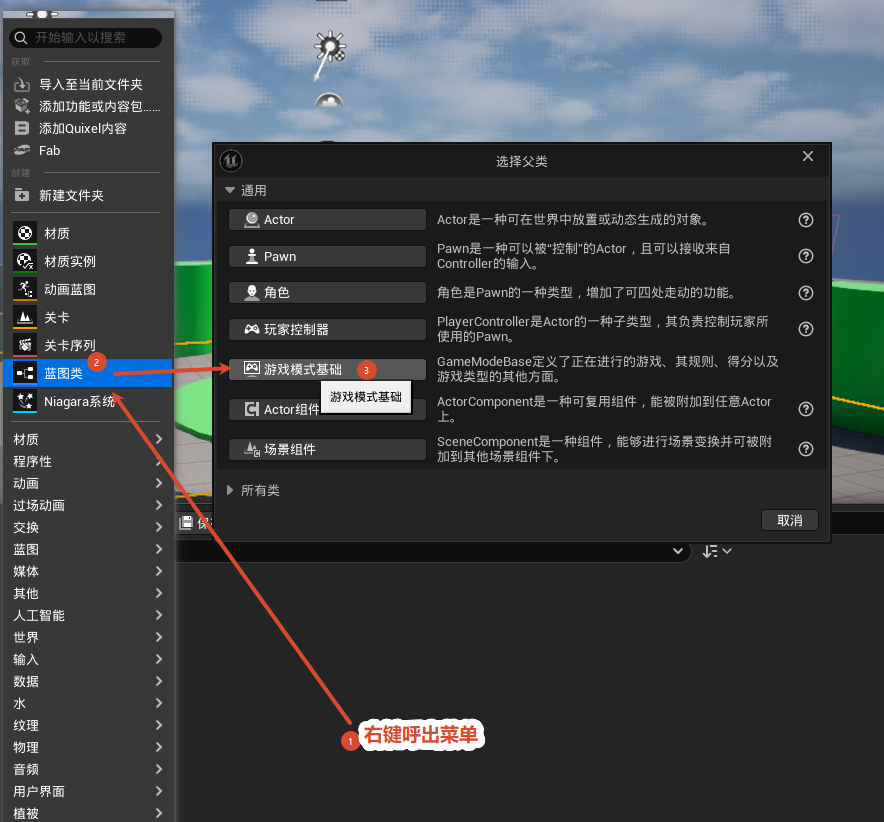

**目的：** 创建一个自定义 GameMode 蓝图，用来统一指定默认 Pawn、游戏规则等全局设置。

**操作：** 内容浏览器右键 → 蓝图类 (Blueprint Class) → 在"选择父类"对话框里选 **游戏模式基础 (Game Mode Base)** 作为父类。

> 对话框里还会列出 Actor、Pawn、角色、玩家控制器 等候选父类，这些都是常用的蓝图父类，按需要选取即可。

## 取消关卡级游戏模式重载

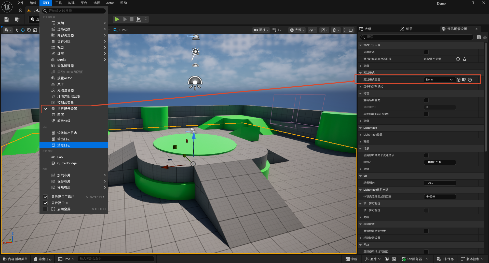

**目的：** 保证游戏模式只在项目设置里统一指定，不在单个关卡里覆盖，避免"项目设置"和"关卡设置"互相打架。

**操作：** 打开**世界场景设置 (World Settings)** 面板 → 在"游戏模式"分组里把**游戏模式重载 (Game Mode Override)** 保持为 **None**。

## 创建角色蓝图

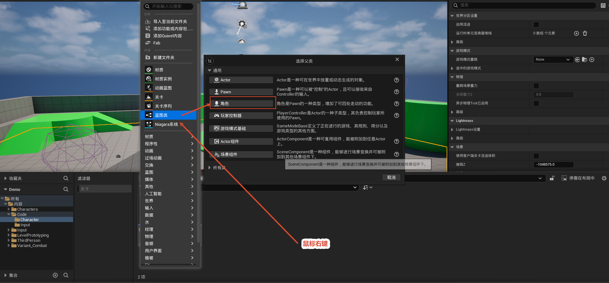

**目的：** 创建玩家可控的角色。

**操作：** 内容浏览器右键 → 蓝图类 → 父类选 **角色 (Character)**。

**为什么用 Character：** Character 是 Pawn 的一种，自带 **CharacterMovementComponent**（角色移动组件），天生支持走动、跳跃、转向等移动功能，比直接用 Pawn 省事。

## 在游戏模式里绑定默认角色

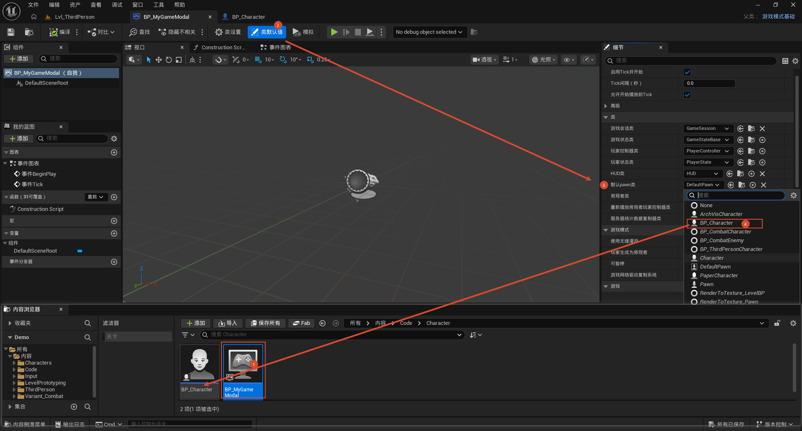

**目的：** 让游戏开始时 GameMode 自动用自己的角色作为玩家 Pawn 出场。

**操作：** 打开 GameMode 蓝图 → 工具栏的**类设置 (Class Settings)** → 细节面板的"类"分组里，把**默认 Pawn 类 (Default Pawn Class)** 设为新建的角色蓝图（如 `BP_Character`）。

## 在项目设置里绑定游戏模式

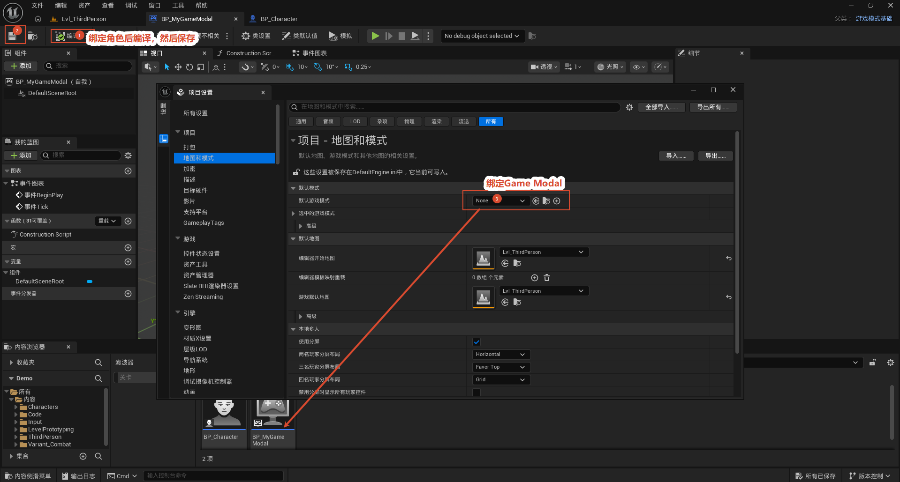

**目的：** 让整个项目默认使用自己的 GameMode。

**操作：** 打开**项目设置 (Project Settings)** → 项目 → **地图和模式 (Maps & Modes)** → 把**默认游戏模式**设为前面创建的 GameMode（如 `BP_MyGameModal`）。

> 至此，"项目默认 GameMode → GameMode 默认 Pawn → 角色"这条绑定链路全部完成。

## 用 BeginPlay 作为输入逻辑入口

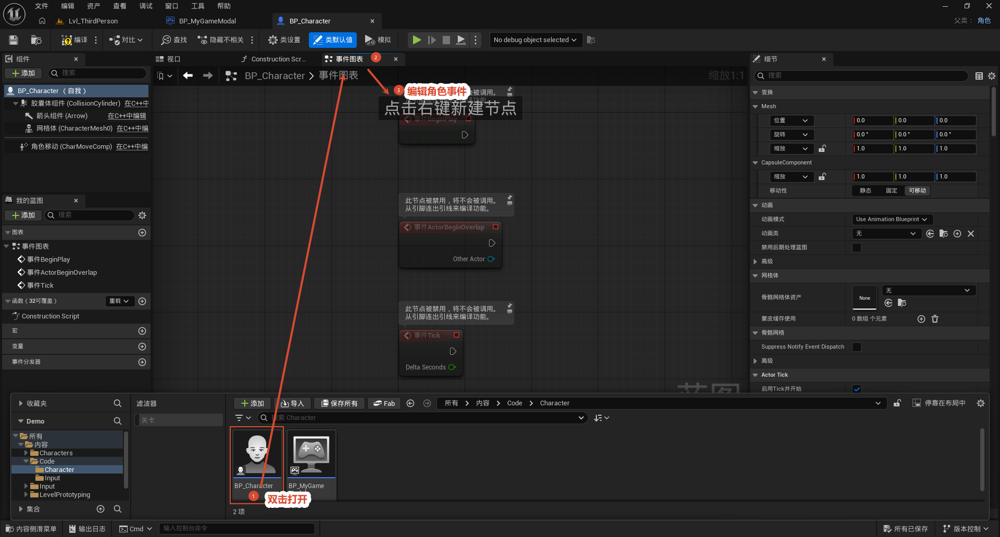

**目的：** 找一个执行入口来注册输入。

**操作：** 打开角色蓝图的事件图表，以**事件 BeginPlay (Event BeginPlay)** 作为入口。输入上下文的注册只需在游戏开始时做一次，因此放在 BeginPlay 最合适。

## 创建输入操作 (InputAction, IA)

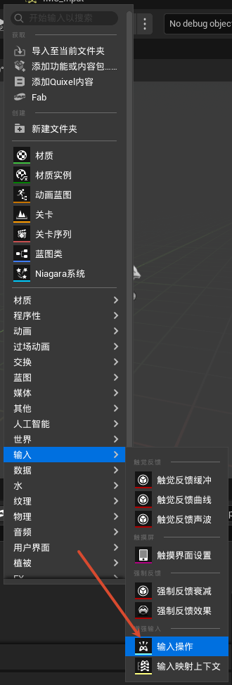

**概念：** **输入操作 (InputAction, 简称 IA)** 是增强输入系统里的一个资产，它定义"某个动作"以及这个动作返回**什么类型的值**（布尔、一维、二维等）。它本身不关心按键，按键映射交给 IMC。

**操作：** 内容浏览器右键 → 输入 (Input) → **输入操作 (InputAction)**。

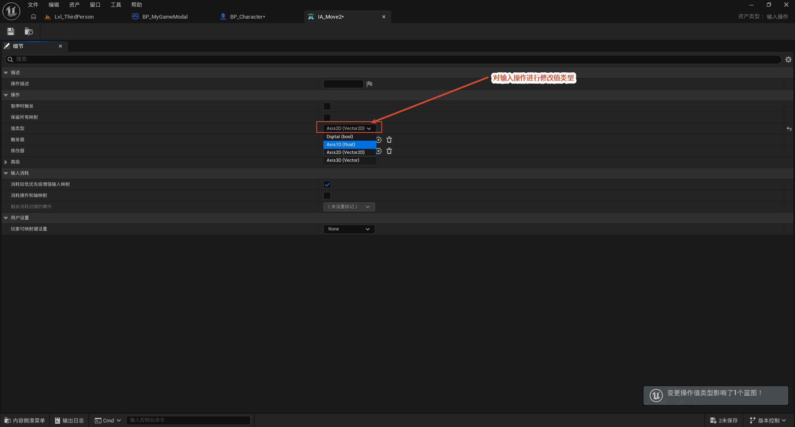

**配置 IA_Move：** 选中新建的 IA 资产（命名为 `IA_Move`），把**值类型 (Value Type)** 设为 **Axis2D（二维向量）**。Axis2D 适合用 WASD 表达"前后 / 左右"两个方向的移动。

## 创建输入映射上下文 (Input Mapping Context, IMC)

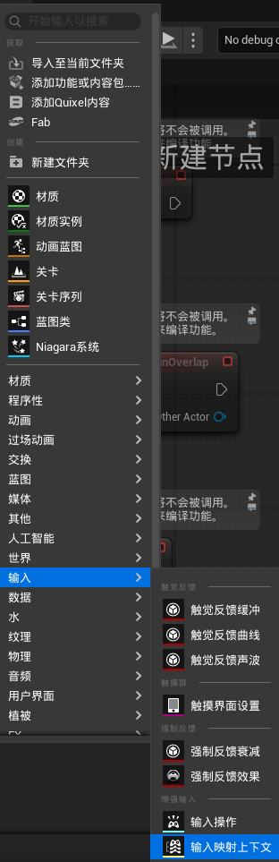

**概念：** **输入映射上下文 (IMC)** 是把 IA 和具体按键 / 鼠标轴对应起来的资产。同一个 IA，可以在不同 IMC 里绑到不同按键（例如步行 / 驾驶两套键位）。

**操作：** 内容浏览器右键 → 输入 → **输入映射上下文 (Input Mapping Context)**，命名如 `IMC_Default`。

## 在 IMC 里绑定按键和鼠标

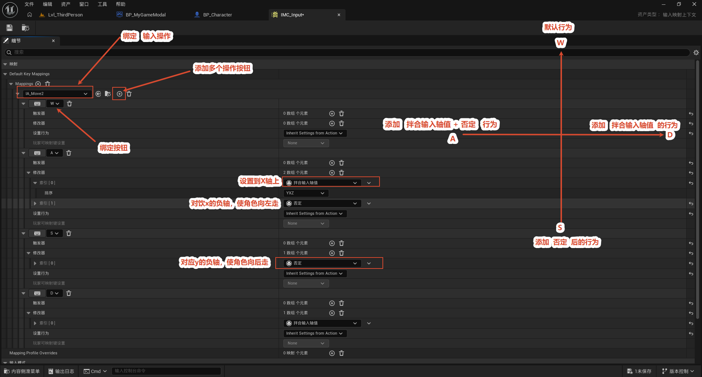

**绑定移动键：** 打开 IMC，在**映射 (Mappings)** 列表里添加 `IA_Move`，并把它绑到键盘 **W / A / S / D** 四个键。四个键共同驱动 IA_Move 的那个二维向量（例如 W 使 Y 为正，D 使 X 为正）。

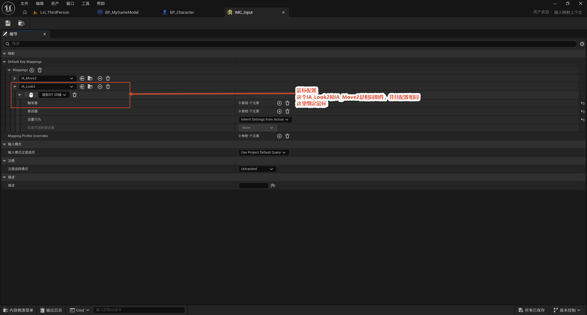

**绑定鼠标视角：** 在同一个 IMC 里再添加 `IA_Look`，绑到 **Mouse XY 2D-Axis（鼠标二维轴）**。这样鼠标的横向 / 纵向移动就被转换成视角旋转用的二维输入。

## 在蓝图里注册输入映射上下文

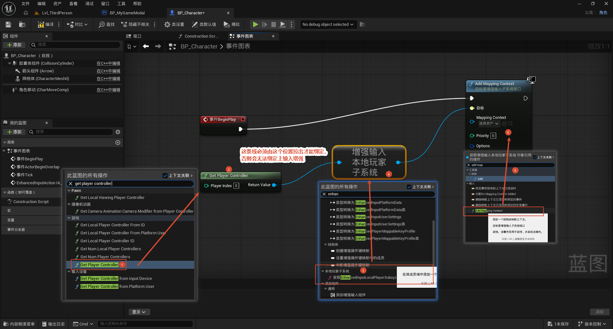

**目的：** 游戏开始时把 IMC 注册给本地玩家，IMC 里定义的按键映射才会生效。

**节点链：** 事件 BeginPlay → **Get Player Controller** → **Get Enhanced Input Local Player Subsystem**，先拿到本地玩家的增强输入子系统。

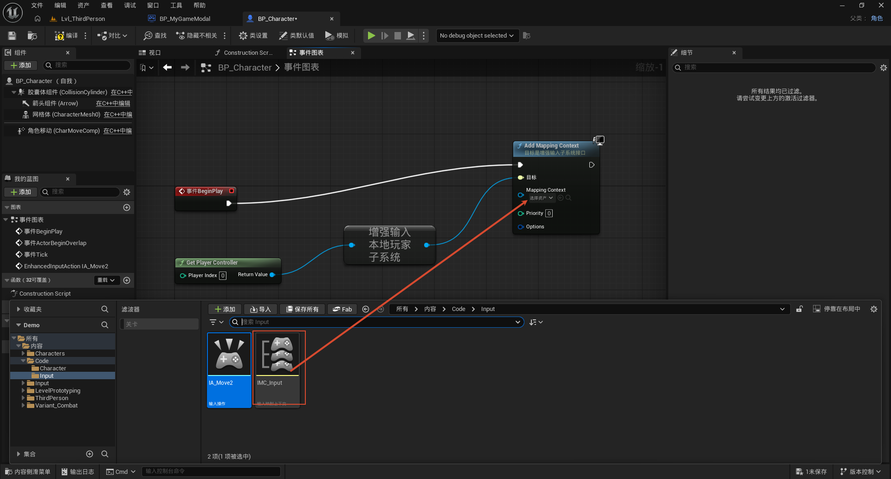

**接 Add Mapping Context 节点：** 在链路末端连 **Add Mapping Context**，IMC 资产设为 `IMC_Default【新创建的那个输入映射上下文】`，**优先级 (Priority)** 设为 `0`。多个 IMC 同时存在时，优先级高的覆盖低的。

## 在蓝图里绑定输入操作

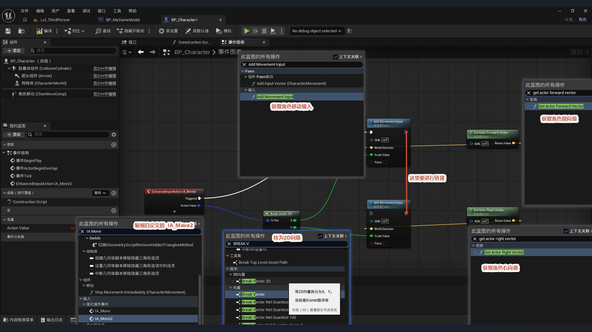

**目的：** 把"按键 → IA → 实际行为"这条链路打通。

**操作：** 通过 Enhanced Input 绑定 `IA_Move`，在它**触发 (Triggered)** 时调用 **Add Movement Input（添加移动输入）**，把输入的二维向量值传进去驱动角色移动。

> 小结：IMC 负责按键 → IA 的映射（上一步），这里负责 IA 触发 → 角色行为 的映射，两者合起来才完成输入处理。

## 角色旋转配置

角色旋转需要配置两件事：**移动时身体自动朝向移动方向**（角色朝向），以及**鼠标驱动视角旋转**（摄像机视角）。两者是配合关系——一个决定"身体朝哪走"，一个决定"视角朝哪看"，第三人称角色两件都要配。

### 移动时朝向移动方向（组件设置）

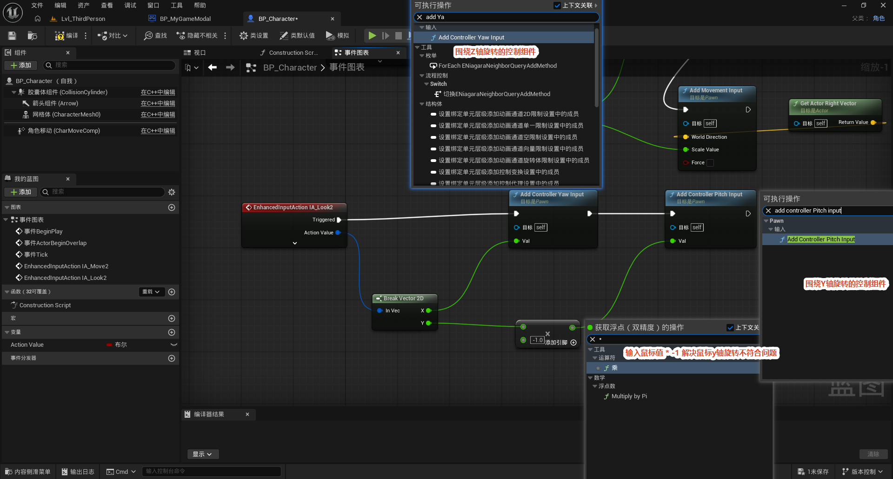

**操作：** 选中角色的 **CharacterMovementComponent**，在细节面板里：

- 勾选 **朝向移动方向 (Orient Rotation to Movement)**；
- **不**勾选 **使用控制旋转偏航 (Use Controller Rotation Yaw)**。

**效果：** 角色不会跟着控制器朝向瞬间转身，而是在移动过程中自动平滑转向移动方向。

### 鼠标驱动视角旋转（蓝图驱动）

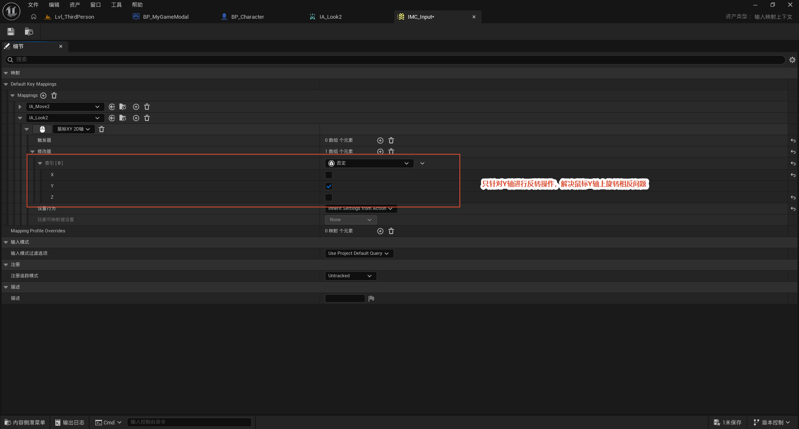

**操作：** 在事件图表里绑定 `IA_Look` 的触发事件，触发后：

- 取 Action Value 的 **X** 调用 **Add Controller Yaw Input**（偏航，左右看）；
- 取 Action Value 的 **Y** 调用 **Add Controller Pitch Input**（俯仰，上下看）。

**效果：** 鼠标移动（Mouse XY）驱动控制器的偏航 / 俯仰，实现鼠标控制视角旋转。

### 修正"上下视角方向与直觉相反"

按上面接好后，经常会遇到一个问题：**鼠标上下推时，视角转动方向和正常直觉相反**（例如鼠标向上推，视角却朝下转）。原因是 Pitch（俯仰）方向的输入正负号与预期不一致。下面两种方案任选其一即可修正。

**方案 1：在蓝图里把输入值 × (-1)**

不改配置，在调用 Add Controller Pitch Input 之前，先把 Action Value 的 Y 乘上 `-1`（即 `value * -1`），把俯仰方向在蓝图里反转过来。

**方案 2：在 IMC 配置里给 Y 轴加反向**

不改蓝图，直接在 `IA_Look` 的 IMC 映射里，给鼠标 Y 轴那一项勾选**反向 (Negate)**，让 Y 轴输入在源头就取反。

> 两种方案效果一样，区别只在改的位置：方案 1 改蓝图逻辑，方案 2 改输入配置。项目里统一用一种即可。
