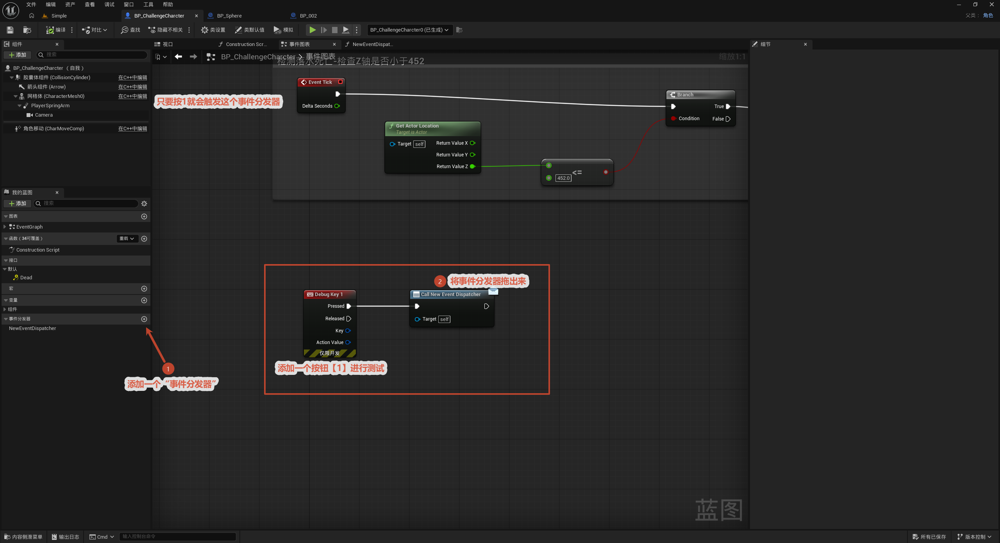
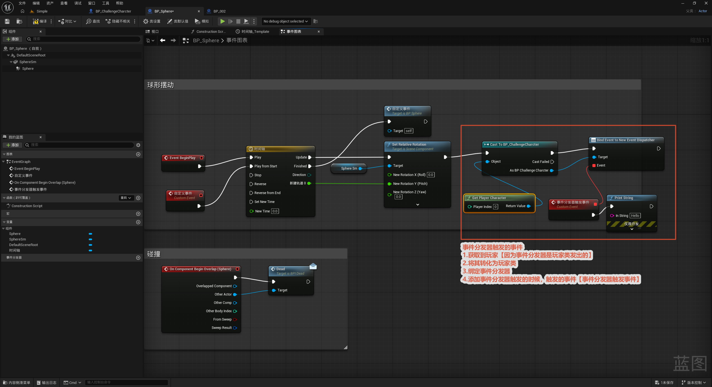

# 事件分发器

本节介绍蓝图通讯的第二种方式——**事件分发器（Event Dispatcher，即委托 / Delegate）**。它解决的问题是"**一件事发生了，要通知一堆关心它的蓝图**"：比如角色死亡这件事，UI 要弹死亡提示、音效管理器要放死亡音效、重生系统要准备复活……如果让角色挨个去调用它们，角色就得认识每一个蓝图。事件分发器反过来——**持有分发器的蓝图喊一声（Broadcast），所有事先登记（Bind）过的蓝图各自响应**，喊的人完全不知道有谁在听。

整体流程一览：

> 在某个蓝图里创建（声明）分发器 → 关心的蓝图各自 Bind 一个自定义事件到它 → 拥有者 Call / Broadcast → 所有绑定的事件一起触发

核心思路：分发器是**一对多的广播**——拥有它的蓝图只负责"**发布事件**"，谁关心谁来"**订阅（绑定）**"。发布者不需要知道、也不持有任何订阅者，彻底解耦。这和 [蓝图接口](../蓝图接口/蓝图接口.md) 正好相对：接口是"**我点名叫某个对象做事**"（一对一、调用方主动找目标），分发器是"**我广播一件事、谁来听我不管**"（一对多、订阅者被动响应）。

---

## 1. 创建事件分发器

**目的：** 在某个蓝图（事件"源头"）里声明一个事件分发器，比如在角色 `BP_ChallengeCharacter` 里建一个 `OnDead` 分发器——"我死了"这件事由它来广播。

**操作：** 打开蓝图 → 左侧 `Event Dispatchers` 旁点 `+` → 命名（如 `OnDead`）。

**关键点：**

- 分发器**归属于它所在的那个蓝图**（拥有者），不像接口那样是独立资源。
- 这里只是"**声明**"了一个事件名，同样可以给它加输入参数（如死亡坐标），广播时带过去。
- 声明之后，它会在两个地方出现：**拥有者**里 `Call OnDead` 用来广播；**订阅者**里 `Bind Event to OnDead` 用来绑定监听。

## 2. 绑定并触发分发器

**目的：** 让关心这件事的蓝图**登记监听**，并在合适的时机**广播**。

**操作：**

- **订阅方（绑定）：** 拿到拥有者（角色）的引用 → 调用 `Bind Event to OnDead`，把一个**自定义事件**连到它的输入引脚上——这个自定义事件就是"听到广播后要做的事"（如 UI 弹提示）。
- **拥有者（广播）：** 在角色的 `Dead` 逻辑里调用 `Call OnDead`（即广播），所有已绑定的自定义事件会被**一次性全部触发**。

**关键点：**

- 必须先 `Bind` 后 `Broadcast`——绑定是"登记"，广播时才按名单挨个通知。没绑定的蓝图收不到，也不会报错。
- 多个蓝图可以同时 `Bind` 同一个分发器，**一次广播、多方响应**——这正是分发器相对接口的核心优势。
- 绑定是**运行时**建立的，通常在 `BeginPlay` 时绑定、`EndPlay` 时解绑，避免引用残留。

> 一句话区分两种通讯方式：**接口 = 调用方点名让目标做事（按对象 / 类型触发）；事件分发器 = 源头广播、众人各取所需（一对多触发）。** 本工程里 [6. 角色死亡设置](../../6.角色死亡设置/角色死亡设置.md) 的"触发器 → 角色"属于"调用方找目标"，适合接口或 Cast；而像"角色死亡后 UI / 音效 / 重生各自响应"这种一个事件多方响应，就适合事件分发器。
