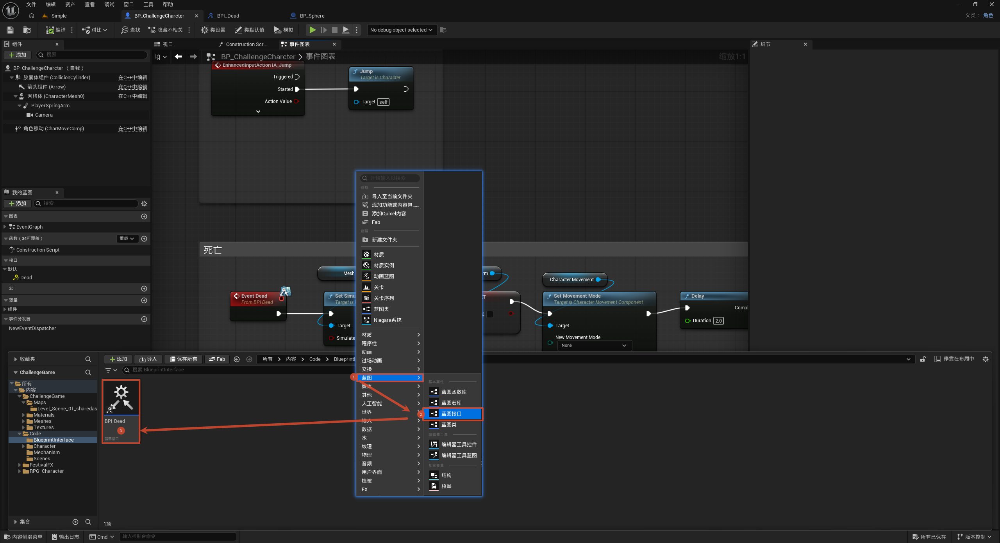
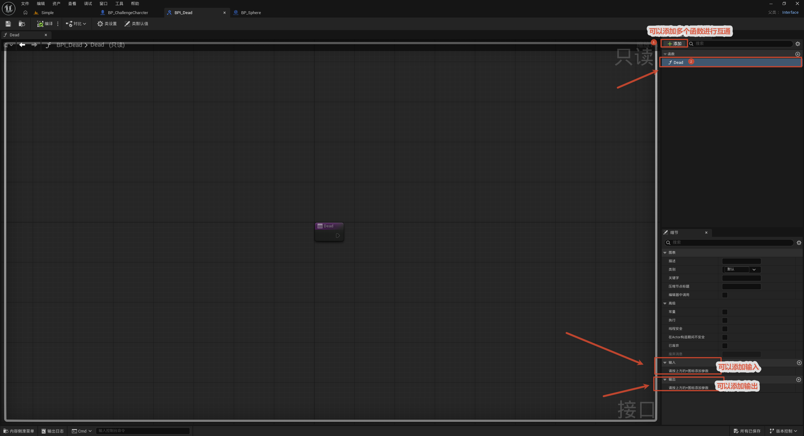
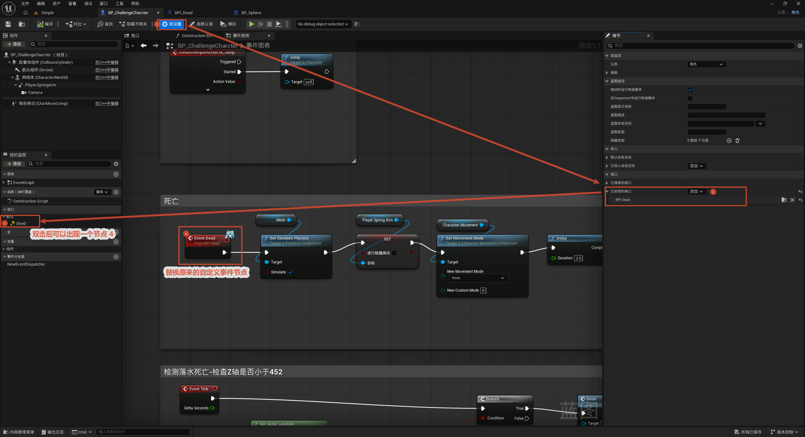
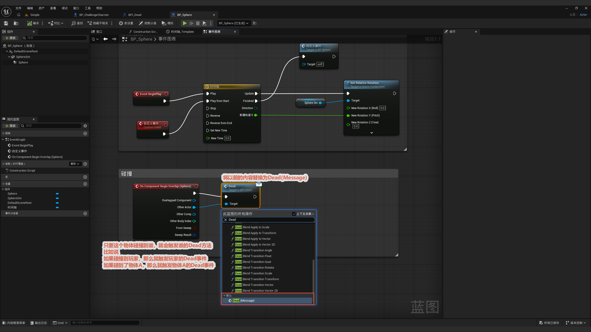

# 蓝图接口

本节介绍蓝图通讯的第一种方式——**蓝图接口（Blueprint Interface，简称 BPI）**。它解决的问题是"**一个调用方，要触发一批不同类型的蓝图**"：比如一个死亡触发区域，碰到的可能是玩家、敌人、可破坏物……如果每种都写一条 `Cast To`，调用方就得认识每一种类型。用接口就能让调用方只管"喊一声 `Dead`"，凡是实现了这个接口的蓝图都会各自执行自己的死亡逻辑，调用方完全不需要知道对方具体是什么。本工程就建了一个 `BPI_Dead` 接口来统一处理死亡触发。

整体流程一览：

> 新建 BPI（只定义函数签名、不写实现）→ 给需要的蓝图实现（赋值）该接口、各写各的逻辑 → 调用方对目标对象调用接口消息 → 命中实现则执行

核心思路：接口只规定"**能做什么**（有什么消息）"，不规定"**怎么做**"——每个实现它的蓝图自己填实现代码。调用方拿到一个对象引用就能直接调用接口消息：实现了就执行、没实现就**什么都不发生**（不会报错）。这就是**面向接口编程的解耦**：调用方和被调方互不依赖对方的具体类型。

---

## 1. 创建蓝图接口

**目的：** 在内容浏览器里新建一个空的蓝图接口（本工程命名为 `BPI_Dead`）。

**操作：** 内容浏览器空白处右键 → `Blueprints` → `Blueprint Interface` → 命名为 `BPI_Dead`。

**关键点：**

- 接口是一个**独立资源**，不属于任何具体蓝图，它只是"一组消息的清单"。
- 它本身**不能加组件、不能写逻辑**，唯一能做的就是在里面添加"函数"（消息）。

## 2. 定义接口的通讯内容

**目的：** 给接口添加要通讯的"消息"（函数）。本工程给 `BPI_Dead` 添加一个 `Dead` 函数——代表"你该死了"这条消息。

**操作：** 打开 `BPI_Dead` → 左侧 `Functions` 旁点 `+` → 命名为 `Dead`。

**关键点：**

- 这里**只定义签名**（名字、输入输出参数），**不写实现**——编辑器也不给你写的地方。
- 可以加参数（比如死亡原因 `Cause`），这样调用时能带数据过去；本工程的 `Dead` 暂不需要参数。

## 3. 为蓝图赋值（实现接口）

**目的：** 让真正要"死亡"的蓝图（如角色 `BP_ChallengeCharacter`）实现这个接口，并写自己的死亡逻辑。

**操作：**

- 打开角色蓝图 → 工具栏点 **Class Settings**（齿轮图标）→ 细节面板 `Interfaces` → `Implemented Interfaces` → `Add` → 选 `BPI_Dead`。
- 实现后，左侧 `Interfaces` 分类里出现 `Dead`，双击进入事件图表写实现（即 [6. 角色死亡设置](../../6.角色死亡设置/角色死亡设置.md) 里的那套布娃娃 + 相机跟随 + 停移动逻辑）。

**关键点：**

- 赋值 = "我承诺会响应 `Dead` 这条消息"，然后蓝图自己决定**怎么死**。
- 多个蓝图可以各自实现同一个 BPI、写完全不同的逻辑（玩家倒地、敌人爆炸、木箱碎裂……）——这就是接口的威力。

## 4. 触发接口内容

**目的：** 死亡触发器（Sphere 碰撞，即 [6. 角色死亡设置](../../6.角色死亡设置/角色死亡设置.md) 里的 `BP_Sphere`）碰到物体时，调用对方的 `Dead` 接口消息，**无需 Cast**。

**节点链：** `On Component Begin Overlap (Sphere)` → 从 `Other Actor` 引出 → 调用 `Dead`（接口消息）。

**关键点：**

- 直接从 `Other Actor` 引出，搜索接口消息 `Dead` 来调用即可，**不需要 `Cast To BP_ChallengeCharacter`**。
- 调用接口消息时传入谁，谁实现就执行谁；**没实现该接口的对象则静默跳过**，不会崩溃——所以一个触发器能通杀所有"可死亡"对象。

> 对比 [6. 角色死亡设置](../../6.角色死亡设置/角色死亡设置.md) 里用 `Cast To BP_ChallengeCharacter` 的做法：Cast 要求调用方**明确知道**对方是角色，碰到敌人 / 木箱就失效。换成接口后，调用方只依赖"对方实现了 `BPI_Dead`"，类型解耦、扩展性更好。接口适合"**调用方点名让某个对象做事**"的场景；而"**一个事件广播给所有关心它的人**"则要用 [事件分发器](../事件分发器/事件分发器.md)。
