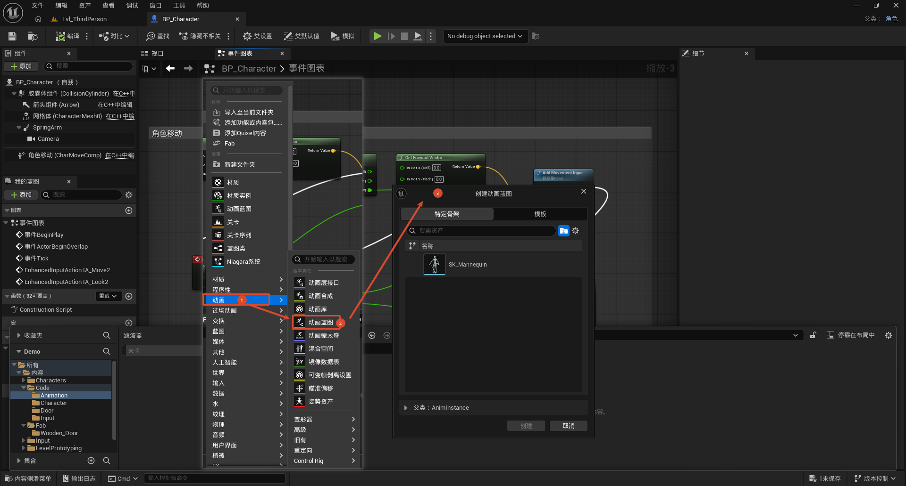
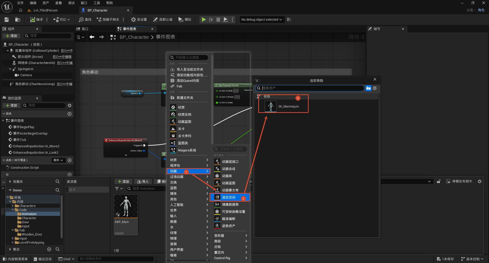
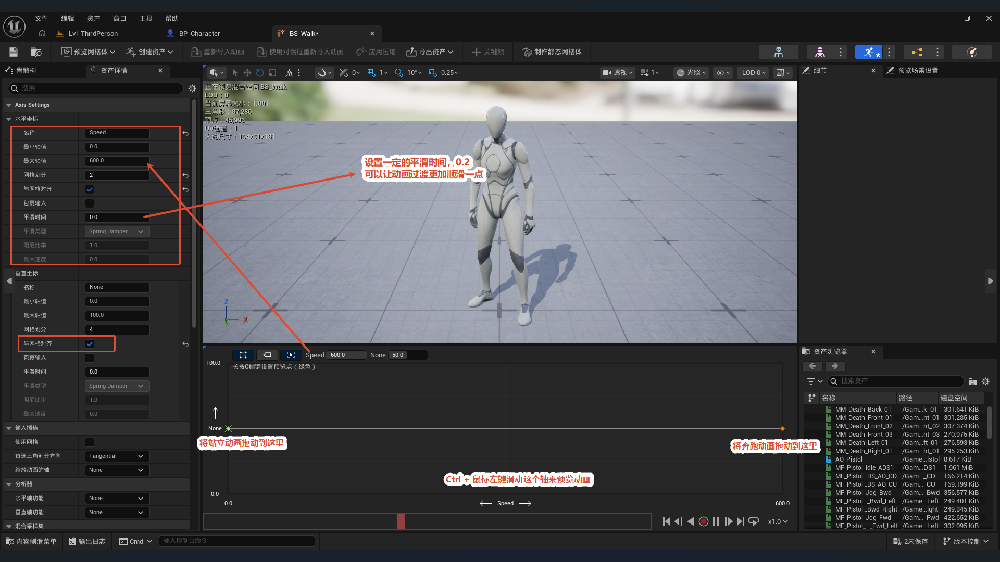
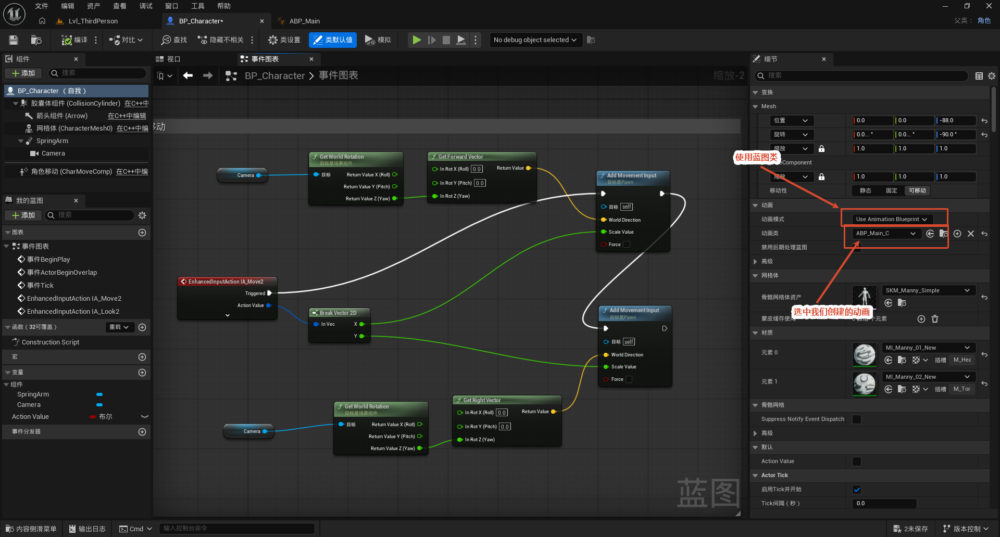
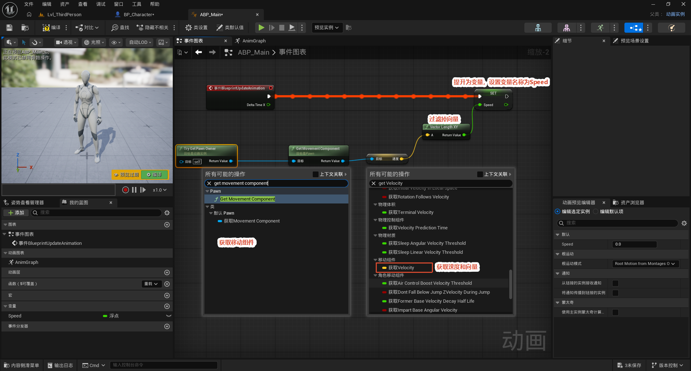
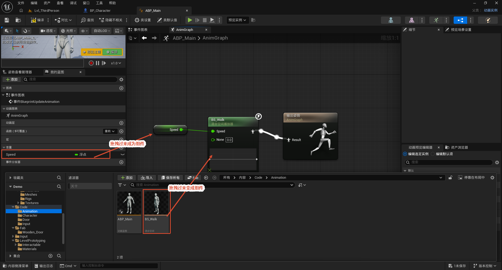

# 动画创建

本节介绍在 UE5 中为角色搭建动画系统的完整流程：先创建两个资产——动画蓝图（AnimBP）与混合空间（Blend Space）；在混合空间里把横轴配置为速度（Speed），并把站立、奔跑动画放到网格上；再把动画蓝图绑定到角色的骨骼网格体组件；然后在动画蓝图的事件图表中通过 `TryGetPawnOwner → Get Movement Component → Get Velocity → Vector Length XY` 计算出角色的水平速度并存入变量 `Speed`；最后在 AnimGraph 里放入混合空间节点，用 `Speed` 驱动混合并输出最终姿态。

整体流程一览（方便对照每一步在做什么）：

> 创建资产（AnimBP + Blend Space）→ 配置混合空间（Speed 轴 + 动画）→ 绑定到角色 → 事件图表算 Speed → AnimGraph 用 Speed 驱动混合

核心思路：**混合空间负责"按速度在站立/奔跑之间混合"，动画蓝图负责"每帧把角色真实速度喂给混合空间"。** 把这两件事接上，角色就能根据移动速度自动切换动画。

---

## 创建动画蓝图

这一步要建两个资产：**动画蓝图 (AnimBP)** 和 **混合空间 (Blend Space)**。两者创建时都要选**同一个骨骼 (Skeleton)**，且这个骨骼必须和角色骨骼网格体用的骨骼一致，否则动画引用不上。

**动画蓝图 (Animation Blueprint)：**

- **目的：** 创建驱动角色骨骼网格体姿态的蓝图，后续在里面写"算速度"和"输出姿态"的逻辑。
- **操作：** 内容浏览器右键 → 动画 (Animation) → 动画蓝图 (Animation Blueprint)。
- **关键点：** 创建时选与角色一致的骨骼；父类 (Parent Class) 保持默认的 `AnimInstance`（动画实例基类）。

**混合空间 (Blend Space)：**

- **目的：** 作为"按速度混合动画"的载体，它本身定义了"在某个速度值下应该播什么动画"。
- **操作：** 同样在 动画 菜单下选 混合空间 (Blend Space)，选择与角色匹配的骨骼。

## 配置混合空间

**目的：** 把混合空间的横轴定义为速度，并把站立、奔跑两个动画分别放到低速端和高速端。

**操作：** 打开混合空间编辑器，在「轴设置 (Axis Settings)」里：

- **横轴 (Horizontal Axis)** 名称设为 `Speed`，最小值 `0.0`、最大值 `600.0`，网格划分 `2`，勾选「与网格对齐」。
- **纵轴 (Vertical Axis)** 保持 `None`——本例只用单一速度轴做一维混合。
- **平滑类型** 选 `Spring Damper`（弹簧阻尼），并设置一定的平滑时间（如 `0.2`），让动画过渡更顺滑，不会速度一变就硬切。
- **网格上放动画：** 低速端（靠近 0）放**站立 (Idle)** 动画，高速端（靠近 600）放**奔跑 (Run)** 动画。

> 预览技巧：按住 **Ctrl + 鼠标左键**拖动底部 Speed 滑块，即可在不同速度下实时预览动画混合效果，方便调轴范围和平滑时间。

## 绑定动画

**目的：** 让角色运行时由自己的动画蓝图驱动姿态。

**操作：** 打开角色蓝图 → 组件面板选中骨骼网格体组件（如 `Mesh`）→ 细节面板的「动画 (Animation)」分类里：

- **动画模式 (Animation Mode)** 设为「使用动画蓝图 (Use Animation Blueprint)」；
- **动画类 (Anim Class)** 指定刚才创建的动画蓝图。

> 不绑定的话，骨骼网格体默认不会播任何动画；指定动画类之后，运行时这个 AnimBP 就接管了角色的姿态输出。

## 获取用户速度

**目的：** 在动画蓝图的事件图表里，每帧算出角色的水平速度，存进变量 `Speed`，供 AnimGraph 使用。

**节点链：** `BlueprintUpdateAnimation`（更新动画，每帧触发）→ `TryGetPawnOwner`（拿到动画蓝图归属的 Pawn）→ `Get Movement Component`（拿移动组件）→ `Get Velocity`（拿速度向量）→ `Vector Length XY`（求水平长度）→ `SET` 写入变量 `Speed`。

**关键点：为什么用 `Vector Length XY` 而不是普通的 `Vector Length`？** 角色跳起来时有竖直速度（Z 轴），如果算进去，跳跃时速度会突然变大、动画错误地切到奔跑。`Vector Length XY` 只取水平面（X、Y）的长度，**过滤掉 Z 轴**，保证速度只反映"在地面上跑多快"。

> 变量 `Speed` 的创建方式：从计算结果右键「提升为变量 (Promote to Variable)」，命名 `Speed`，类型为浮点。

## 配置动画

**目的：** 把算出来的 `Speed` 接到混合空间上，完成"按速度平滑切换动画"的整条链路。

**操作：** 切换到动画蓝图的**动画图表 (AnimGraph)**，在最终「输出姿态 (Output Pose)」之前放入刚才配置好的混合空间节点：

- 把事件图表算出的 `Speed` 变量连到混合空间节点的横轴 (Speed) 输入引脚；
- 节点的输出引脚接最终的输出姿态。

**效果：** 混合空间节点根据传入的速度，在站立与奔跑之间自动混合——速度为 0 时纯站立，速度接近 600 时纯奔跑，中间平滑过渡。至此整条"算速度 → 驱动混合 → 输出姿态"的配置完成。
