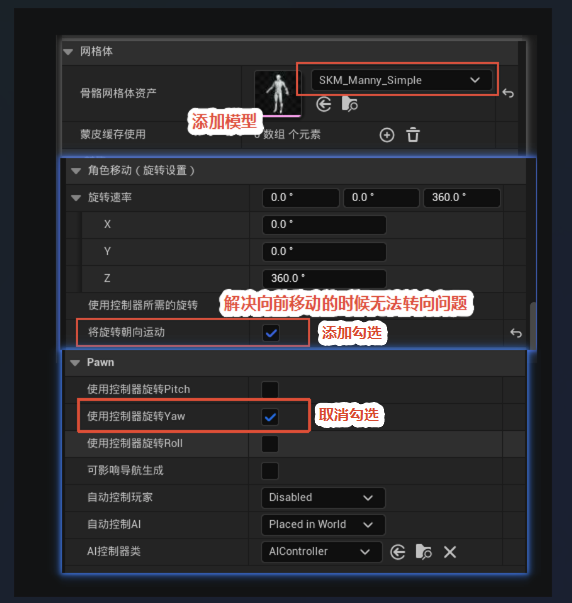
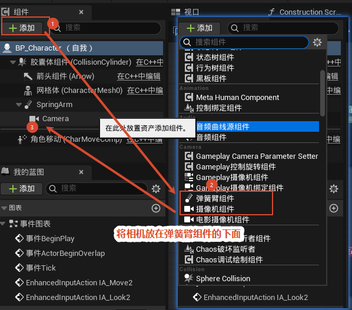
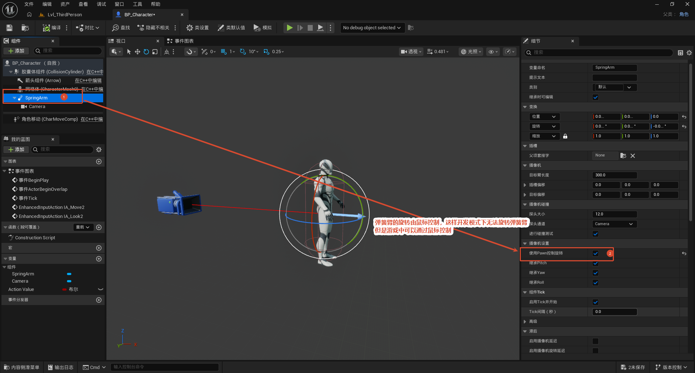
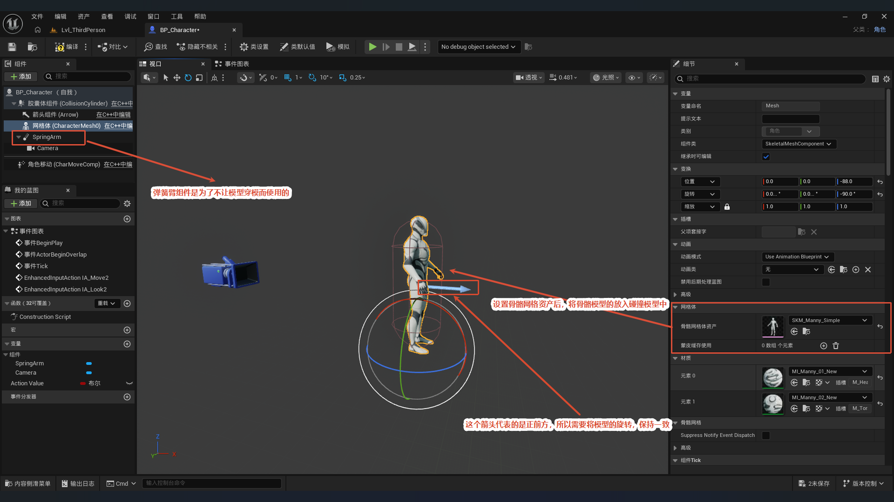
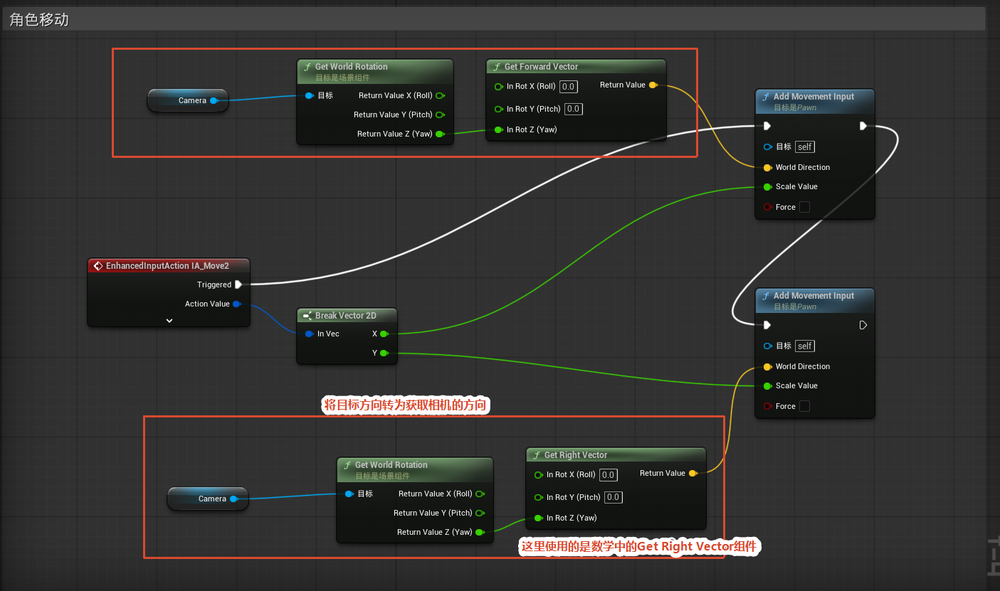
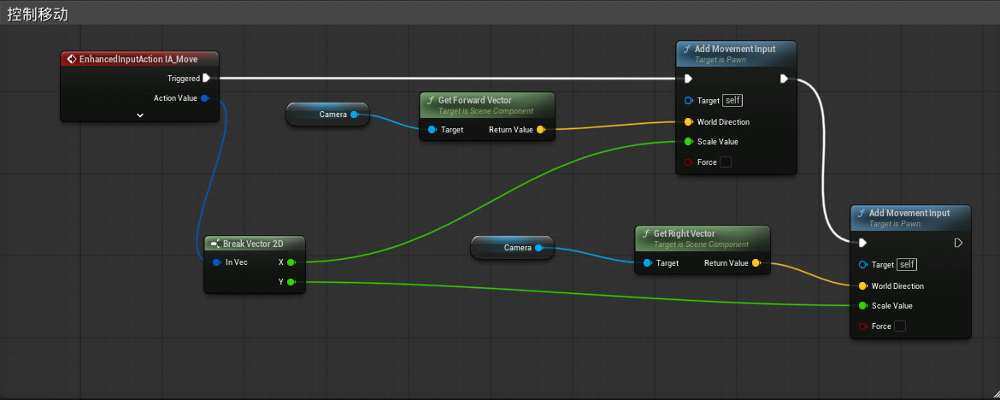
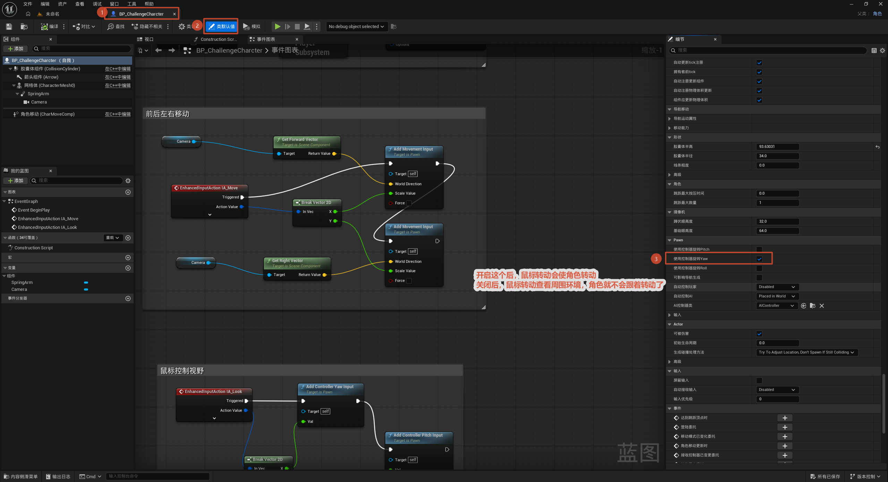

# 第三人称角色移动

本教程介绍如何在 UE5 中从零配置一个第三人称角色（`BP_Character`）。整体工作流程为：先在角色蓝图的类默认值里调整 Pawn 与角色移动组件的旋转设置，再为角色添加 SpringArm（弹簧臂）与 Camera（相机）组件并配置弹簧臂属性，接着为网格体指定骨骼网格资产与动画蓝图，最后在事件图表中通过 Enhanced Input（`IA_Move2` / `IA_Look2`）配合 `Get Control Rotation`、`Add Movement Input`、`Add Controller Pitch/Yaw Input` 等节点完成基于相机朝向的移动与视角控制逻辑。

整体流程一览：

> 角色配置（旋转设置）→ 加 SpringArm + Camera 组件 → 配置网格体模型 → 事件图表写移动 / 视角逻辑

第三人称的两个关键点：**相机用弹簧臂挂在角色身后**（弹簧臂负责距离和碰撞），**移动方向以相机朝向为基准**（按 W 是朝相机看的方向走，而不是世界正前方）。后面每一步都是围绕这两点展开的。

---

## 角色配置

**目的：** 在 `BP_Character` 的细节面板里，把角色移动组件和 Pawn 的旋转相关默认值调好，保证角色移动时能正常转向。

**关键设置：**

- **旋转速率 (Rotation Rate)**：X、Y 轴为 `0.0`，Z 轴为 `360.0`。角色只在 Z 轴（偏航）方向转向，这个值控制转向的角速度——设成 0 会导致"向前移动时无法转向"，所以要给 Z 一个非零值。
- **使用控制器旋转 Yaw (Use Controller Rotation Yaw)**：勾选。让角色身体跟随控制器（也就是相机）的偏航朝向。
- **使用控制器旋转 Pitch / Roll**：不勾选（第三人称角色不需要随相机俯仰/翻滚翻身）。

> 网格体项此时已指定骨骼资产 `SKM_Manny_Simple`，后续在"模型配置"会再细调。

## 设置弹簧臂

这一步分两部分：先把弹簧臂和相机组件加进来并挂好层级，再配置弹簧臂的属性。

### 添加弹簧臂和相机组件

**操作：** 角色蓝图组件面板 → 「+ 添加 (Add)」→ 搜索添加 **弹簧臂组件 (Spring Arm)** 和 **摄像机组件 (Camera)**。

**关键点：Camera 必须作为 SpringArm 的子组件挂在他下面。** 这样相机的位置和旋转就由弹簧臂统一驱动——弹簧臂一转，挂在末端的相机跟着转，这正是第三人称视角的基础。

> 加完后组件层级大致是：胶囊体 → 网格体、SpringArm（其下挂着 Camera）、角色移动组件。

### 设置弹簧臂

**目的：** 配置相机到角色的距离、旋转方式与碰撞。

**关键设置（选中 SpringArm，在细节面板）：**

- **目标臂长 (Target Arm Length)** = `300.0`：相机到角色的距离，数值越大镜头越远。
- **使用 Pawn 控制旋转 (Use Pawn Control Rotation)**：勾选。让弹簧臂的旋转跟随控制器输入——也就是鼠标转动时弹簧臂带着相机一起转。
- **进行碰撞测试 (Do Collision Test)**：勾选。相机退到墙边时会被挡住并自动拉近，避免穿墙。

> 一个容易困惑的点：勾了"使用 Pawn 控制旋转"后，**编辑器视口里无法手动转动弹簧臂**（因为它已被控制器接管），但**运行游戏后可以用鼠标正常控制**。这是正常现象，不是坏了。

## 模型配置

**目的：** 给网格体指定骨骼网格资产和动画，并把模型摆正到胶囊体里、朝向对齐正前方。

**操作（选中 CharacterMesh0，在细节面板）：**

- **骨骼网格体资产 (Skeletal Mesh Asset)** = `SKM_Manny_Simple`；材质 (Materials) 元素 0 / 1 分别指定对应材质。
- **动画 (Animation)**：动画模式 = `使用动画蓝图 (Use Animation Blueprint)`，动画类稍后指定动画蓝图（当前可能为 None）。
- **Transform 变换**：
  - Location Z = `-88.0`：把模型下沉，让脚底对齐到胶囊体底部，避免角色悬空或陷地。
  - Rotation Z = `-90.0`：**朝向修正**——见下面关键点。

**关键点：为什么 Rotation Z 要设 -90？** 胶囊体上那根箭头代表角色的**正前方**，而 Manny 模型自带的朝向和箭头不一致，直接放上去会侧着身。把 Z 旋转设为 `-90.0` 是为了让模型的脸朝向和箭头（正前方）对齐，这样移动方向和模型朝向才一致。

## 事件流程修改

> 同一个功能也可以用下面这种连线方式实现（另一种配置），效果一致，按习惯选择即可。

**目的：** 在事件图表里用 Enhanced Input 写移动和视角逻辑，让移动方向跟着相机走、视角跟着鼠标走。

**移动输入（`IA_Move2`）：**

`IA_Move2` 触发 → 轴输入 (Axis Input) 处理方向 → **Get Control Rotation（获取控制旋转）** → **Add Movement Input（添加移动输入）**。

**这里的核心是 `Get Control Rotation`**：它把移动方向换算到**相机朝向**坐标系下，所以按 W 是朝相机看的正前方走，按 D 是朝相机右侧走——这就是第三人称"以相机为准"的移动手感。如果没有这一步，W 会变成世界正北方，和镜头方向脱节。

**视角输入（`IA_Look2`）：**

`IA_Look2` 触发 → **Add Controller Pitch Input**（上下看）+ **Add Controller Yaw Input**（左右看）。鼠标移动直接驱动控制器的俯仰 / 偏航。

**收尾——`Use Pawn Control Rotation`：** 把控制器的旋转同步给 Pawn，于是挂在 Pawn 上的弹簧臂和相机就跟着鼠标转动，构成完整的"鼠标转视角 → 角色身体跟随 → 相机绕角色转"的第三人称控制闭环。

> 小结：移动逻辑用 `Get Control Rotation` 实现"相机相对移动"，视角逻辑用 `Add Controller Pitch/Yaw Input` 实现"鼠标控视角"，两者配合 Use Pawn Control Rotation 把整条链路串起来。

---

## 补充：Use Controller Rotation Yaw 的效果与问题

前面在「角色配置」里勾选了 **使用控制器旋转 Yaw (Use Controller Rotation Yaw)**，开启后的实际效果见下面视频：

<video src="使用控制器旋转Yaw开启效果对比.mp4" controls muted width="100%"></video>

**开启后的现象：** 角色身体会始终跟随控制器的偏航朝向——鼠标左右转动时，不只是相机在转，角色身体也跟着一起转。

**带来的问题：** 角色**还没开始移动**（原地站立）时，只要转动鼠标，身体就会跟着转动，这与多数第三人称游戏"站立时只转镜头、移动后才转身体"的手感不一致。

**解决方法：** 按下图调整角色移动组件的旋转设置，让角色只在移动时才朝向移动方向。

