# 角色跳跃

本篇演示如何在 UE5 的动画蓝图（AnimBP，`ABP_ChallengeCharacter`）中完整实现角色跳跃动画系统。整体工作流为：先在角色蓝图中通过增强输入绑定跳跃事件，再在 AnimGraph 中创建一个状态机（`basic`），依次建立 Locomotion、Jump_Start、Jump_Loop、Jump_End 四个状态并为每个状态指定动画资产；随后通过点击状态之间的连线（过渡规则），利用 Z 轴速度、是否下坠（Is Falling）等变量设置状态切换条件；这些变量在事件图表中通过 `TryGetPawnOwner → Cast To Character → CharacterMovement` 链路每帧更新；最后进入 PIE 调试模式运行测试，发现并修复"原地起跳卡死"的问题。

整体流程一览：

> 绑定跳跃键 → 建状态机 + 4 个状态 → 每个状态挂动画 → 写 4 条过渡规则 → 事件图表每帧刷变量 → PIE 调试修 bug

**状态机闭环：** `Locomotion（行走/静止）→ Jump_Start（起跳）→ Jump_Loop（空中循环）→ Jump_End（落地）→ 回到 Locomotion`

**过渡条件总览（全篇最值得速查的部分）：**

| 过渡                    | 切换条件                                                      | 含义                                |
| ----------------------- | ------------------------------------------------------------- | ----------------------------------- |
| Locomotion → Jump_Start | `Z Speed > 100` **AND** `Is Falling`                          | 向上速度够大且已离地 → 进入起跳     |
| Jump_Start → Jump_Loop  | 起跳动画剩余时间 `≤ 0.1s`                                     | 起跳动作快播完 → 进入空中循环       |
| Jump_Loop → Jump_End    | **NOT** `Is Falling`                                          | 落地（不再下坠）→ 播落地动作        |
| Jump_End → Locomotion   | `Speed ≥ 1` **OR** `Z Speed ≥ 1` **OR** 落地动画剩余 `≤ 0.1s` | 开始移动 或 落地动画播完 → 回到行走 |

**驱动这三个条件用的变量（在事件图表每帧刷新）：**

- `Speed`（浮点）：水平速度，同时驱动 Locomotion 混合空间的移动 blend。
- `Z Speed`（浮点）：垂直速度，判断是否起跳。
- `Is Falling`（布尔）：角色是否离地/下坠。

---

## 绑定跳跃事件

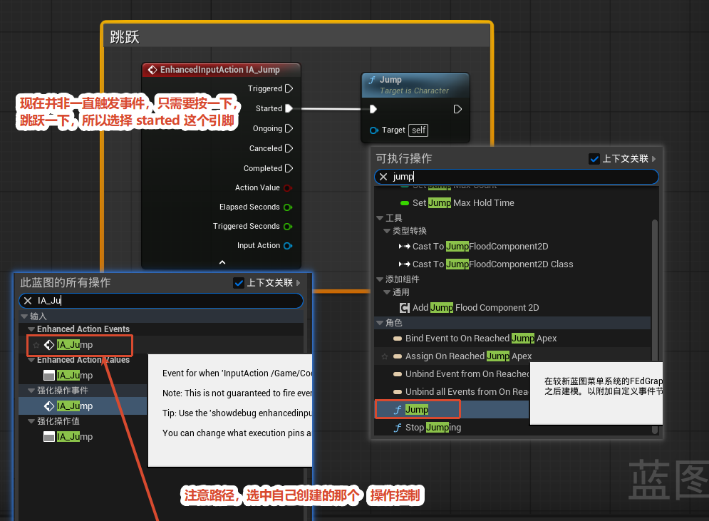

**目的：** 把跳跃键接到角色的 Jump 函数。

**操作：** 在角色蓝图事件图表里，从「此蓝图的所有操作」搜 `IA_Ju` 拖出自建的 `EnhancedInputAction IA_Jump` 节点；再搜 `jump`（勾选「上下文关联」）拖入 `Jump`（Target is Character）节点。

**关键点——选哪个触发引脚？** IA 节点有 `Triggered`、`Started`、`Ongoing`、`Canceled`、`Completed` 等引脚。跳跃是"按一下跳一下"，不是持续触发，所以用 **`Started`（按下瞬间）**，而不是会持续触发的 `Triggered`。

**连接：** `IA_Jump` 的 `Started` → `Jump` 节点的执行引脚，`Jump` 的 Target 设为 `self`。完成"按下跳跃键 → 调用角色 Jump"。

## 创建状态机

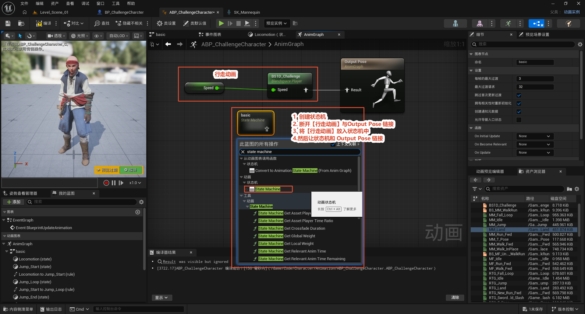

**目的：** 在 AnimGraph 里建一个状态机来管理"行走 / 起跳 / 空中 / 落地"几种姿态的切换，取代原来直接连到 Output Pose 的单一行走动画。

**操作步骤：**

1. AnimGraph 右键 → 动画状态机 → `State Machine`，新建节点命名为 `basic`。
2. 断开原先行走动画（Blend Space Player `BSTD_Challenge`）与 Output Pose 的连线。
3. 把行走动画放进状态机内部。
4. 让状态机的输出接到 `Output Pose`。

> 细节面板里有「每帧最大过渡 (Max Transitions Per Frame) = 3」等参数，控制一帧内允许多少次状态跳转，一般保持默认。

## 状态机编辑

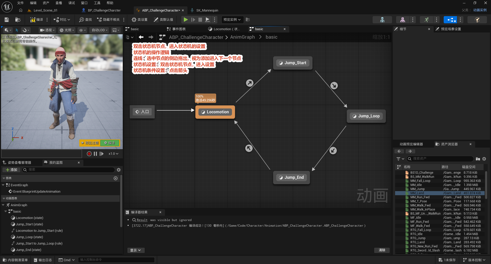

**目的：** 进入状态机内部，搭好四个状态及其过渡连线。

**操作：** 双击 `basic` 状态机节点进入内部编辑视图，建好四个状态：`Locomotion`、`Jump_Start`、`Jump_Loop`、`Jump_End`。

**连线方式：** 从一个节点的侧边拖出连线到下一个节点，即建立"过渡"；入口 (Entry) 先连到 `Locomotion`，整体连成 `Locomotion → Jump_Start → Jump_Loop → Jump_End → Locomotion` 的闭环。

> 节点上显示的「100% 激活 XX 秒」表示当前预览中它处于激活状态，用来观察实际跑到哪个状态。

## 状态机结构总览

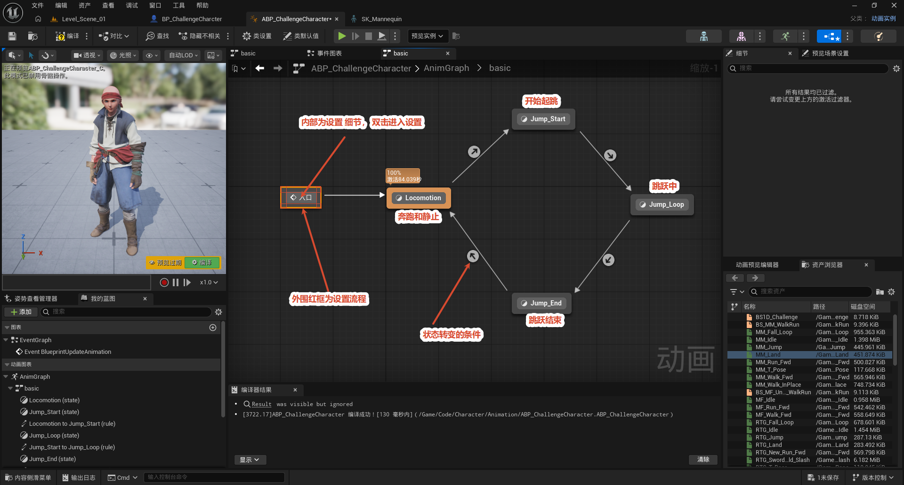

这张图是对整套状态机结构的总览：`Entry → Locomotion → Jump_Start → Jump_Loop → Jump_End → 回到 Locomotion`。

理解上分两层：

- **外围（设置流程）**：节点和连线的搭建，决定"有哪些状态、按什么顺序走"。
- **内部（设置细节）**：双击进入每个**状态**指定动画，双击每条**过渡箭头**编写切换条件。

> `Locomotion → Jump_Start` 的箭头就是"状态转变的条件"——后面几节都是在编辑这类箭头对应的规则图。右侧资产浏览器里有 `BS1D_Challenge`、`BS_MM_WalkRun`、`MM_Fall_Loop` 等可用动画资产，编译器结果显示 `ABP_ChallengeCharacter 编译成功`。

## 单个状态动画设置

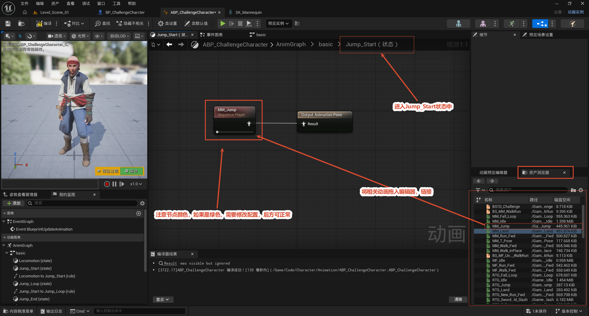

**目的：** 给每个状态指定一段具体动画（以 `Jump_Start` 为例）。

**操作：** 双击进入 `Jump_Start` 状态内部 → 从资产浏览器把 `MM_Jump` 动画拖入编辑器，生成一个 `Sequence Player` 节点 → 把它的 `Result` 连到状态内的 `Output Animation Pose`。

**关键点——注意节点颜色：** 动画节点如果显示为**绿色**，表示该动画当前**无效**，必须修正设置后才能正常工作（见下节）。正常生效的节点不是绿色。

### 修复"绿色无效节点"

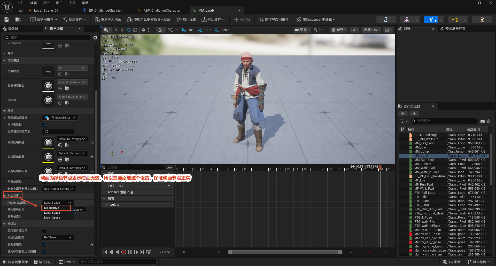

**问题：** Sequence Player 节点呈绿色 = 动画无效。

**排查：** 选中该节点，看细节面板的「附加设置」区域，问题通常出在 **`Additive 动画类型 (Additive Animation Type)`** 的取值被设错了（下拉有 `No additive`、`Mesh Space`、`Local Space` 等）。改到合适的叠加类型（一般起跳这种完整动画选 `No additive`）后，节点恢复正常。

> 这是排查"绿色无效动画节点"的典型入口：先检查动画节点的叠加 / 引用设置。

**Bug 效果**

<Video src="/4.动画节点无效配置.mp4" />

## 状态切换条件设置

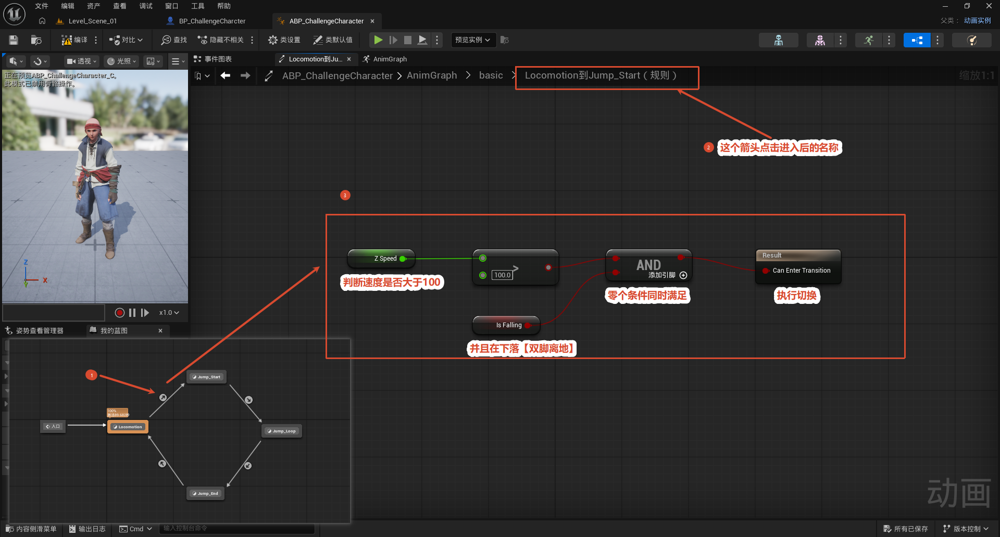

**目的：** 编写状态之间何时切换的判断条件。

**操作：** 点击两个状态之间的**过渡箭头**（例如 `Locomotion → Jump_Start`），进入该过渡的**规则编辑图表**（顶部面包屑会显示 `... / basic / Locomotion -> Jump_Start`）。在这个规则图里用节点连出一个布尔值给 `Result（Can Enter Transition）`，为真时即触发切换。

**关键点：切换条件写在"过渡箭头"的规则图里，不是写在状态内部。** 状态内部只管"播什么动画"，箭头才管"什么时候跳到下一个状态"。

## Locomotion 到 Jump_Start 的条件

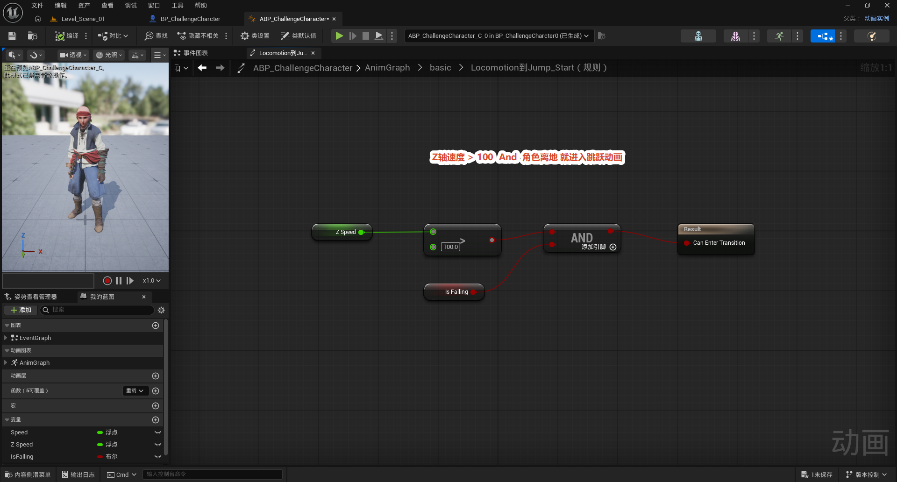

**逻辑：** `Z 轴速度 > 100` **AND** `角色已离地` → 进入起跳动画。

**节点：** 浮点变量 `Z Speed` 经比较节点判断 `> 100.0`，结果与布尔变量 `Is Falling` 一起接入 `AND` 节点，输出连到 `Result`。即"向上速度足够大 且 角色已离地"时，从行走切到起跳。

> 这两个变量 (`Z Speed`、`Is Falling`) 都在事件图表中每帧更新，下面 7.1～7.4 一步步把它们接出来。

### 拆分引脚

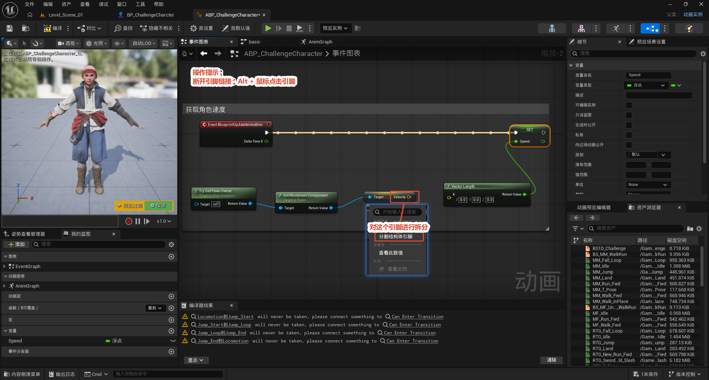

**目的：** 把速度向量拆成 X / Y / Z 三个分量，方便单独取 Z 轴。

**操作：** 在事件图表 (`Event BlueprintUpdateAnimation`) 里，`TryGetPawnOwner` 拿到角色 → 获取移动组件 → 读取速度。右键速度 (Velocity) 引脚 → **分割结构体引脚**，向量就被拆成 `Velocity X / Y / Z` 三个独立引脚。

> 快捷键：**Alt + 点击引脚** 可断开该引脚的链接。拆分后才能单独取 Z 分量判断跳跃，X/Y 继续用于算水平速度。

### 获取 Z 轴速度

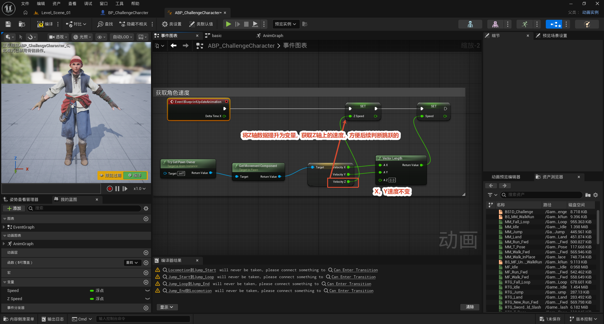

**目的：** 算出垂直速度并存入变量 `Z Speed`，同时算出水平速度存入 `Speed`。

**操作：** `Event BlueprintUpdateAnimation` 每帧驱动 → `TryGetPawnOwner → 获取移动组件 → Get Velocity` 得到速度向量 → 拆分为 `Velocity X / Y / Z`：

- Z 分量单独引出 → 提升为变量 → `SET Z Speed`，用于跳跃判断。
- 整体速度大小用 `Vector Length` 计算 → 写入 `SET Speed`，作为水平移动 blend 参数。

> X、Y 速度本身不变，只是把 Z 单独拿出来用。

### 获取下坠变量

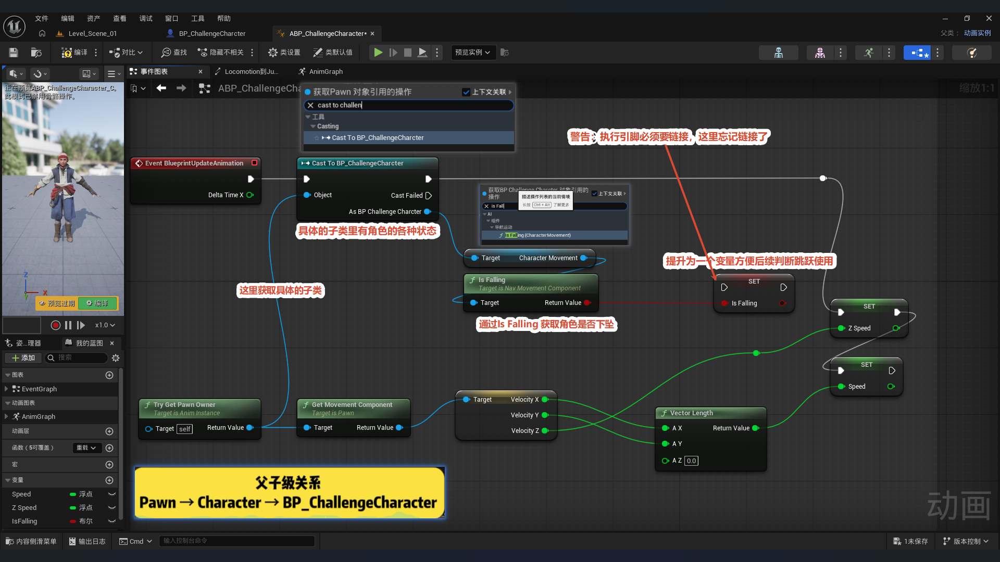

**目的：** 拿到"角色是否离地/下坠"并存入布尔变量 `Is Falling`。

**操作：** `Event BlueprintUpdateAnimation` → `Try Get Pawn Owner` → **`Cast To BP_ChallengeCharacter`**（把通用 Pawn 转换成具体角色子类，继承关系是 `Pawn → Character → BP_ChallengeCharacter`）→ 转换后的角色 `Get Movement Component` → 调用 **`Is Falling`** → `SET Is Falling` 写入布尔变量。

> **常见坑——执行引脚必须链接：** SET 节点的执行引脚必须接到执行链上，否则变量根本不会更新。图里就有一处"忘记链接执行引脚"的警告，调变量时最容易漏这里。

### 取角色数据的完整连接图

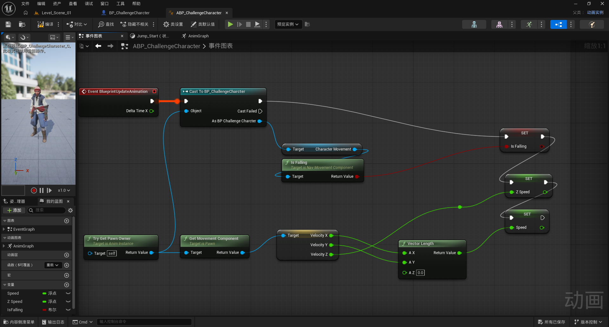

这张图是事件图表里"取角色数据"的完整总图，把 7.1～7.3 串成一条链：

**执行流：** `Event BlueprintUpdateAnimation` → `Try Get Pawn Owner` → `Cast To BP_ChallengeCharacter`，转换出的 `As BP Challenge Character` 分两路用：

- **下坠判断路：** 角色 → `Get Movement Component` → `Is Falling` → `SET Is Falling`。
- **速度判断路：** 角色 → `Get Velocity` → 拆分出 `Velocity X / Y / Z`；X、Y（AZ 设为 0）经 `Vector Length` → `SET Speed`；Z 直接 → `SET Z Speed`。

三个变量 `Speed`、`Z Speed`、`Is Falling` 由此每帧刷新，供各过渡规则使用。

## Jump_Start 到 Jump_Loop

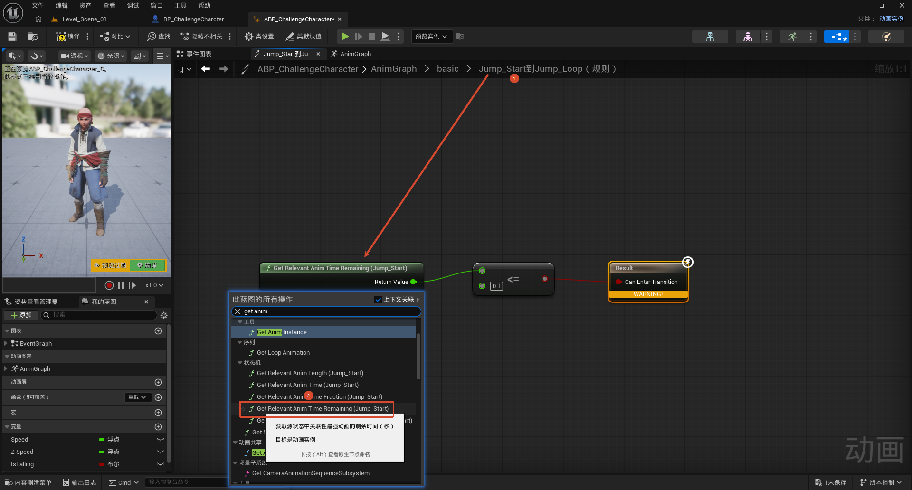

**逻辑：** 起跳动画**剩余时间 ≤ 0.1 秒**时 → 切入空中循环 `Jump_Loop`。

**节点：** `Get Relevant Anim Time Remaining (Jump_Start)`（获取源状态动画的剩余秒数）与 `0.1` 比较（`<= 0.1`），结果连到 `Result`。

**为什么这样：** 保证起跳动作播到快结束（剩 ≤ 0.1s）才进入下坠循环，不会过早切走，起跳与下坠衔接更自然。

## Jump_Loop 到 Jump_End 规则与 Debug 调试

### Jump_Loop 到 Jump_End 规则

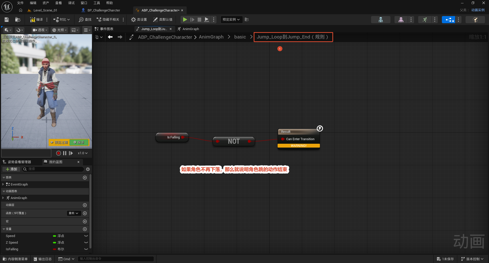

**逻辑：** 角色不再下坠（已落地）→ 切到落地动作 `Jump_End`。

**节点：** 取布尔变量 `Is Falling`，经 `NOT` 取反后连到 `Result`。即 `NOT Is Falling` 为真（落地瞬间）时触发。这条规则只依赖 `Is Falling` 一个变量。

### 进入 Debug 调试

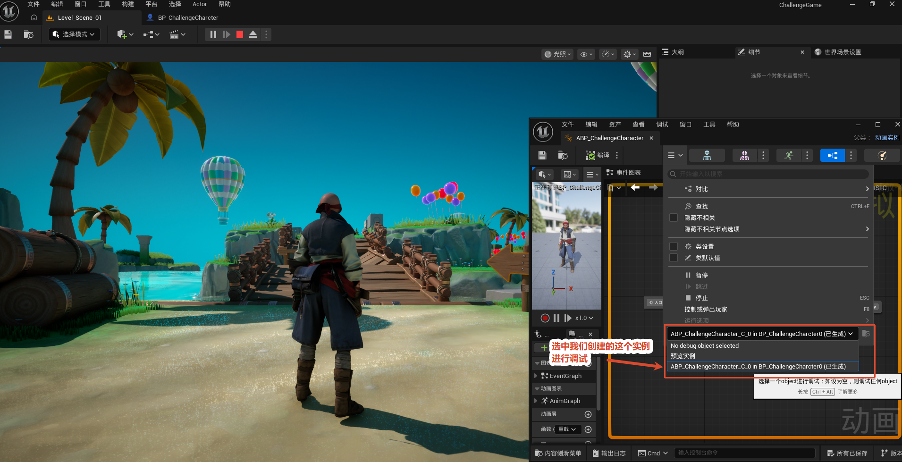

**目的：** 运行游戏后实时观察状态机跑到哪个状态、变量取值是多少，用来排查动作异常。

**操作：** 点工具栏「播放 (Play)」进入 PIE 运行模式；在 `ABP_ChallengeCharacter` 编辑器顶部的**调试下拉框**里，选中运行时生成的实例（如 `ABP_ChallengeCharacter_C_0 in BP_ChallengeCharcter0（已生成）`）。选定后，状态机图表就会实时高亮当前激活状态并显示变量值。

### Debug 发现的问题

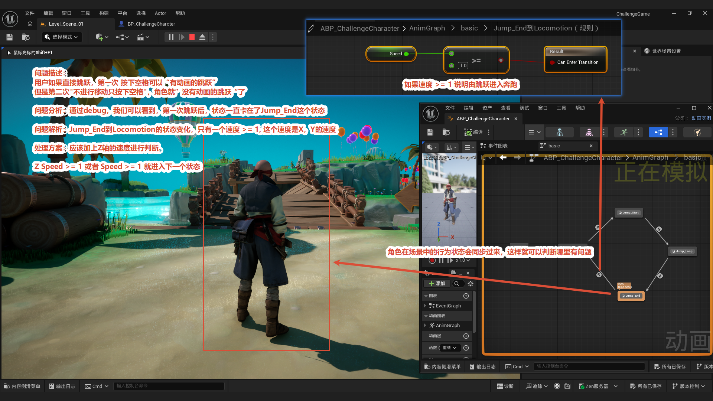

**现象：** 第一次按空格能正常"有动画地跳跃"；但第二次（原地不移动只按空格）就变成"没有动画的跳跃"。

**定位：** 通过 debug 看到，第一次跳跃后状态**一直卡在 `Jump_End`** 没回到 Locomotion。

**根因：** 原来 `Jump_End → Locomotion` 的条件只判断了水平速度 `Speed >= 1`。原地垂直起跳时没有水平移动，`Speed` 为 0，永远满足不了 `>= 1`，于是角色卡死在 `Jump_End`，下一次跳跃自然没动画。

**修复方案：** 加上 Z 轴速度判断——`Z Speed >= 1` **或** `Speed >= 1` 就进入下一个状态（详见下一节）。

## Jump_End 到 Locomotion 规则（修复版）

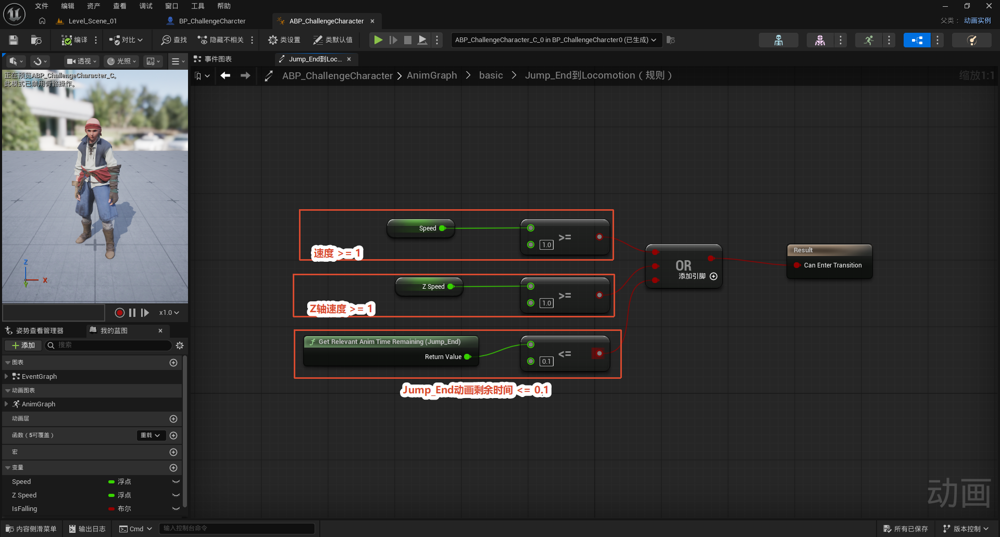

这一节就是上一节 Debug 发现问题后的**修复版本**。用一个 `OR` 节点合并三个条件，任意一个成立即从 `Jump_End` 切回 `Locomotion`：

- `Speed >= 1`：水平速度足够（开始走/跑）；
- `Z Speed >= 1`：**新增的垂直速度判断**——这是修复原地起跳卡死的关键；
- `Get Relevant Anim Time Remaining (Jump_End) <= 0.1`：落地动画快播完，兜底防止一直停在落地动作。

相比原版只判断 `Speed >= 1`，这里补上了 `Z Speed >= 1` 和剩余时间兜底，原地起跳也能正常回到 Locomotion。至此整套跳跃状态机的动画与切换条件全部完成并可正常循环。

> 回顾这条 debug 线索很有价值：**现象（第二次没动画）→ debug 定位（卡在 Jump_End）→ 根因（条件只看水平速度）→ 修复（加上垂直速度判断）**。状态机里"过渡条件漏掉某种情况"是最常见的卡死原因，这套排查思路可以复用到别的状态机上。
