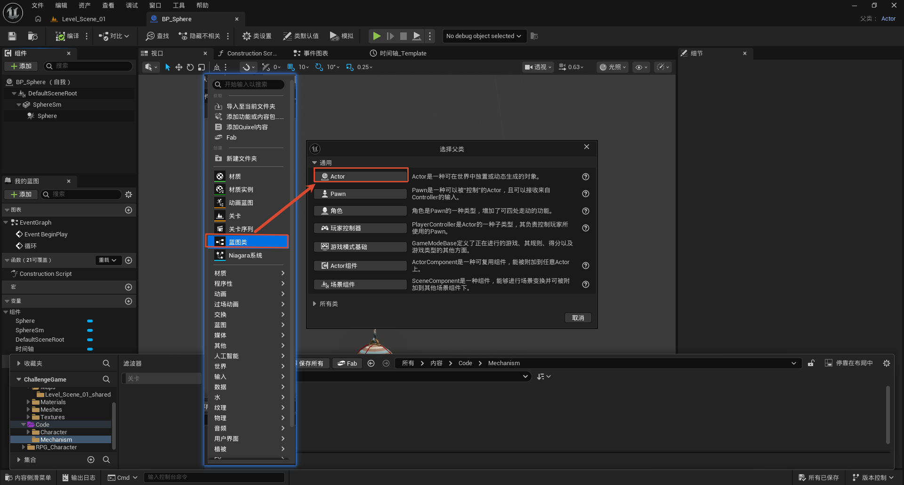
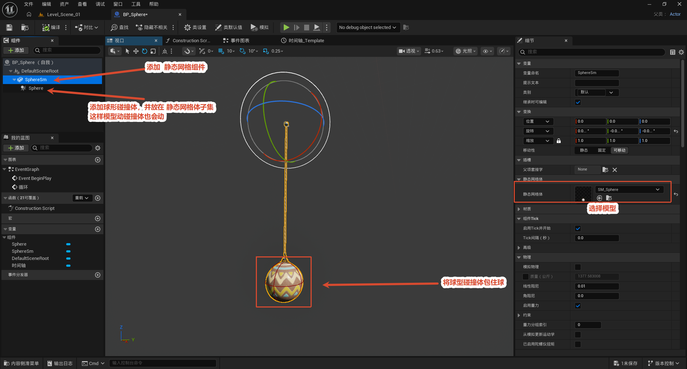
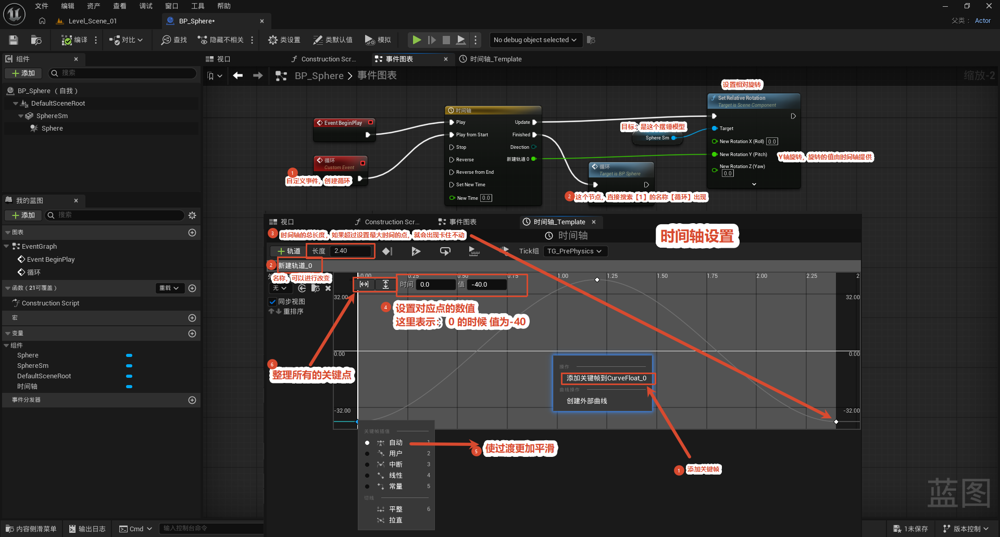

# 制作大摆锤

本节介绍如何在 UE5 中制作一个可以左右摆动的大摆锤（蓝图 `BP_Sphere`）。整体工作流程为：先在内容浏览器的 `Content/Code/Mechanism` 目录下创建一个蓝图类、父类选择 `Actor`；接着在蓝图组件中添加一个静态网格体组件（`SphereSm`）并指定模型 `SM_Sphere`，再在其下挂载一个球形碰撞体（`Sphere`）作为子组件，使碰撞体随模型一起运动；最后在事件图表中用 `Event BeginPlay` 触发一个时间轴（Timeline）节点，通过时间轴上的浮点曲线（CurveFloat）生成旋转角度值，驱动 `Set Relative Rotation` 节点让摆锤模型绕轴左右摆动，形成循环动画。其中时间轴节点的用法可参考 [特殊节点](../../特殊节点/特殊节点.md) 一节。

整体流程一览：

> 建蓝图（父类 Actor）→ 加静态网格 + 球形碰撞（碰撞挂网格下）→ 事件图表用时间轴驱动旋转

核心思路：**碰撞体必须挂在静态网格体下面当子组件**，这样网格体被时间轴带着转时，碰撞体跟着一起转；再用一条 `-40 → +40` 的浮点曲线驱动 Y 轴旋转，就得到 ±40° 的左右摆动循环。

---

## 创建蓝图类

**目的：** 创建摆锤蓝图 `BP_Sphere`。

**操作：** 内容浏览器（`所有 > 内容 > Code > Mechanism`）空白处右键 → **蓝图类 (Blueprint Class)** → 在「选择父类」对话框的「通用」分类里选 **Actor** 作为父类 → 命名 `BP_Sphere` 保存。

**为什么选 Actor：** 大摆锤是一个要放进关卡、并能挂载网格体和碰撞体的场景对象，而 Actor 正是"可在世界中放置或动态生成的对象"基类，最贴合这个需求。

> 对话框里的 Pawn、Character、玩家控制器、游戏模式基础等都是常用父类，但它们要么带输入/移动功能（摆锤不需要），要么是控制器/规则类，不适合这里。

## 模型设置

**目的：** 给蓝图加上可见的球体模型和对应的碰撞体，并搭好"碰撞随模型一起动"的层级。

**操作（组件面板）：**

1. 点「+ 添加」→ 搜索添加**静态网格体 (Static Mesh)** 组件，命名 `SphereSm`。
2. 再添加一个**球体碰撞 (Sphere Collision)** 组件，命名 `Sphere`，并把它**拖到 `SphereSm` 下面作为它的子组件**。
3. 选中 `SphereSm`，细节面板里把**静态网格体 (Static Mesh)** 指定为 `SM_Sphere`。

**关键点——为什么把碰撞体挂在网格体下面？** 子组件会跟随父组件一起变换。把球形碰撞做成 `SphereSm` 的子组件后，时间轴驱动网格体旋转时，碰撞体自动跟着转，保证"看得见的球"和"用来检测碰撞的球"始终重合。

**收尾：** 调整球形碰撞的半径，让它恰好**包裹住球形模型**，碰撞检测范围才和可视模型一致。视口里球体通过连杆挂在顶部环形框架（三色环 = 旋转轴）下方，运行时就绕这根轴左右摆。

> 组件层级：`BP_Sphere → DefaultSceneRoot → SphereSm（静态网格）→ Sphere（球形碰撞）`。

## 绑定左右摆动的事件

**目的：** 用时间轴生成 ±40° 的旋转值，驱动摆锤绕轴左右摆动并循环。

**节点链：** `Event BeginPlay`（和自定义事件）→ **Timeline** 的 Play 引脚 → Timeline 的 Update 输出 → **Set Relative Rotation**（Target = `SphereSm`，旋转值由时间轴提供，接在 Y 轴上）。

**为什么有两个入口都接 Play？** `Event BeginPlay` 负责游戏开始时启动第一次播放；再接一个**自定义事件 (Custom Event)** 用来在播放结束后重新触发，形成循环播放。

> 自定义事件节点的添加：在事件图表空白处右键搜 `Custom Event` 即可。

**时间轴关键设置：**

- **长度 (Length)** = `2.40` 秒：摆动一个来回的时长。注意——**如果实际关键帧超出了这里设的最大时间，时间轴会卡住不动**，所以长度要 ≥ 最后一个关键帧的时间。
- **浮点曲线 (CurveFloat)**：在画布上右键「添加关键帧到 CurveFloat_0」建关键帧，插值类型选**平滑**，让往复过渡像真实钟摆一样自然。
- **关键帧数值**：时间 `0.0` 处值 `-40.0`，对称端约 `40.0`——即摆锤在 **±40°** 之间左右摆。

**驱动旋转：** 时间轴曲线输出的值接到 `Set Relative Rotation` 的 Y 轴旋转引脚，每帧更新 `SphereSm` 的相对旋转，从而实现大摆锤的左右摆动循环动画。

> 时间轴节点的详细用法（输入/输出引脚、关键帧编辑等）见 [特殊节点](../../特殊节点/特殊节点.md)。
