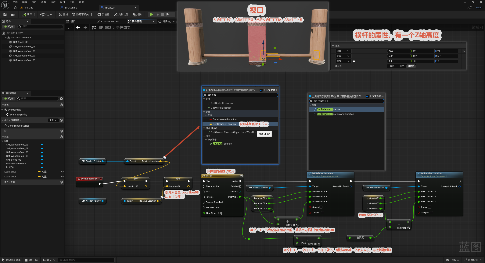

# 时机跳跷跷障碍

本节介绍如何制作一个"时机跳跃"跷跷板障碍：两根横杆（`SM_Wooden_Pole_06` / `SM_Wooden_Pole_08`）一上一下交替运动，玩家需要把握时机从中间穿过或跳过去。整体由一个**设置了循环的时间轴（Timeline）**驱动——`BeginPlay` 启动时间轴，时间轴循环输出数值，每帧通过 `Get / Set Relative Location` 改写两根横杆的相对位置，让它们反相升降（一根升起的瞬间另一根降下）。

整体逻辑一览：

> Event BeginPlay → Timeline（循环）→ 每帧 Update → 用保存的两个位置 + 偏移做计算 → Set Relative Location 驱动两根横杆反相升降

核心思路：先把两根横杆的基准位置**提升为变量**（`Location06` / `Location08`）存下来，再用时间轴的输出叠加上"横杆原始高度 30"的偏移，并通过**相减 + 取绝对值**让两根杆一个升高、一个降低（反相运动）。

---

## 配置事件

**目的：** 用一个循环时间轴驱动两根横杆反相升降，形成需要"看时机跳过去"的障碍。

**入口与时间轴：**

- `Event BeginPlay` 触发后启动 **Timeline** 节点。
- 时间轴**设置了循环**（在时间轴编辑器里勾选 Loop），所以两根横杆会持续一上一下交替运动，不会停。

**位置变量（关键）：**

- 用 `Get Relative Location` 取出两根横杆（`SM_Wooden_Pole_06` / `SM_Wooden_Pole_08`）当前的相对位置。
- 把取到的位置**提升为变量** `Location06` / `Location08`，方便后续每帧反复读取和参与计算。

**偏移与反相计算（图上红字批注对应处）：**

- **`+` 节点**：给位置叠加上横杆的**原始高度 `30`** 作为偏移量。
- **`-` 节点 + `ABS`（取绝对值）**：把两根杆的位置相减再取绝对值——因为设计上是"一个杆子在上、一个杆子在下"，相减后取绝对值才能得到正确的升降幅度，保证两根杆始终反相（你升我降）。

**驱动：**

- 计算出的新位置通过 `Set Relative Location` 写回两根横杆；时间轴每帧 Update 一次，于是横杆平滑地一上一下循环运动。
- `Set Relative Location` 的 **Sweep**（扫描）引脚决定移动时是否做碰撞检测，**Teleport**（传送）引脚决定是直接传送还是平滑过渡。做这种持续运动的障碍一般**不开 Teleport**，让它平滑移动，玩家才有反应和跳跃的余地。

> 时间轴的循环设置、输入/输出引脚、关键帧编辑等细节见 [特殊节点](../../特殊节点/特殊节点.md)。
>
> 注意：`Get / Set Relative Location` 操作的是组件的**相对位置**（相对父组件 / 蓝图根），所以这里的横杆应当是挂在蓝图下的静态网格体子组件，这样改相对位置才会让它在蓝图局部空间内上下移动。
