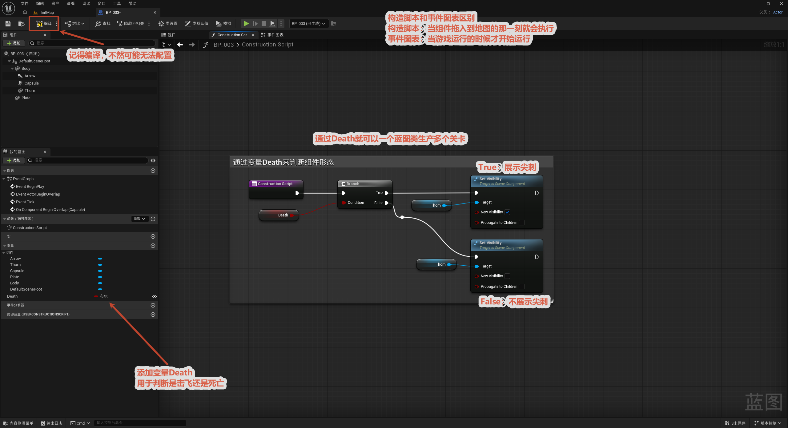
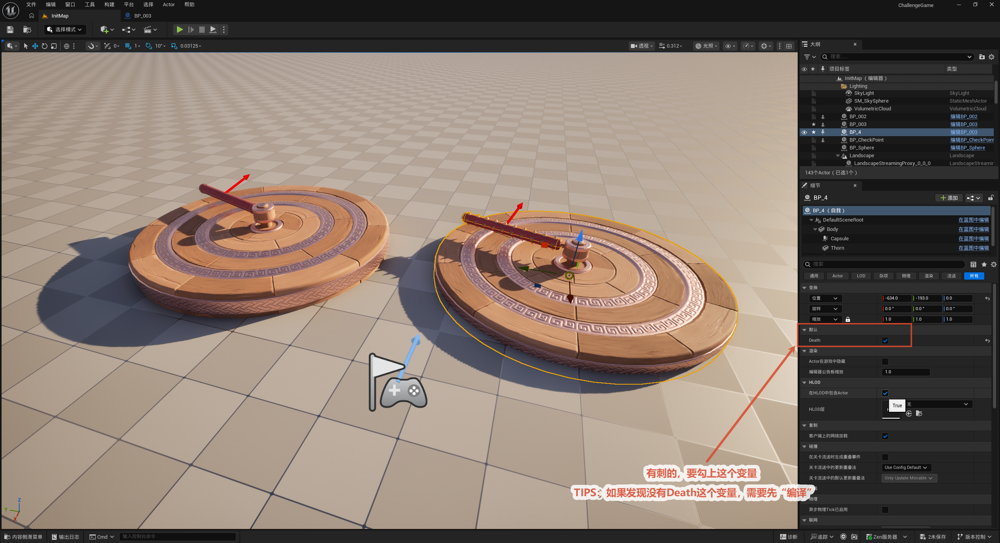
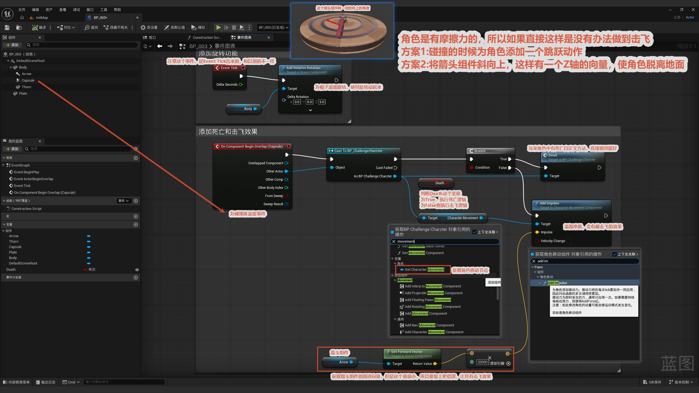

# 旋转指针

本节制作一个"旋转指针"障碍：一根持续自转的箭头，玩家碰到时根据设置**要么被击飞、要么直接死亡**。这个蓝图最巧妙的地方在于用一个布尔变量 `Death` 同时控制两件事——

- **外观**：带刺还是不带刺（带刺 = 危险，不带刺 = 弹板）；
- **行为**：碰到是致死还是把玩家击飞。

于是**同一个蓝图类**可以在关卡里拖出两种完全不同形态的障碍：勾上 `Death` 就是带刺的致死陷阱，不勾就是无刺的弹射台。构造脚本负责编辑器里的外观切换，事件图表负责运行时的自转和碰撞反应。

整体流程一览：

> 构造脚本（按 `Death` 显隐尖刺）→ 关卡里拖实例、配不同 `Death` → 事件图表（每帧自转 + 碰撞按 `Death` 分流：死亡 / 击飞）

---

## 配置构造脚本

**先搞清两个概念（图上红字重点强调）：**

- **构造脚本 (Construction Script)**：组件被拖进地图的那一刻就执行，**编辑器里实时生效**。所以适合用来"按变量配置不同实例的外观"。
- **事件图表 (Event Graph)**：**游戏运行时**才开始执行。

**目的：** 在构造脚本里根据 `Death` 变量控制尖刺组件（`Thorn`）的显隐，让一个蓝图类在地图里能呈现两种形态。

**节点链：** `Construction Script` → `Branch`（Condition = `Death`）→

- **True 分支** → `Set Visibility`（Target = `Thorn`，可见）= **展示尖刺**；
- **False 分支** → `Set Visibility`（Target = `Thorn`，隐藏）= **不展示尖刺**。

> **关键点：** `Death` 既是这里的"外观开关"，又是后面事件图表里的"行为开关"，所以带刺的形态自然对应"致死"、无刺的对应"击飞"——一个变量把外观和行为绑定在一起，这就是"一个蓝图类生产多个关卡 / 形态"的思路。
>
> **记得编译：** 改完构造脚本和变量后必须编译蓝图，否则细节面板里看不到 `Death` 变量、也就没法配置。

## 不同展示类型的配置

**目的：** 在关卡里用同一个蓝图摆出两种不同形态的障碍。

**操作：** 把蓝图实例拖进关卡，选中后在细节面板里设置 `Death` 变量——

- **勾上 `Death`**：带刺形态（致死陷阱）；
- **不勾 `Death`**：无刺形态（弹射台）。

> **TIPS：** 如果在细节面板里找不到 `Death` 变量，是因为蓝图还没编译——回蓝图编辑器点一下编译，它就会出现。

## 配置事件

事件图表干两件事：**让指针持续自转**，以及**碰到角色时按 `Death` 分流处理**。

### 持续自转

`Event Tick`（每帧触发）→ `Add Relative Rotation`（Delta Rotation 设为 `Z = 5.0`，X / Y 为 0）。

每帧给指针绕 Z 轴追加 5°，形成**匀速自转**。用 `Event Tick` 而不是 Timeline，是因为这里只要"匀速一直转"，不需要曲线插值。

### 碰撞反应（击飞 / 死亡）

碰撞体（`Capsule`）用 `On Component Begin Overlap` 检测角色重叠 → `Cast To BP_ChallengeCharacter` 把重叠对象转成具体角色类 → `Branch`（Condition = `Death`）分流：

- **`Death = True` → 死亡逻辑**（带刺陷阱致死）；
- **`Death = False` → 击飞逻辑**：取箭头组件的前向量、乘上倍速，用 `Add Impulse` 把角色打飞。

### 击飞的关键设计（图上红字重点）

直接给角色一个平面冲量是**击飞不起来**的——因为角色站在地上有**摩擦力**，水平方向的力会被地面抵消。图上给了两个解决思路，本例用的是方案 2：

- **方案 1**：碰撞时给角色触发一个跳跃动作，先让它离地；
- **方案 2（本例采用）**：**把箭头组件斜向上倾斜**，这样它的前向量自带一个 Z（向上）分量，冲量方向就朝斜上方，能把角色直接打离地面。

另外，箭头前向量本身是单位向量、数值很小，所以还要**乘一个倍速（图中为 `20000`）**放大冲量，击飞效果才明显。

> 小结：`Event Tick` + `Add Relative Rotation` 负责转；`Begin Overlap` + `Cast` + `Branch(Death)` 负责碰撞分流；斜向上的箭头前向量 × 倍速 + `Add Impulse` 负责把角色打飞。`Death` 变量从构造脚本到事件图表一以贯之，把外观和行为统一在一起——这是这个蓝图最值得学的设计。
