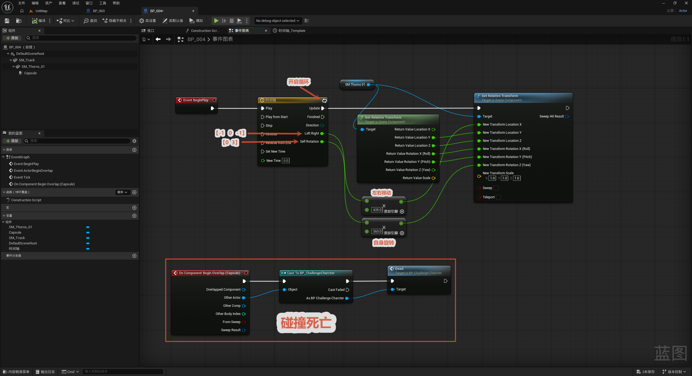

# 妙笔生花

本节制作一个"妙笔生花"障碍——一排尖刺（`SM_Thorns_01`）一边左右移动、一边自转，玩家碰到就死亡。整体由一个**开启循环的时间轴**驱动两件事：左右平移和自身旋转；另外用碰撞重叠触发死亡。

整体流程一览：

> BeginPlay → Timeline（循环，两条轨道：左右移动 + 自身旋转）→ Set Relative Transform 驱动尖刺
> 角色碰到 Capsule → Cast To 角色 → 死亡

核心思路：**一条 Timeline 同时输出两个值**——一条轨道（左右移动，幅度约 435）驱动位置、另一条轨道（自身旋转，到 360°）驱动旋转。再用 `Get Relative Transform` → `Set Relative Transform` 的模式：先读当前变换，把要动的那几个通道换成时间轴的值，其余通道保持不变，再写回去。

---

## 配置事件

**目的：** 让尖刺持续"左右移动 + 自转"并循环，碰到角色则致死。

**持续运动（BeginPlay 驱动）：**

- `Event BeginPlay` → **Timeline**（**开启循环 Loop**）。
- Timeline 有两条轨道：
  - **Left Right（左右移动）**：关键帧幅度约 `435`，驱动尖刺左右平移。
  - **Self Rotation（自身旋转）**：关键帧到 `360`（整圈），驱动尖刺自转。
- Timeline 的 Update 输出 → `Get Relative Transform`（读当前变换）→ 替换其中的位置 / 旋转通道 → `Set Relative Transform`（写回 `SM_Thorns_01`）。

**为什么用 Get + Set Relative Transform？** 这样可以**只改要动的那几个通道**（位置走左右移动轨道、旋转走自转轨道），其余通道（如缩放）保持读到的原值不变，避免把整个变换一次性覆盖掉。

**碰撞死亡：**

- `On Component Begin Overlap (Capsule)` → `Cast To BP_ChallengeCharacter` → 转换成功则触发 **Dead**（死亡逻辑）。
- 即角色一碰到尖刺的胶囊碰撞体就死亡。

> 小结：`Timeline` 双轨道（左右 + 自转）+ `Set Relative Transform` 负责"动"，`Begin Overlap` + `Cast` + `Dead` 负责"碰到就死"。时间轴的循环、关键帧等细节见 [特殊节点](../../特殊节点/特殊节点.md)。
