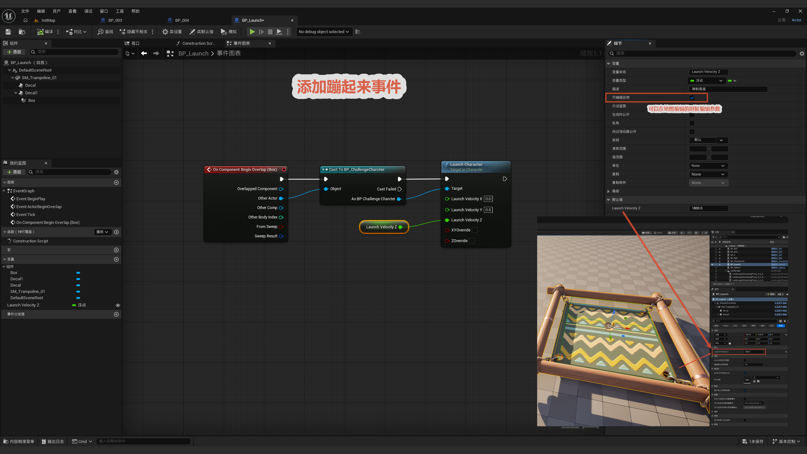

# 蹦床

本节制作一个"蹦床"——角色踩上去就被向上弹飞。核心就一条事件链：检测重叠 → 调用 `Launch Character` 把角色发射出去，发射力度做成变量方便每个蹦床实例单独调。

整体流程一览：

> 角色进入 Box 碰撞 → Cast To 角色 → Launch Character（Z 速度由变量提供）→ 弹飞

核心思路：**用 `Launch Character` 而不是 `Add Impulse`** 来弹角色。`Launch Character` 是专门给 Character 用的"发射"函数，会正确处理角色移动组件的状态（比如切换到下落模式），比直接加冲量更稳。弹力大小用一个**提升为变量、且实例可编辑**的 `Launch Velocity Z`，这样同一份蹦床蓝图，关卡里每个实例都能调不同的弹跳高度。

---

## 事件配置和提升变量

**节点链：** `On Component Begin Overlap (Box)` → `Cast To BP_ChallengeCharacter` → `Launch Character`。

- 重叠事件用 `Box` 碰撞体触发（角色一踩到蹦床区域就触发）。
- `Cast To BP_ChallengeCharacter` 确认重叠的是玩家角色，转换成功才继续弹。
- `Launch Character` 的 **Launch Velocity** 只给 Z 分量一个值（X、Y 为 0），所以角色被**笔直向上**弹飞。

**关键点——把弹力提升为变量：**

- `Launch Velocity Z` 的值（如 `1800.0`）不要写死，右键**提升为变量 (Promote to Variable)**。
- 在变量设置里勾选 **实例可编辑 (Instance Editable)**，这样每个蹦床实例在关卡细节面板里都能单独调弹跳高度——大蹦床调高、小蹦床调低，复用同一份蓝图。

> 这是复用蓝图的关键技巧：**把需要逐实例调整的参数都做成"实例可编辑变量"**，一份蓝图就能派生出多种参数配置，不用每种都新建一个蓝图。
