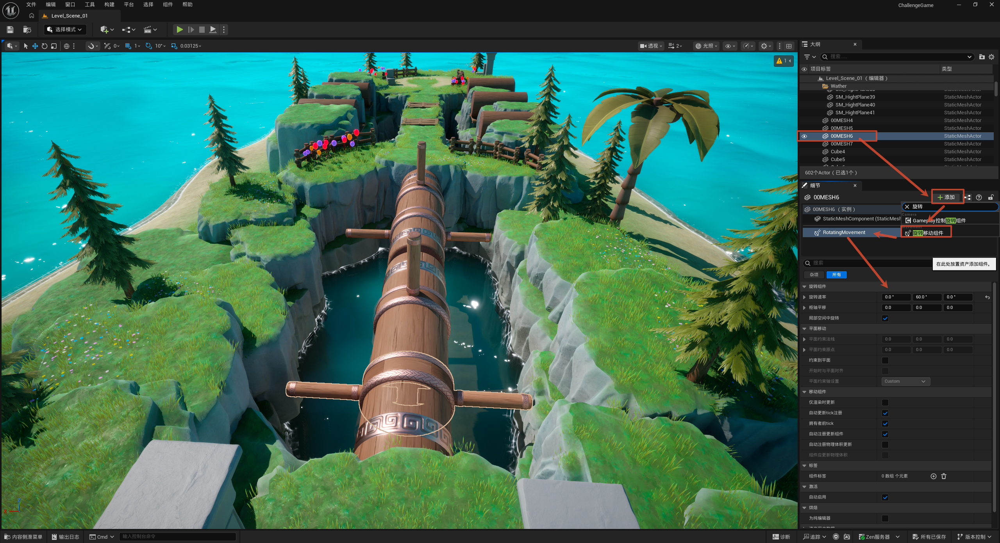

# 滚木

本节制作一个"滚木"障碍——一根持续滚动旋转的圆木，玩家需要找时机穿过。和 [5.3 旋转指针](../5.3旋转指针/旋转指针.md) 用 `Event Tick` + `Add Relative Rotation` 手动驱动旋转不同，这里用 UE5 内置的 **旋转移动组件 (Rotating Movement Component)**，完全不用写事件逻辑，加个组件、设个旋转速率就行。

整体流程一览：

> 选中滚木静态网格体 → 添加 Rotating Movement 组件 → 设置旋转速率（Y=60°/秒）→ 自动持续滚动

核心思路：**Rotating Movement Component 是 UE5 专门用来让物体自动旋转的组件**，挂上之后只要设好"每秒转多少度"，运行时就会自己转，省去手写每帧旋转的代码。

---

## 添加旋转组件

**目的：** 让滚木绕轴持续旋转，不用写任何事件逻辑。

**操作（细节面板）：**

1. 选中滚木的静态网格体（如 `00MESH6`）。
2. 点「+ 添加」→ 搜索添加 **旋转移动组件 (Rotating Movement Component)**。
3. 设置 **旋转速率 (Rotation Rate)**：`X=0, Y=60, Z=0`——即每秒绕 Y 轴转 60°。

**关键点：**

- 旋转速率只在**一个轴**上给非零值（这里 Y=60），决定滚木绕哪根轴、转多快。
- 这个组件运行时自动生效，不需要 `Event Tick`，比手写每帧旋转更省性能、也更简洁。

> 对比：[5.3 旋转指针](../5.3旋转指针/旋转指针.md) 用 `Event Tick` + `Add Relative Rotation` 手动转，这里用组件自动转。两种都能实现持续旋转——**简单的匀速自转优先用 Rotating Movement Component**；需要在旋转过程中夹带其他逻辑（比如碰撞反应）时，再用 Event Tick 手动控制。
