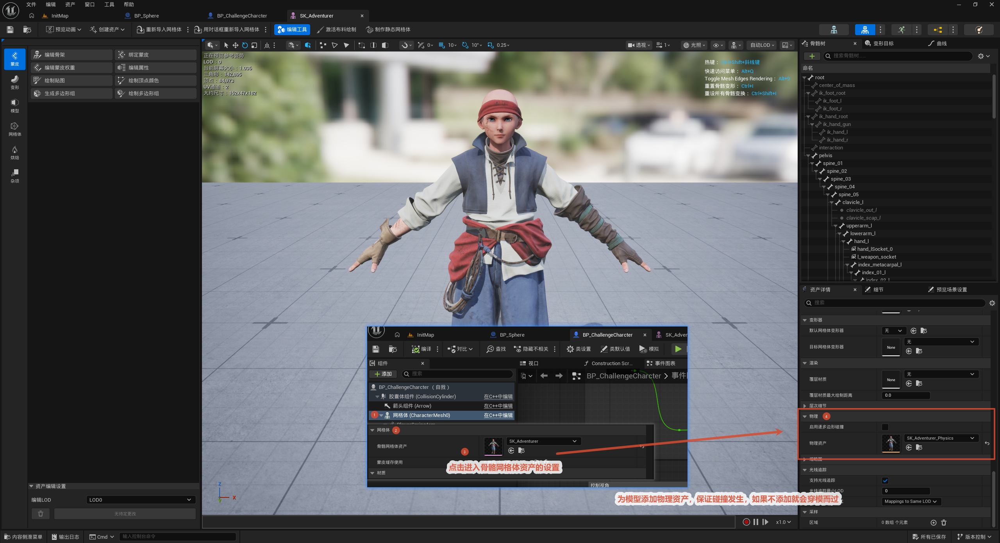
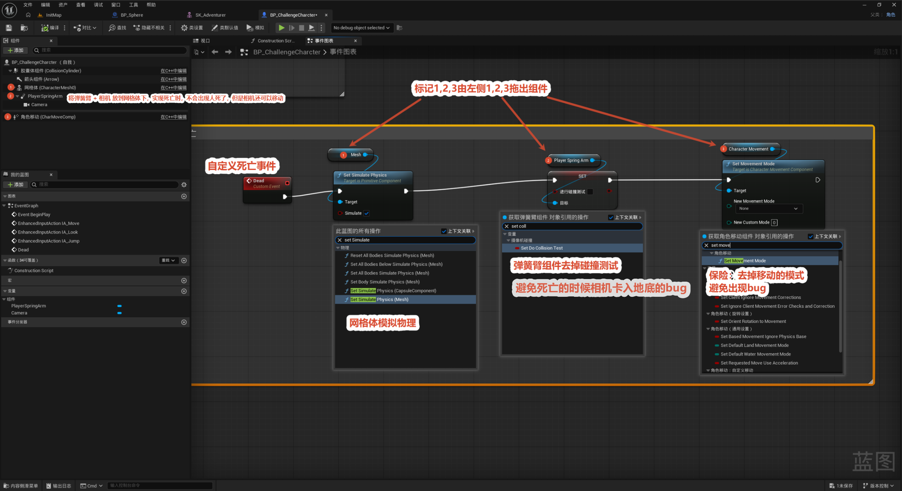
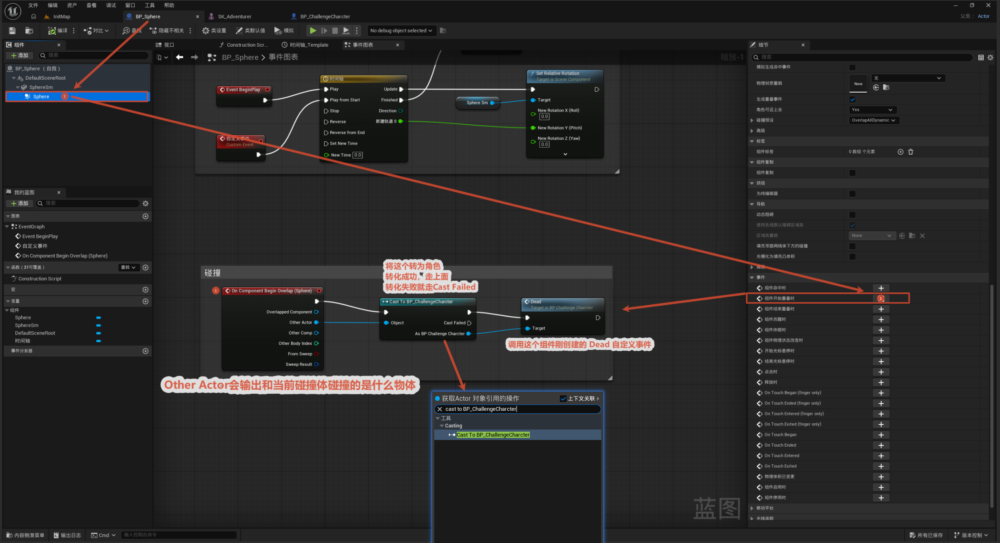
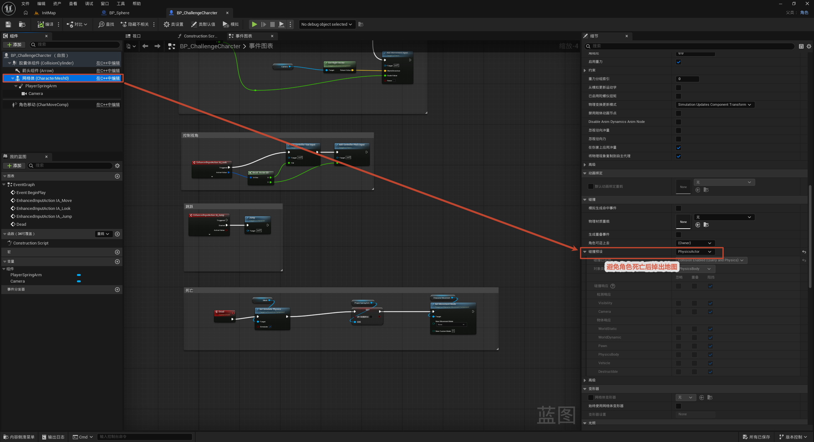

# 角色死亡设置

本节在角色蓝图（`BP_ChallengeCharacter`）里搭建死亡系统：写一个 `Dead` 自定义事件，让角色死亡时变成"布娃娃"倒下、相机跟随、停止移动；再用一个带 Sphere 碰撞的死亡触发器，在角色碰到时调用 `Dead`。

整体流程一览：

> 组件准备（弹簧臂 + 相机挂到网格体下）→ 写 `Dead` 事件（网格体模拟物理 + 弹簧臂去碰撞 + 停移动）→ 死亡触发器碰撞调用 `Dead`

核心思路：死亡时让角色网格体**开启物理模拟**变成布娃娃倒地，同时**把弹簧臂和相机挂到网格体下面**——这样相机跟着倒下的身体走，不会出现"人死了相机还飘在原地"的违和感；再停掉角色移动组件，避免死亡后还能乱动。

---

## 0. 组件（资材）设置

**目的：** 先把组件结构和引用理顺，为死亡表现做准备。

**关键操作：** 把 **弹簧臂 (PlayerSpringArm) + 相机 (Camera) 挪到网格体 (Mesh) 下面**当子组件。

**为什么这样挂？** 死亡后网格体变布娃娃倒地，相机作为它的子组件会跟着倒，不会"人死了相机还能到处飘、移动"。

**准备引用：** 把接下来要操作的组件（Mesh、PlayerSpringArm、CharMoveComp）从左侧组件面板拖进事件图表，得到它们的引用，供下一步 `Dead` 事件调用。

## 1. 死亡自定义事件

**目的：** 新建一个 `Dead` 自定义事件，作为死亡的统一入口。

**节点链：** `Dead` → `Set Simulate Physics` → 处理弹簧臂 → `Set Movement Mode`。具体：

- **Set Simulate Physics**（Target = `Mesh`，Simulate = **true**）：网格体开启物理模拟，变成布娃娃倒下。
- **弹簧臂去掉碰撞测试**（PlayerSpringArm 的 `Do Collision Test` = **false**）：避免死亡后相机卡进地底（弹簧臂不再做碰撞探测）。
- **Set Movement Mode = None**（Target = `CharMoveComp`）：停掉角色移动，作为保险，避免死亡后角色还能移动产生 bug。

> **为什么用自定义事件？** 把死亡逻辑封装成一个事件，调用方（碰撞触发器、掉落检测等）只要 call 一下 `Dead` 就行，不用每个触发点都重写一遍。

## 2. 添加碰撞事件

**目的：** 用死亡触发器（Sphere 碰撞）检测角色，碰到就调用角色的 `Dead`。

**节点链：** `On Component Begin Overlap (Sphere)` → `Cast To BP_ChallengeCharacter` → 转换成功则调用 `Dead`。

- `Other Actor` 输出"和当前碰撞体碰撞的是什么物体"。
- Cast 成功（是玩家角色）走上方调用 `Dead`；失败走 `Cast Failed`（不是角色就忽略，避免误触发）。

## 4. 网格体设置

**目的：** 让致命障碍的网格体**不物理阻挡**角色，只靠重叠事件触发死亡。

**操作：** 选中网格体，细节面板里把**碰撞预设 (Collision Preset)** 设为 `PhysicsActor`，并把**碰撞响应**设为**全部不响应 / Ignore All**。

**为什么这样设？** 如果障碍网格体正常产生碰撞，角色会被挡住、卡在边缘。设成"全部不响应"后，角色能直接穿过障碍的网格体，而重叠事件仍然触发 → 调用 `Dead`，实现"碰到即死、但不被挡住"。

> 小结：`Dead` 事件负责死亡表现（布娃娃 + 相机跟随 + 停移动），Sphere 碰撞 + `Cast` 负责触发它。死亡之后如何重生，见 [7. 死亡后重生](../7.死亡后重生/死亡后重生.md)。
