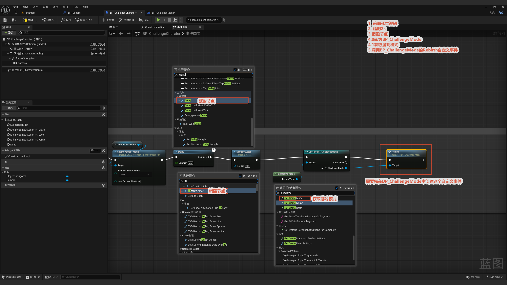
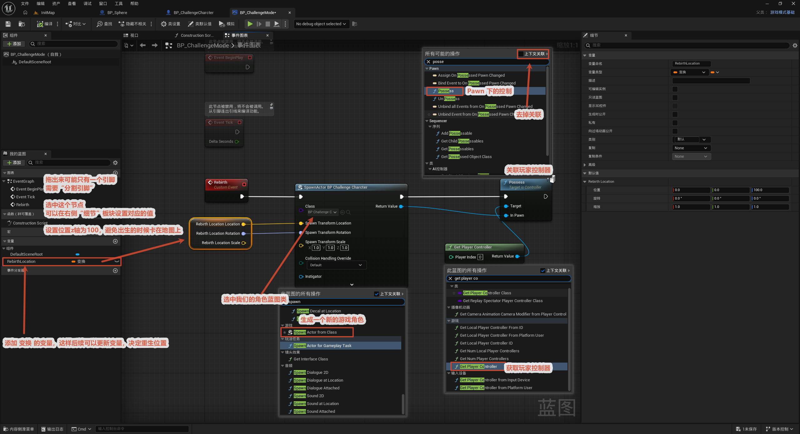

# 死亡后重生

本节在死亡系统基础上加上"重生"：在 `Dead` 事件末尾延迟一下，然后调用 `Rebirth` 自定义事件——它在重生点生成一个新角色，并让玩家控制器 Possess（接管）新角色，实现死亡后重新操控。

整体流程一览：

> `Dead` 末尾 → `Delay`（给死亡表现留时间）→ 调用 `Rebirth` → `Spawn Actor`（在重生点生成新角色）→ `Get Player Controller` → `Possess`（玩家重新接管）

核心思路：**重生不是把死掉的布娃娃"扶起来"，而是直接生成一个全新的角色**，再把玩家控制器 Possess 到新角色上。重生位置用一个 `Rebirth Location`（Transform）变量保存，由检查点系统（见 [8. 检查点制作](../8.检查点制作/检查点制作.md)）更新，所以重生会回到最后经过的检查点。

---

## 1. 补充 Dead 事件

**目的：** 把死亡和重生串起来。

**操作：** 在 `Dead` 自定义事件末尾接一个 `Delay`（给死亡动画 / 布娃娃表现留几秒），再调用 `Rebirth` 自定义事件。

> 通常在重生前还会对已死的旧角色做收尾（隐藏 / 禁用输入 / 销毁），具体节点以图中为准。

## 2. 编写 Rebirth 事件

**节点链：** `Rebirth` → `Spawn Actor from Class` → `Get Player Controller` → `Possess`。

- **Spawn Actor from Class**：Class 选自己的角色蓝图 `BP_ChallengeCharacter`，在重生点生成一个新角色。
  - **生成位置**用 `Rebirth Location`（Transform 变量）提供；位置 Z 设为 **100**，避免新角色出生时卡进地面。
  - `Rebirth Location` 的引脚可以"分割"出位置 / 旋转 / 缩放，逐项填。
- **Get Player Controller**：拿到当前玩家的控制器。
- **Possess**（在 Pawn 分类下）：把玩家控制器关联到新生成的角色，玩家就能重新操控。

> 关于 `Rebirth Location`：它是个 Transform 变量，**由检查点写入**（见 [8. 检查点制作](../8.检查点制作/检查点制作.md)），决定重生在哪。对旧的已死角色可以 `Unpossess`（"去掉关联"）再销毁。
