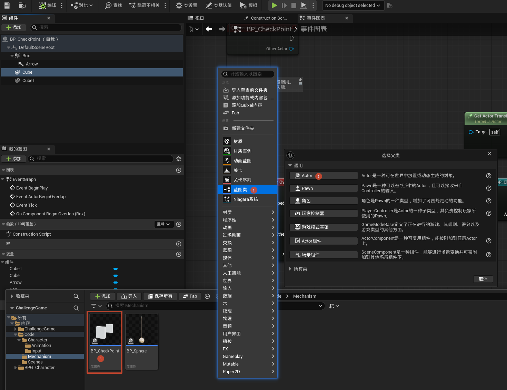
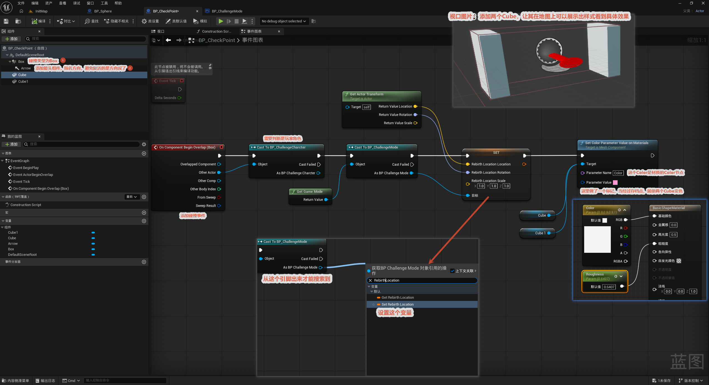

# 检查点制作

本节制作检查点：玩家经过时，把当前检查点的位置记录到游戏模式 (GameMode) 的 `Rebirth Location` 变量里作为重生点，并让检查点的 Cube 变色作为视觉反馈。这样死亡重生（见 [7. 死亡后重生](../7.死亡后重生/死亡后重生.md)）就会回到最后经过的检查点。

整体流程一览：

> 建检查点蓝图（Actor + Box + Arrow + Cube）→ 玩家碰到 Box → Cast 角色 + Get Game Mode → 把检查点 Transform 写入 `Rebirth Location` → Cube 变色反馈

核心思路：**重生位置存在 GameMode (`BP_ChallengeMode`) 里当全局变量**，而不是存在角色身上——因为检查点（写入方）和重生逻辑（读取方）是不同蓝图，用 GameMode 做"中转站"最干净。

---

## 1. 创建检查点蓝图类

**目的：** 创建检查点蓝图 `BP_CheckPoint`。

**操作：** 新建蓝图类，父类选 **Actor**，命名 `BP_CheckPoint`，然后加组件：

- **Box 碰撞**：检测玩家经过（触发重叠事件）。
- **Arrow（箭头）**：指示检查点朝向——重生位置会带上这个朝向，加箭头是为了避免"激活的方向反了"、重生时面朝错方向。
- **Cube（网格体）**：可视化标记，激活后变色（加两个 Cube 让效果更明显）。

## 2. 添加碰撞事件

**节点链：** `On Component Begin Overlap (Box)` → `Cast To BP_ChallengeCharacter`（确认是玩家）→ `Get Game Mode` → `Cast To BP_ChallengeMode` → `Get Actor Transform`（取本检查点的变换）→ `Set Rebirth Location`（位置 / 旋转 / 缩放）→ `Set Color Parameter Value on Materials`（Cube 变色）。

**关键点：**

- `Rebirth Location` 是 GameMode 上的变量，所以要先 `Get Game Mode` 再 `Cast To BP_ChallengeMode` 才能访问到它。
- 用 `Get Actor Transform` 把检查点自身的位置 / 朝向写进去，重生时就回到这里、朝向也一致。
- 最后改材质 Color 参数让 Cube 变色，给玩家"检查点已激活"的反馈。

> **架构要点：** `Rebirth Location` 放在 GameMode 里，检查点写、重生读，两边都通过 `Get Game Mode` 访问——这是跨蓝图共享游戏状态的标准做法。
