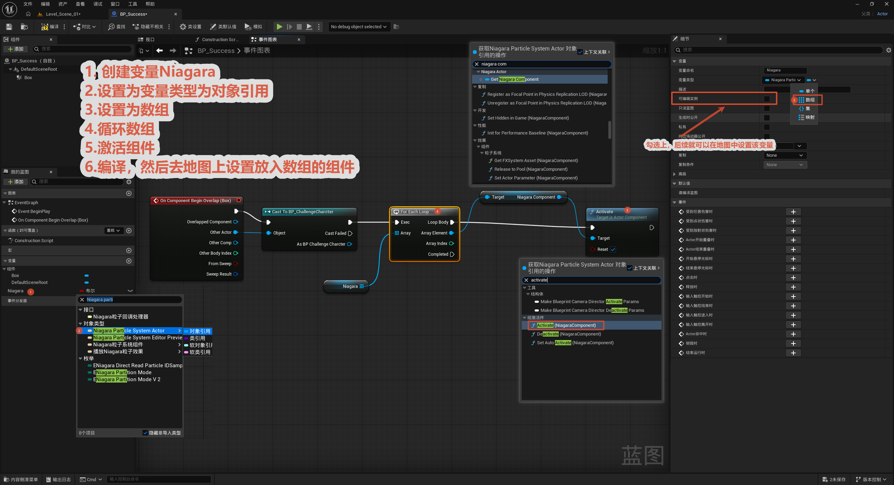
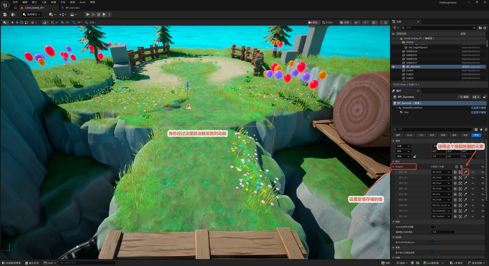

# 游戏胜利

本节制作游戏胜利触发：一个 `BP_Success` 蓝图（终点区域），玩家碰到时激活一组 Niagara 粒子特效（庆祝效果）并触发胜利动画。要激活的特效做成一个数组变量，方便在地图里逐个指定。

整体流程一览：

> 建 `BP_Success`（Box 触发 + Niagara 特效数组）→ 玩家碰到 Box → Cast 角色 → `For Each Loop` 遍历特效数组 → 逐个 `Activate` → 胜利动画

核心思路：**把要播放的庆祝特效做成"对象引用数组"变量，并设为实例可编辑**——这样每个终点实例都能在地图里单独指定要激活哪些特效；触发胜利时用 `For Each Loop` 遍历数组，逐个 `Activate`，一次性点燃所有庆祝粒子。

---

## 1. 胜利事件绑定

**节点链：** `On Component Begin Overlap (Box)` → `Cast To BP_ChallengeCharacter`（确认是玩家到达）→ `For Each Loop`（遍历 Niagara 数组）→ `Activate`（激活每个 Niagara 组件）。

**关键点：**

- 新建一个变量，类型设为 **Niagara 对象引用**，并**设为数组**——用来存要激活的特效组件。
- 勾选**实例可编辑**，编译后就能在地图细节面板里给每个终点实例指定特效组件。
- `For Each Loop` 循环数组，对每个元素调用 `Activate`，把庆祝特效全部点起来。

## 2. 设置变量

**目的：** 在地图里给终点实例填上要激活的特效。

**操作：** 选中地图里的 `BP_Success` 实例，用"吸取"把要激活的 Niagara 组件逐个填进数组变量（"使用这个吸取地图的元素"）。角色经过 Box 区域即触发胜利流程（特效 + 胜利动画）。

> 这是 [5.5 蹦床](../5.制作场景地图/5.5蹦床/蹦床.md)"实例可编辑变量"技巧的进阶版：这里变量是**数组**，可以在地图里挂多个特效组件，一份蓝图配出不同的庆祝效果。
