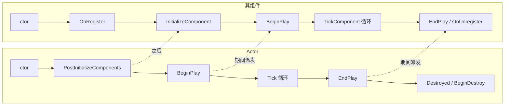

# 查阅 · Actor 与组件生命周期全表

> 本篇是查阅手册：Actor 与 UActorComponent 的**全部常用生命周期函数**按调用阶段排列，含"何时调用 / 蓝图对应 / 典型用途 / 注意事项"。宏觧行顺序讲解见[第 9 章 常用篇](/C++/9.运行顺序与生命周期-常用篇.md)；框架类（GameMode / Controller / GameInstance…）见[第 11 章](/C++/11.查阅-引擎启动与框架类生命周期.md)。对照引擎 5.4 源码（`Actor.cpp` / `ActorComponent.cpp`）。

## 快速导航

- [一、Actor 生成 / 加载阶段](#一生成--加载阶段每函数)
- [二、初始化阶段](#二初始化阶段)
- [三、运行阶段](#三运行阶段)
- [四、销毁阶段](#四销毁阶段)
- [五、Actor 与组件顺序对照](#五actor-与组件顺序对照)
- [六、UActorComponent 全表](#六uactorcomponent-全表)

---

## 一、生成 / 加载阶段（每函数）

生成路径（`SpawnActor`）和关卡加载路径（`PostLoad`）入口不同，汇合于初始化阶段。

| 函数 | 何时调用 | 蓝图对应 | 典型用途 | 注意 |
|---|---|---|---|---|
| **构造函数** | CDO、编辑器加载类、放置、生成时 | —（配置在类默认值面板） | `CreateDefaultSubobject`、默认值、关 Tick | 编辑器里也会跑，禁止游戏逻辑；`GetWorld()` 不可靠 |
| `PostSpawnInitialize` | 生成后引擎内部调用 | — | 一般不重写 | 内部串联 OnComponentCreated → 注册 → PostActorCreated → Construction |
| `PostActorCreated` | 生成新实例时（关卡加载**不**调用） | — | 与"新生成"相关的初始化 | 区分"摆好的"和"生成的"就靠它 vs PostLoad |
| `PostLoad` | 从磁盘反序列化（关卡摆放、保存加载） | — | 修正旧版本序列化数据 | 运行时 SpawnActor 不调用 |
| `PreRegisterAllComponents` | 注册组件前 | — | 少用 | — |
| `PostRegisterAllComponents` | 注册组件后 | — | 依赖组件已注册的设置 | — |
| `OnConstruction` / `ExecuteConstruction` | 生成时一次；**编辑器里每次移动/改属性** | Construction Script | 按生成参数动态装配（改网格、改材质） | 别放重逻辑，编辑器里会被高频调用；加载路径不触发 |

## 二、初始化阶段

| 函数 | 何时调用 | 蓝图对应 | 典型用途 | 注意 |
|---|---|---|---|---|
| `PreInitializeComponents` | 组件初始化前 | — | 少用 | — |
| **`PostInitializeComponents`** | 全部组件创建/注册/初始化完成后，BeginPlay 前 | — | 依赖**自家组件**的初始化 | 必须调 `Super::`（不调直接 Fatal）；此时**其它 Actor 未必就绪** |

组件侧的 `InitializeComponent` 见[第六节](#六uactorcomponent-全表)。

## 三、运行阶段

| 函数 | 何时调用 | 蓝图对应 | 典型用途 | 注意 |
|---|---|---|---|---|
| **`BeginPlay`** | 世界开始播放时统一派发；运行时生成则生成后当帧 | Event BeginPlay | 找其它 Actor / GameMode、绑定委托、开局逻辑 | 不调 `Super::BeginPlay()` ⇒ **组件 BeginPlay 全不执行**；组件 BeginPlay 在 Actor 之后 |
| `ReceiveBeginPlay` | 同上（蓝图事件入口） | Event BeginPlay | — | C++ 里一般直接重写 BeginPlay |
| **`Tick(DeltaTime)`** | 每帧（受 TickGroup 编排） | Event Tick | 每帧逻辑、插值、倒计时 | 默认开启，不用就 `PrimaryActorTick.bCanEverTick = false`；节流用 `SetTickInterval`；DeltaTime 受 TimeDilation 影响 |
| `ReceiveTick` | 同上 | Event Tick | — | — |
| `OnConstruction`（再次） | 编辑器移动/改属性 | Construction Script | — | 运行时不会反复触发 |

## 四、销毁阶段

| 函数 | 何时调用 | 蓝图对应 | 典型用途 | 注意 |
|---|---|---|---|---|
| **`EndPlay(Reason)`** | `Destroy`、切关卡、PIE 结束、流卸载、退出游戏 | Event EndPlay | 解绑委托、停计时器、清理 | 5 种 Reason 对照表见[第 9 章](/C++/9.运行顺序与生命周期-常用篇.md#5-endplay--离场清理)；组件 EndPlay 在 Actor EndPlay 内派发 |
| **`Destroyed`** | `Destroy()` 链上；基类实现第一行触发 EndPlay | Event Destroyed | 销毁特效、通知 | 想在 EndPlay 之前做清理就先写逻辑再调 `Super::Destroyed()` |
| `OnDestroyed` / `OnEndPlay`（委托） | 同上 | Bind Event to OnDestroyed / OnEndPlay | 外部监听某 Actor 销毁 | 委托广播，非虚函数 |
| `OnUnregister`（组件） | 组件注销时 | — | — | — |
| `BeginDestroy` | 进入 GC 队列 | — | 基本不用 | 引擎层，游戏逻辑别写这 |
| `IsSelected` / 编辑器事件 | 编辑器选中变化 | — | 编辑器工具开发用 | 运行时不触发 |

---

## 五、Actor 与组件顺序对照

同一时刻，Actor 虚函数与其组件虚函数的相对顺序（均已在源码核实）：

| 时机 | 顺序 |
|---|---|
| 组件注册 | 组件 `OnRegister` → Actor `PostRegisterAllComponents` |
| 组件初始化 | 组件 `InitializeComponent` → Actor `PostInitializeComponents` |
| 开始播放 | Actor `BeginPlay`（Super 调用点）→ 各组件 `BeginPlay` → Actor `BeginPlay` 剩余部分 |
| 每帧 | Actor `Tick` 与组件 `TickComponent` 各自独立由 TickGroup 调度，**互相顺序不保证** |
| 结束播放 | Actor `EndPlay` → 各组件 `EndPlay`（在 Actor EndPlay 基类实现内派发） |
| 注销 | 组件 `OnUnregister` / `UninitializeComponent` → Actor 层面无对应虚函数 |

---

## 六、UActorComponent 全表

组件（第 3 章讲过三类基座：`UActorComponent` / `USceneComponent` / `UPrimitiveComponent`）自己的生命周期：

| 函数 | 何时调用 | 蓝图对应 | 典型用途 | 注意 |
|---|---|---|---|---|
| 构造函数 | 同 Actor 构造时机 | — | `bWantsInitializeComponent = true`、Tick 开关 | 别放游戏逻辑 |
| `OnComponentCreated` | 所有人（Actor）创建后、注册前 | — | 少用 | — |
| **`OnRegister`** | `RegisterComponent` 时 | — | 注册期设置（物理、碰撞形态） | 每次注册/注销循环都会走 |
| `OnUnregister` | 注销时 | — | 与 OnRegister 配对清理 | — |
| **`InitializeComponent`** | Actor `PostInitializeComponents` 前 | — | 组件自身数据初始化 | 需构造函数里 `bWantsInitializeComponent = true`，否则不调用 |
| `UninitializeComponent` | 注销/销毁 | — | 配对清理 | — |
| **`BeginPlay`** | 所属 Actor `BeginPlay` 之后 | — | 开局逻辑、找外部引用 | 由 Actor 的 `BeginPlay` 基类实现派发 |
| **`TickComponent(DeltaTime, TickType)`** | 每帧 | — | 每帧逻辑 | `PrimaryComponentTick.bCanEverTick`；`SetComponentTickEnabled` 开关 |
| `Activate` / `IsActive` | `bAutoActivate` 或手动 `Activate()` | Activate 事件 | 启用组件功能 | 与 BeginPlay 是两套机制（激活≠开始播放） |
| `Deactivate` | 手动停用 | Deactivate 事件 | 暂停组件功能 | — |
| `EndPlay(Reason)` | 同 Actor EndPlay 链 | — | 清理 | — |
| `BeginDestroy` | GC 阶段 | — | — | 游戏逻辑别写这 |

> 常用开关速查：`SetComponentTickEnabled(bool)`、`SetComponentTickInterval(float)`、`SetAutoActivate`（构造期）、`SetIsReplicated(bool)`（网络）。

---

## 附：排查工具

| 现象 | 查什么 |
|---|---|
| "我的 BeginPlay 没跑" | 是不是关卡加载路径的 Actor 被流卸载？类是否 `bHidden`?；最常见：忘了 `Super::BeginPlay()` 导致连锁异常 |
| "组件没 Tick" | `PrimaryComponentTick.bCanEverTick`？被 `SetComponentTickEnabled(false)`？TickGroup 配置？ |
| "编辑器里 ConstructionScript 卡" | 里面是否有重操作（Spawn、查资产）？它在每次拖动都会执行 |
| "EndPlay 跑了两次" | 流关卡卸载 + Destroy 叠加；用 `EndPlayReason` 区分来源 |
