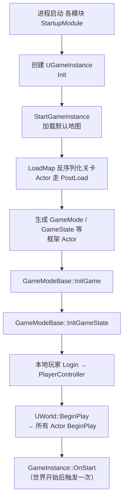
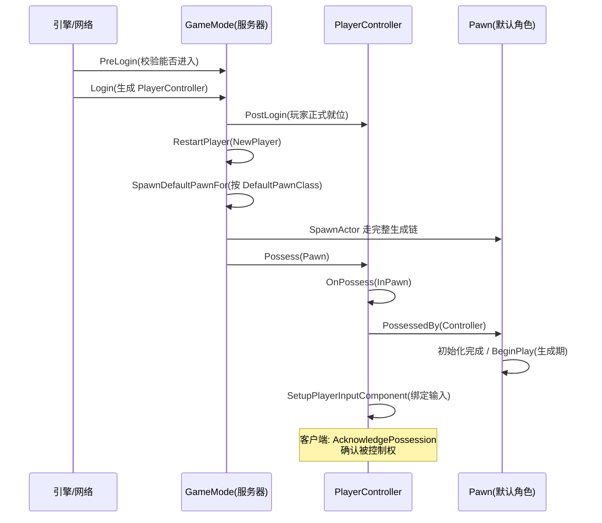

# 查阅 · 引擎启动与框架类生命周期

> 本篇是查阅手册：引擎 / 世界级的启动顺序，以及 GameMode、GameState、PlayerController、Pawn / Character、GameInstance、子系统这些**框架类**的生命周期函数。Actor / 组件层面的全表见[第 10 章](/C++/10.查阅-Actor与组件生命周期全表.md)，宏观讲解见[第 9 章 常用篇](/C++/9.运行顺序与生命周期-常用篇.md)。对照引擎 5.4 源码（`GameModeBase.cpp` / `GameInstance.cpp` / `World.cpp` / `Controller.h` / `Pawn.h`）。

## 快速导航

- [一、引擎到世界的启动时序](#一引擎到世界的启动时序)
- [二、玩家加入时序（登录 → 操控角色）](#二玩家加入时序)
- [三、AGameModeBase 全表](#三agamemodebase-全表)
- [四、GameState / PlayerState](#四gamestate--playerstate)
- [五、Controller / Pawn / PlayerController](#五controller--pawn--playercontroller)
- [六、UGameInstance](#六ugameinstance)
- [七、子系统（Subsystem）](#七子系统)
- [八、World 常用委托](#八world-常用委托)

---

## 一、引擎到世界的启动时序

独立游戏启动（PIE 流程类似，只是世界来自编辑器复制）：



要点：

- **GameMode 的 InitGame / InitGameState 早于所有 Actor 的 BeginPlay**（第 9 章总览图②→④）——在 Actor 的 BeginPlay 里访问 GameMode / GameState 是安全的；
- `GameMode 只存在于服务器`：单机就是本地；多人游戏里客户端没有 GameMode，对应逻辑在 GameState（复制）里；
- PIE 与独立启动的主要差异：世界来自编辑器复制（而不是从磁盘加载），所以 PIE 里编辑器摆放的 Actor 有一步"复制世界"的过程，生命周期函数不变。

## 二、玩家加入时序

玩家进入（或重生）时的完整链路，是第 1 章"GameMode 指定默认 Pawn"背后的机制：



- 重生（第 7 章死亡后重生）走的还是 `RestartPlayer` 这条链——`Destroy` 旧 Pawn → `RestartPlayer` 重新生成/possess；
- `Possess` 之后输入才会路由到 Pawn 的 `SetupPlayerInputComponent`（第 2 章的输入绑定就发生在这里）。

## 三、AGameModeBase 全表

按场景分组（均为 `AGameModeBase` 虚函数，5.4 源码核实）：

**初始化 / 开局**

| 函数 | 何时调用 | 典型用途 |
|---|---|---|
| `InitGame(MapName, Options, ErrorMessage)` | 地图加载后、任何 Actor 初始化前 | 读启动参数、全局配置，GameMode 最早的入口 |
| `InitGameState` | GameState 生成后 | 初始化 GameState 数据 |
| `StartPlay` | World BeginPlay 链中 | 默认实现调 GameState::HandleBeginPlay，一般不重写 |

**玩家进出**

| 函数 | 何时调用 | 典型用途 |
|---|---|---|
| `PreLogin(Options, Address, UniqueId, ErrorMessage)` | 连接请求时（服务器） | 校验能否进入（版本、人数上限） |
| `Login(...)` | 校验通过后 | 生成/复用 PlayerController |
| `PostLogin(NewPlayer)` | PlayerController 就位后 | 开局广播、给玩家发初始消息 |
| `Logout(Exiting)` | 玩家断开 | 清理、保存数据 |

**重生 / 出生点**

| 函数 | 何时调用 | 典型用途 |
|---|---|---|
| `RestartPlayer(NewPlayer)` | PostLogin 后、死亡重生时 | 重生总入口（第 7 章重生机制就是它） |
| `RestartPlayerAtPlayerStart` / `RestartPlayerAtTransform` | 同上变体 | 指定出生点/位置重生 |
| `ChoosePlayerStart` | RestartPlayer 内 | 挑选 PlayerStart（第 8 章检查点可重写它） |
| `SpawnDefaultPawnFor(Player)` | RestartPlayer 内 | 按第 1 章的 DefaultPawnClass 生成角色 |
| `SetPlayerDefaults(PlayerPawn)` | 生成后 | 给角色设默认值（速度、名称等） |

**暂停 / 切换**

| 函数 | 何时调用 | 典型用途 |
|---|---|---|
| `SetPause / ClearPause / AllowPausing` | 暂停请求 | 暂停逻辑（单机常用 SetPause） |
| `ResetLevel / Reset` | 手动 Reset 调用 | 重置关卡到初始状态 |
| `ProcessServerTravel / CanServerTravel` | 服务器切图 | 多人无缝/非无缝切换 |
| `SwapPlayerControllers` | 无缝切换中 | 换控制器 |

> `AGameMode`（比赛状态扩展）额外有 `StartMatch / OnMatchStateSet` 等状态机函数，单机学习阶段用 `AGameModeBase` 足够。

## 四、GameState / PlayerState

| 类 | 函数 | 何时调用 | 典型用途 |
|---|---|---|---|
| `AGameStateBase` | `HandleBeginPlay` | World BeginPlay 链中 | 默认实现触发所有 Actor 的 BeginPlay，别乱重写 |
| `AGameStateBase` | `HasMatchStarted / HasMatchEnded` | 查询 | 判断比赛状态（GameMode 同名函数转发到这里） |
| `APlayerState` | `CopyProperties(PlayerState)` | 无缝切换/重生复制时 | 把旧 PlayerState 数据拷到新对象（分数、名次） |
| `APlayerState` | `OnRep_…` 系列 | 客户端属性同步 | 多人场景客户端刷新 UI |

单机学习阶段最常用的其实只是：**GameState 存全局数据（剩余时间、比分），PlayerState 存每玩家数据（名字、分数）**——它们的存在是因为 GameMode/PlayerController 不复制到客户端。

## 五、Controller / Pawn / PlayerController

**AController**

| 函数 | 何时调用 | 典型用途 |
|---|---|---|
| `OnPossess(InPawn)` | Possess 成功后（服务器/本机） | Controller 侧接管初始化（AI 控制逻辑常写这里） |
| `OnUnPossess` | 失控时 | 清理 |

**APlayerController（继承 AController）**

| 函数 | 何时调用 | 典型用途 |
|---|---|---|
| `AcknowledgePossession(P)` | 客户端确认控制权 | 客户端侧初始化 |
| `SetupInputComponent` | 收到输入组件时 | 绑定控制器级输入（比 Pawn 的 SetupPlayerInputComponent 更早） |
| `OnPossess / OnUnPossess` | 同 AController | 同上 |

**APawn / ACharacter**

| 函数 | 何时调用 | 典型用途 |
|---|---|---|
| `PossessedBy(NewController)` | 被 Possess 时（Pawn 侧） | Pawn 接管初始化；玩家/AI 通用 |
| `UnPossessed` | 失控时 | 清理 |
| `SetupPlayerInputComponent` | 被玩家控制器接管后 | **绑定增强输入**（第 2 章重写的就是它；AI 控制的 Pawn 不会调用） |
| `OnRep_PlayerState` | 客户端 PlayerState 同步到 | 客户端拿 PlayerState |
| `PawnClientRestart` | 客户端重接管 | 重新绑定输入 |

> ACharacter 没有额外的大生命周期虚函数，它的扩展在**组件事件**上：`CharacterMovement` 的 `OnMovementUpdated`、`ACharacter` 的 `OnLanded`/`Landed`（落地事件，跳跃落地逻辑常用）、`OnJumped`。

## 六、UGameInstance

游戏进程级的"全局管家"（第 1 章提过它在 World 之上）：

| 函数 | 何时调用 | 典型用途 |
|---|---|---|
| `Init` | 引擎启动时（一次） | 全局初始化、创建/加载存档管理器 |
| `Shutdown` | 进程退出时（一次） | 全局清理、保存 |
| `StartGameInstance` | 启动流程中 | 加载默认地图（一般不重写） |
| `OnStart` | 第一个世界 BeginPlay 后（一次） | 开局全局逻辑（PIE 里也会触发） |
| `OnWorldChanged(World)` | 切换世界时 | 清理与旧世界绑定的资源 |

## 七、子系统（Subsystem）

不继承 Actor 的"全局对象"方案（5.x 官方推荐）：

| 子系统类型 | 生命周期 | 常见用途 |
|---|---|---|
| `UEngineSubsystem` | 引擎全程 | 与世界无关的工具（通知中心） |
| `UGameInstanceSubsystem` | GameInstance 全程 | 存档、音频管理器等跨关卡服务 |
| `UWorldSubsystem` | 每个世界一份 | 世界级管理器；`OnWorldBeginPlay` 在世界开始时被调（第 9 章总览图④） |
| `ULocalPlayerSubsystem` | 每本地玩家 | UI、输入辅助 |

统一接口：`ShouldCreateSubsystem` → `Initialize()`（注册时）→ `Deinitialize()`（注销时）；World 子系统另有 `OnWorldBeginPlay`。蓝图里通过 `Get GameInstance Subsystem` 等节点访问——**子系统天然单例，是替代"全局 Actor 管理器"玩法的现代答案**。

## 八、World 常用委托

不重写类也能挂进生命周期（`FWorldDelegates`，静态绑定示例）：

```cpp
// 模块/插件启动时注册一次
FWorldDelegates::OnPostWorldInitialization.AddLambda(
    [](UWorld* World, const UWorld::InitializationValues) {
        // 任何世界初始化后
    });
```

| 委托 | 时机 |
|---|---|
| `FWorldDelegates::OnPostWorldInitialization` | 世界初始化后 |
| `AWorldSettings::OnWorldBeginPlay`（实例委托） | 世界 BeginPlay（广播给所有 Actor 之前） |
| `FWorldDelegates::OnWorldCleanup` | 世界清理 |
| `UWorld::OnActorsInitialized` | 所有关卡 Actor 初始化后 |

---

## 附：常见依赖问题速查

| 问题 | 依据 |
|---|---|
| BeginPlay 里能拿 GameMode / GameState 吗 | 能——`InitGame / InitGameState` 早已完成（第 9 章总览图②→④） |
| BeginPlay 里能拿别的 Actor 吗 | 同关卡摆好的可以（同一批派发，但**互相顺序不保证**——用委托/延迟一帧更稳）；运行时生成的不可靠（它可能还没生成） |
| `SetupPlayerInputComponent` 什么时候被调 | Pawn 被**玩家**控制器 Possess 之后；AI Possess 不调用 |
| 玩家断线 / PIE 结束时清理写哪 | Pawn `EndPlay`（Reason 区分来源）+ GameMode `Logout` |
