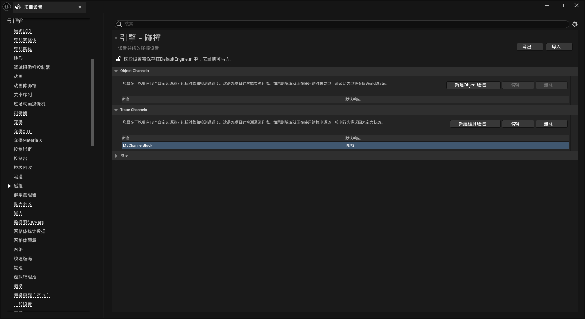

# LineTrace：射线检测

`EnemyCharacter` 里已经写过这样一段"敌人视线检测"：每帧从敌人向玩家发一条射线，射线没被障碍物挡住就算"看得见"，看得见就转身面向玩家——

```cpp
// EnemyCharacter.cpp（精简版，完整实现见源码）
bool AEnemyCharacter::CanSeeActor(const AActor* TargetActor, FVector Start, FVector End) const
{
    FHitResult Hit;                                          // 单次检测的命中结果
    ECollisionChannel Channel = ECollisionChannel::ECC_Visibility;  // 用 Visibility 通道

    FCollisionQueryParams QueryParams;
    QueryParams.AddIgnoredActor(this);                       // 忽略敌人自己
    QueryParams.AddIgnoredActor(TargetActor);                // 忽略玩家

    GetWorld()->LineTraceSingleByChannel(Hit, Start, End, Channel, QueryParams);

    DrawDebugLine(GetWorld(), Start, End, FColor::Blue, false);  // 视口里画出来看

    return !Hit.bBlockingHit;    // 没被挡住 = 看得见
}
```

这就是 **LineTrace（线性射线检测）**——从起点到终点发一条看不见的射线，问引擎："这条线路上最先撞到什么？"它是 UE 里最高频的物理查询手段：AI 视线、子弹命中、鼠标点击拾取、角色落地判断，底层全是它。

---

## 一、一次 LineTrace 的五个要素

```cpp
GetWorld()->LineTraceSingleByChannel(
    OutHit,       // ① FHitResult&：出口参数，引擎把命中结果写进去
    Start,        // ② 起点（FVector）
    End,          // ③ 终点（FVector）——射线只走这一段，不会无限延伸
    Channel,      // ④ 用哪条碰撞通道去"问"
    QueryParams   // ⑤ 附加参数：忽略谁、要不要复杂碰撞等（可省略）
);
```

缺一不可的是前四个。**通道（④）决定"谁能回答这条射线"**：物体对该通道的响应是 `Block` 就会挡住射线，`Ignore` 就当它不存在，`Overlap` 表现为"碰到但不挡"（Multi 检测时能记录到它，详见[第五节](#五single-与-multiblock-与-overlap)）。

## 二、FHitResult：命中结果里有什么

```cpp
if (Hit.bBlockingHit)                    // 最先看它：到底挡没挡住
{
    Hit.GetActor();                      // 打中的 Actor（可能为空，判空再用）
    Hit.GetComponent();                  // 打中的具体组件（碰撞是组件级的！）
    Hit.ImpactPoint;                     // 命中点在【对方表面】的世界坐标
    Hit.Location;                        // 射线实际停下的位置（= 表面命中点）
    Hit.ImpactNormal;                    // 命中表面的法线（做反射、贴墙用）
    Hit.Distance;                        // 从起点到命中点的距离（射程判断用）
    Hit.BoneName;                        // 打中的骨骼名（命中头部/身体判定用）
    Hit.PhysMaterial.Get();              // 物理材质（子弹打沙地/金属不同特效）
}
```

最容易混的一对：**`ImpactPoint` vs `Location`**。对 LineTrace 来说两者数值相同；但对 Sweep（带体积的检测，见[小结](#小结)）来说，`Location` 是检测体中心停下的位置，`ImpactPoint` 才是真正贴到对方表面的点。习惯上取表面点一律用 `ImpactPoint`。

## 三、四个 ByChannel / ByObjectType 函数

| 函数 | 返回 | 一句话用途 |
|---|---|---|
| `LineTraceSingleByChannel` | 第一个 Block 命中 | **默认选它**。视线检测、射击命中 |
| `LineTraceMultiByChannel` | 沿途所有命中（到 Block 为止） | 射线穿过的所有 Overlap 物体都要知道时 |
| `LineTraceSingleByObjectType` | 第一个 Block 命中 | 只关心**某几类物体**（如只打 Pawn），对无关物体完全免疫 |
| `LineTraceSingleByProfile` | 第一个 Block 命中 | 用预设的碰撞 Profile（如 `Pawn`）整体提问 |

`ByChannel` 和 `ByObjectType` 的区别在"提问方式"：

```cpp
// ByChannel：拿一条通道问所有物体 —— "Visibility 通道上谁挡我？"
GetWorld()->LineTraceSingleByChannel(Hit, Start, End, ECC_Visibility);

// ByObjectType：先圈定物体类型，只问这几类 —— "在 Pawn 和 PhysicsWorld 里谁挡我？"
FCollisionObjectQueryParams ObjectParams;
ObjectParams.AddObjectTypesToQuery(ECC_Pawn);
ObjectParams.AddObjectTypesToQuery(ECC_PhysicsBody);
GetWorld()->LineTraceSingleByObjectType(Hit, Start, End, ObjectParams);
```

记法：**ByChannel 按"我拿的尺子"筛选，ByObjectType 按"被测者"筛选**。想忽略一大片无关物体时 ByObjectType 更省（比如 UI 拾取只关心 Pawn，墙、道具天然不参与）。

## 四、FCollisionQueryParams：检测的开关面板

```cpp
FCollisionQueryParams QueryParams;
QueryParams.AddIgnoredActor(this);            // 忽略指定 Actor（可多次调用）
QueryParams.AddIgnoredActors(TArray);         // 批量忽略
QueryParams.bTraceComplex = true;             // 用复杂碰撞（三角面级，准但慢；命中特效贴表面用）
QueryParams.bReturnPhysicalMaterial = true;   // 让 Hit.PhysMaterial 有效（默认不开！）
QueryParams.bIgnoreTouches = true;            // 连 Overlap 命中也不要，只要 Block
```

**忘记忽略自己是新手第一大坑**：射线从自己身体里发出，第一帧就打中自己的碰撞胶囊，`bBlockingHit` 永远为 true——敌人就"永远看得见"或"永远看不见"（取决于取不取反）。凡是从 Actor 自身出发的射线，`AddIgnoredActor(this)` 必写。

## 五、Single 与 Multi、Block 与 Overlap

项目里同时演示了两种检测，两者的行为差异值得单独记：

```cpp
GetWorld()->LineTraceSingleByChannel(Hit, Start, End, Channel, QueryParams);       // 单发
GetWorld()->LineTraceMultiByChannel(HitResults, Start, End, Channel, QueryParams); // 多发
```

- **Single**：只把**第一个 Block 命中**写进 `FHitResult`，问的是"最先撞到谁"；
- **Multi**：把沿途命中的**所有结果**按顺序写进 `TArray<FHitResult>`——但注意：**碰到 Block 响应的物体就截止**，后面的物体不会进数组。

所以 Multi 并不是"穿透一切"，它收集的是"沿途所有 Overlap 命中 + 直到第一个 Block 为止"。想让射线真正穿过并记录每个物体，要把物体对所用通道的响应改成 **Overlap**（比如静态网格体 Collision Preset 选 `OverlapAll`）；响应为 **Ignore** 的物体则对 Multi 也完全隐形。这三种响应放在一张表里：

| 物体对通道的响应 | Single 结果 | Multi 结果 |
|---|---|---|
| `Block` | 命中并停止 | 记录该结果并**截止** |
| `Overlap` | 不命中（Single 只认 Block） | 记录该结果，继续前进 |
| `Ignore` | 当不存在 | 当不存在 |

另外 Multi 版本有个隐藏考点：`CanSeeActor` 是 `const` 成员函数，而 `LineTraceMultiByChannel` 的出参是 `TArray<FHitResult>&`（要写入）。**const 函数里成员变量只读，传不出去**——所以项目里给 `HitResults` 加了 `mutable`：

```cpp
// EnemyCharacter.h
// CanSeeActor 是 const 成员函数，成员变量在其中是只读的，
// 加 mutable 才能传给 LineTraceMultiByChannel 的 TArray<FHitResult>& 出参
UPROPERTY(EditAnywhere)
mutable TArray<FHitResult> HitResults;
```

`mutable` 的语义就是"排除在 const 之外"——逻辑上不改变对象状态（只是缓存/出参用途）的成员，用它绕开 const 限制是 C++ 惯用法。

## 六、碰撞通道：预设与自定义

预设通道直接用枚举：`ECC_Visibility`（能被"看见"的几何体都挡它，视线检测首选）、`ECC_Camera`（专门给相机用，防止相机穿墙）、`ECC_WorldStatic` / `ECC_WorldDynamic` / `ECC_Pawn` / `ECC_PhysicsBody`（Object 通道，按物体类别用）。

预设不够用时可以自定义：**编辑器 → 项目设置 → Collision → New Trace Channel / New Object Channel**：



选择通道类型时：

- **TraceType（射线通道）**：给 LineTrace 用的"尺子"，蓝图里显示为 `TraceTypeQuery1`，C++ 对应 `ECC_GameTraceChannel1`；
- **ObjectType（物体通道）**：给物体归类用的"身份牌"，蓝图里是 `ObjectTypeQuery1`，配合 ByObjectType 检测。

新建后 `Config/DefaultEngine.ini` 会多出一行（项目里已建过 `MyChannelBlock` 通道）：

```ini
+DefaultChannelResponses=(Channel=ECC_GameTraceChannel1,
                          DefaultResponse=ECR_Block, bTraceType=True,
                          Name="MyChannelBlock")
```

各字段：`DefaultResponse=ECR_Block` 表示新通道对所有物体默认阻挡；`bTraceType=True` 表示这是射线通道。C++ 里切换使用只需一行：

```cpp
// ECollisionChannel Channel = ECollisionChannel::ECC_Visibility;
ECollisionChannel Channel = ECollisionChannel::ECC_GameTraceChannel1;  // 换成自定义通道
```

::: warning 通道枚举值会错位
每个自定义通道的枚举值（GameTraceChannel1/2/3…）**按添加顺序递增**。中途删除或调整顺序，已有枚举值会整体错位——`ECC_GameTraceChannel2` 可能已经不是原来那条通道。改通道列表后要全局搜索引用处逐一核对。
:::

## 七、调试：DrawDebugLine

```cpp
#include "DrawDebugHelpers.h"

// 一条只显示一帧的蓝色线（放 Tick 里每帧重画，肉眼看就是持续的线）
DrawDebugLine(GetWorld(), Start, End, FColor::Blue, false);

// 常用变体
DrawDebugLine(GetWorld(), Start, End, FColor::Green, true, -1.f, 0, 2.f);  // 持久 + 粗 2
DrawDebugPoint(GetWorld(), Hit.ImpactPoint, 12.f, FColor::Red, false);     // 标出命中点
DrawDebugSphere(GetWorld(), Hit.ImpactPoint, 10.f, 12, FColor::Red);       // 命中点画球
```

参数依次是：世界、起点、终点、颜色、是否持久（`false` = 只显示一帧，`true` = 一直留着，**记得手动清理或用 `-1.f` 生命周期**）、寿命、深度优先级、粗细。

写在检测旁边，视线逻辑对不对一眼便知——"看不见玩家"八成是射线被意外东西挡了，画出来立刻真相大白。**发布版本别忘删**（或用 `#if ENABLE_DRAW_DEBUG` 包起来）。

## 八、完整流程：敌人视线检测

把上面所有要素串起来，就是项目里的实现。整个调用链：

```
BeginPlay ──> GetPlayerCharacter 拿到目标
    │
Tick ──> LineTraceActor(Target)
             ├─ 起点 = 自己位置，终点 = 目标位置
             ├─ CanSeeActor：LineTraceSingleByChannel + 忽略双方 + DrawDebugLine
             │      └─ return !Hit.bBlockingHit（没挡住 = 看得见）
             └─ 看得见 ──> FindLookAtRotation(Start, End) 算朝向
                           └─ SetActorRotation 转身面向玩家
```

```cpp
// EnemyCharacter.cpp —— LineTraceActor：检测 + 转向
bool AEnemyCharacter::LineTraceActor(const AActor* TargetActor)
{
    if (TargetActor == nullptr) return false;          // 目标没生成直接返回

    FVector Start = GetActorLocation();                // 起点：敌人位置
    FVector End   = TargetActor->GetActorLocation();   // 终点：玩家位置

    if (CanSeeActor(TargetActor, Start, End))
    {
        // 让 X 轴指向目标方向所需的旋转角（Kismet 数学库工具函数）
        FRotator DirectRotation = UKismetMathLibrary::FindLookAtRotation(Start, End);
        SetActorRotation(DirectRotation);              // 看得见：转身面向玩家
        return true;
    }
    return false;                                      // 看不见：不动
}
```

两个工程细节：`GetPlayerCharacter` 写在 `BeginPlay` 而不是构造函数——构造阶段世界还没完全初始化；`CanSeeActor` 声明为 `const`——它只做只读查询不改状态，语义上就该是 const（这也是引出 `mutable` 的前提）。

## 九、常见坑汇总

| 坑 | 说明与正确姿势 |
|---|---|
| **没忽略自己** | 射线打中自己的碰撞胶囊。从自身出发的射线必写 `AddIgnoredActor(this)`；连目标一起忽略，否则"看得见"的永远是对方碰撞体 |
| **`PhysMaterial` 永远是空** | 默认不返回物理材质。要 `QueryParams.bReturnPhysicalMaterial = true` |
| **Multi 以为能穿透** | Multi 遇到 Block 即截止。要"穿过并记录每个物体"，把物体对通道的响应改成 Overlap，不是换 Multi |
| **Overlap 物体 Single 测不到** | Single 只认 Block 命中，Overlap 响应的物体对它隐形——要收集这类物体用 Multi 或 ByObjectType |
| **自定义通道后枚举错位** | 删改通道列表会使 GameTraceChannel 枚举值整体偏移，全局搜索引用逐一核对（见[第六节](#六碰撞通道预设与自定义)） |
| **调试线残留** | `DrawDebugLine` 持久模式（`true`）的线不会自己消失，久了满屏线。Tick 里调试用 `false` 每帧重画 |
| **`Hit.GetActor()` 不判空** | 命中的可能是纯组件场景，用前判 `nullptr` |
| **每帧 LineTrace 太多** | 单条 LineTrace 很便宜，但 × 敌人数 × 每帧仍需节制。视线检测可降到 0.1s 一次（Timer 或计数器），人眼根本看不出差别 |

## 小结

- LineTrace 五要素：`FHitResult` 出参、起点、终点、通道、QueryParams；
- 通道决定谁能回答：`Block` 挡住、`Ignore` 隐形、`Overlap` 碰而不挡（Single 不认、Multi 记录）；
- 函数家族一句话：**默认 SingleByChannel**；要沿途所有命中用 Multi；只关心某类物体用 ByObjectType；按预设问用 ByProfile；
- `FCollisionQueryParams` 是开关面板：忽略自己必写，`bReturnPhysicalMaterial` 按需开；
- 自定义 Trace 通道走项目设置，`bTraceType=True` 对应 `ECC_GameTraceChannel1`，删改列表警惕枚举错位；
- `DrawDebugLine` 是射线检测的"眼睛"，调试期必开、发布前必删；
- LineTrace 的近亲：**Sweep**（射线换成带体积的形状，如胶囊/球，函数名换成 `SweepSingleByChannel`，武器近战判定、角色落地检测常用）与 **Overlap**（不问路径、只问一块区域里有什么，`OverlapMultiByObjectType`）——三件套合称 UE 物理查询。
