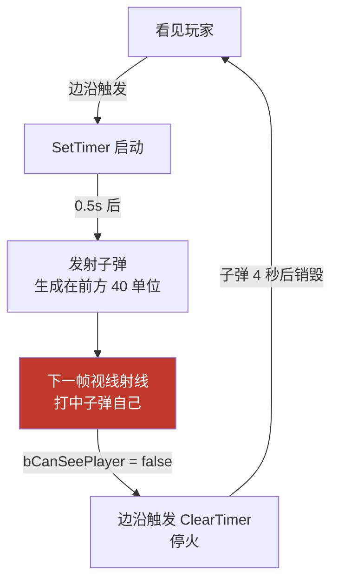
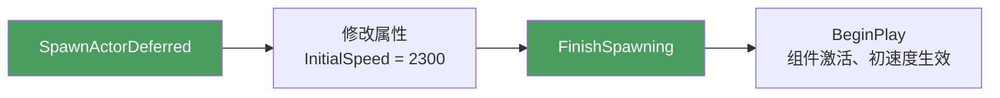

# 实战：发射子弹与定时开火

第 14 章重构完视线检测后，敌人"看得见玩家"也只是打一行日志。这次让它真的开火：看见玩家就每隔几秒发射一颗子弹（源码在 `Source/MyThird/Projectile/BallProjectile.cpp` 与 `EnemyCharacter.cpp` 的 `Fire`）。

一个能开火的敌人需要四块拼图：

| 拼图 | 用什么 |
|---|---|
| 子弹本身 | 自定义 `ABallProjectile`：球体碰撞 + 投射物移动组件 |
| 子弹的"皮" | C++ 基类 + 蓝图子类（网格体、材质在蓝图里配） |
| 生成子弹 | `SpawnActorDeferred` + `FinishSpawning` |
| 何时开火 | 边沿触发（看见/看不见的状态变化）+ `FTimerHandle` 定时器 |

---

## 一、组装子弹 Actor

### 组件搭配

```cpp
ABallProjectile::ABallProjectile()
{
    PrimaryActorTick.bCanEverTick = true;

    SphereComponent = CreateDefaultSubobject<USphereComponent>("Sphere Component");
    SphereComponent->SetSphereRadius(35.f);
    SetRootComponent(SphereComponent);                       // 球体当根

    ProjectileMovementComponent =
        CreateDefaultSubobject<UProjectileMovementComponent>("Projectile Movement Component");
    ProjectileMovementComponent->InitialSpeed = 1300.f;      // 初速度

    SphereComponent->SetCollisionEnabled(ECollisionEnabled::QueryAndPhysics); // 物理通道必须开着
    SphereComponent->SetSimulatePhysics(true);               // 开启模拟物理
}
```

两个组件的分工：

| 组件 | 基类家族 | 职责 |
|---|---|---|
| `USphereComponent` | Scene 系（有位置） | 根组件：碰撞外形 + 物理模拟 |
| `UProjectileMovementComponent` | 纯逻辑（`UActorComponent`） | 按初速度飞行、命中后的弹射/停止 |

注意 `ProjectileMovementComponent` **没有也不需要 `SetupAttachment`**——第 3 章的规则：只有 Scene 系组件才存在"挂在哪"的问题，运动组件是纯逻辑，只驱动别人的位移，自己不在场景层级里。它默认驱动的就是 Actor 的根组件（更新 `UpdatedComponent`），所以球体既是碰撞体也是被驱动的对象。

### 碰撞与物理

`SetCollisionEnabled(QueryAndPhysics)` 把碰撞从"仅查询"（LineTrace 能测到但不产生物理效果）升级为"查询 + 物理"；`SetSimulatePhysics(true)` 让球体真正参与物理模拟——撞墙会弹、落地会滚。注释里那句"物理通道必须开着"就是指前者：不开 `Physics` 类型，模拟物理没有意义。

### 关键配置：别让子弹挡住自己的视线

本章踩过的一个真实坑。最初子弹发射后敌人就"停火"了，故障链是这样的：



原因：第 14 章视线检测的射线走 `ECC_Visibility` 通道，而球体碰撞体**默认对 Visibility 是 Block 响应**——子弹正好飞在敌人与玩家之间的视线上，把自己"晃瞎"了。更糟的是模拟物理下子弹可能落地停在脚边滚，一挡就是整个 4 秒生命周期。

修法是让子弹对 Visibility 通道**忽略**——子弹是"打出去的东西"，不该参与"能不能被看见"的判定：

```cpp
// 对 Visibility 通道忽略:视线检测(LineTrace)用的是 ECC_Visibility,
// 子弹若响应该通道会挡住敌人自己的射线,导致"发射 → 看不见 → 停火"的振荡
SphereComponent->SetCollisionResponseToChannel(ECC_Visibility, ECR_Ignore);
```

这里体现了碰撞系统的分层设计：`SetCollisionEnabled` 决定**整体**开不开碰撞，`SetCollisionResponseToChannel` 再**按通道**细调每个通道的响应（Block / Overlap / Ignore）。物理模拟照常（走 Physics 通道），唯独视线检测穿透子弹。另一种做法是生成子弹时把它加进视线检测的 `IgnoreActors` 列表，但每颗子弹都要登记、还要管理生命周期，远不如通道响应一行来得干净。

### 自动销毁

```cpp
void ABallProjectile::BeginPlay()
{
    Super::BeginPlay();
    SetLifeSpan(4.f);   // 4 秒后自动 Destroy
}
```

子弹是消耗品，打不中人也会一直飞（或一直滚）。`SetLifeSpan` 让 Actor 在指定秒数后自动销毁，防止场景里积累成百上千个失效球体拖垮性能。

## 二、TSubclassOf：C++ 基类 + 蓝图子类

`ABallProjectile` 在 C++ 里只有碰撞和运动，**没有外观**——网格体、材质这类美术资产适合放蓝图。于是敌人在 C++ 里只引用"类"，实例交给编辑器配：

```cpp
// EnemyCharacter.h
UPROPERTY(EditAnywhere)
TSubclassOf<ABallProjectile> BallProjectileClass;   // 在蓝图里选一个 BallProjectile 的子类
```

`TSubclassOf<T>` 是"指向 T 或其子类的类引用"（第 4 章反射体系的常客）。这样 C++ 只认识基类接口，蓝图子类 `BP_BallProjectile` 负责挂网格体、调材质——逻辑与外观分离，想换子弹外观改蓝图即可，不用重编译 C++。

## 三、两种生成方式：SpawnActor vs SpawnActorDeferred

### 先看普通写法

```cpp
// Fire() 里被注释掉的旧写法：
GetWorld()->SpawnActor<ABallProjectile>(BallProjectileClass, SpawnLocation, GetActorRotation());
```

一步到位，但生成后想再改参数就**晚了**——`SpawnActor` 返回时 Actor 已经跑完 `BeginPlay`，组件都已激活。比如把 `InitialSpeed` 从构造函数里的 1300 改成 2300：运动组件在激活时就把初速度换算成了实际速度，之后再改 `InitialSpeed` 字段，飞出去的球不会变快。

### 延迟生成：在"出厂前"动手术

```cpp
void AEnemyCharacter::Fire()
{
    if (BallProjectileClass == nullptr) return;    // 蓝图没配类就别开火

    FVector ForwardVector = GetActorForwardVector();
    float SpawnDistance = 40.f;
    FVector SpawnLocation = GetActorLocation() + ForwardVector * SpawnDistance;
    // 生成点沿朝向前方偏移 40 单位，避免子弹生成在敌人身体里、一出生就撞自己

    FTransform SpawnTransform(GetActorRotation(), SpawnLocation);
    ABallProjectile* Projectile =
        GetWorld()->SpawnActorDeferred<ABallProjectile>(BallProjectileClass, SpawnTransform);

    Projectile->GetProjectileMovementComponent()->InitialSpeed = 2300;   // 此时还没激活，改了才算数

    Projectile->FinishSpawning(SpawnTransform);    // 到这里才真正"出生"
}
```

两种方式的流程对照：

| | `SpawnActor` | `SpawnActorDeferred` + `FinishSpawning` |
|---|---|---|
| 调用次数 | 一次 | 两次（Deferred 拿半成品 → Finish 收尾） |
| 返回时 Actor 状态 | 已 `BeginPlay`，组件已激活 | 停在初始化阶段 |
| 能否改属性再激活 | 不能（改了不生效） | 能（`InitialSpeed` 改完再出生） |
| 典型用途 | 生成即定型的 Actor | 需要先注入参数的生成（网络游戏中尤为常见） |



`GetProjectileMovementComponent()` 是 `BallProjectile.h` 里暴露的 `FORCEINLINE` 访问器——私有的运动组件指针通过它交给外界（比如这里的敌人）在生成前调参。

## 四、边沿触发 + 定时开火

### 为什么不直接每帧 Fire

`Tick` 里每帧检测 `bCanSeePlayer`，若看见就调 `Fire()`，会一秒射几十发。开火要的是"**看见的那一刻**开始按固定节奏射"，这有两个关键词：状态**变化**才触发（边沿触发）、按**节奏**射（定时器）。

### Tick：边沿检测

```cpp
void AEnemyCharacter::Tick(float DeltaTime)
{
    Super::Tick(DeltaTime);
    bool bCanSeePlayer = LookComponents->CanSeeTargetActor();   // 读组件缓存（第 14 章）

    if (bCanSeePlayer != bPreviousCanSeePlayer)     // 只在"看见↔看不见"翻转的那一帧进入
    {
        if (bCanSeePlayer)
        {
            GetWorldTimerManager().SetTimer(
                FireTimerHandle, this, &AEnemyCharacter::Fire,
                FireInterval,     // 间隔 3 秒一发
                true,             // bLoop：循环
                FireDelay);       // 首发延迟 0.5 秒（看见后别瞬间开枪，给玩家反应时间）
        }
        else
        {
            GetWorldTimerManager().ClearTimer(FireTimerHandle);   // 看不见立刻停火
        }
    }
    bPreviousCanSeePlayer = bCanSeePlayer;    // 本帧状态存档，供下帧比对
}
```

`bPreviousCanSeePlayer` 就是上一帧的快照。两帧一比对，"持续看得见"的每一帧结果都相同、不进分支；只有看见/看不见**切换的那一帧**才动作——这就是电平/边沿的区别，和蓝图里 "Event Tick + 分支 + FlipFlop" 一类做法是同一个思路。

### SetTimer 参数逐个看

```cpp
FTimerHandle FireTimerHandle;    // 定时器句柄：Clear 时靠它找到"哪一个"定时器
float FireInterval = 3.f;        // 每发间隔
float FireDelay   = 0.5f;        // 首发延迟
```

```cpp
GetWorldTimerManager().SetTimer(句柄, 对象, 成员函数指针, 间隔, 是否循环, 首次延迟);
```

| 参数 | 本例值 | 说明 |
|---|---|---|
| 第 1 个 | `FireTimerHandle` | 输出型句柄，`ClearTimer` 靠它停表 |
| 第 2、3 个 | `this`, `&AEnemyCharacter::Fire` | 定时到点回调谁 |
| 间隔 | `3.f` | 循环模式下每 3 秒一发 |
| `bLoop` | `true` | `false` 则只发一次（延时调用用这个） |
| 首次延迟 | `0.5f` | 从 `SetTimer` 到第一发的时间 |

看得见 → `SetTimer` 启动节奏；看不见 → `ClearTimer` 停表。若只 Set 不 Clear，人躲到墙后子弹仍会按点射出——定时器不会因为条件消失而自动停。

## 五、常见坑

1. **`BallProjectileClass` 没在蓝图里配** → `Fire()` 开头判空直接 return，一颗子弹都没有，且没有任何报错——最"安静"的坑；
2. **子弹挡住敌人视线** → 碰撞体默认对 `ECC_Visibility` 是 Block，子弹飞在视线上会让敌人立刻"看不见"玩家而停火（振荡循环）；用 `SetCollisionResponseToChannel(ECC_Visibility, ECR_Ignore)` 修，详见第一节；
3. **直接 `SpawnActor` 后改 `InitialSpeed`** → 不生效，组件激活时初速度已换算完毕；要改参数就走 `SpawnActorDeferred`；
4. **`FinishSpawning` 忘写** → Actor 停在半初始化状态，世界里不可见；
5. **生成点不偏移** → 子弹生成在敌人胶囊体内，一出生就撞宿主（或在物理模拟下把敌人顶飞）；
6. **只有 `SetTimer` 没有 `ClearTimer`** → 目标消失后仍在原地空射；
7. **边沿变量忘了帧末更新** → `bPreviousCanSeePlayer` 不回写，第二帧起条件永远成立/不成立，节奏全乱；
8. **子弹不 `SetLifeSpan`** → 场景被失效弹丸塞满，帧率稳步下滑。

## 小结

- 子弹 Actor 的经典组装：`USphereComponent` 当根（碰撞 + 模拟物理），`UProjectileMovementComponent` 负责飞行——运动组件是纯逻辑组件，不需要 `SetupAttachment`；
- 投射物应对 `ECC_Visibility` 设 `ECR_Ignore`：碰撞响应可以按通道细调，别让子弹挡住发射者自己的视线检测；
- 外观放蓝图子类，C++ 只持有 `TSubclassOf<T>` 类引用——逻辑与资产分离；
- 生成前要改参数 → `SpawnActorDeferred` → 改属性 → `FinishSpawning`；一步到位的 `SpawnActor` 适合生成即定型的场景；
- "看见才开始、按节奏射"= 边沿触发（`bPreviousCanSeePlayer` 快照比对）+ `FTimerHandle` 定时器（`SetTimer` / `ClearTimer` 成对出现）；
- 消耗型 Actor 记得 `SetLifeSpan` 自动销毁。
