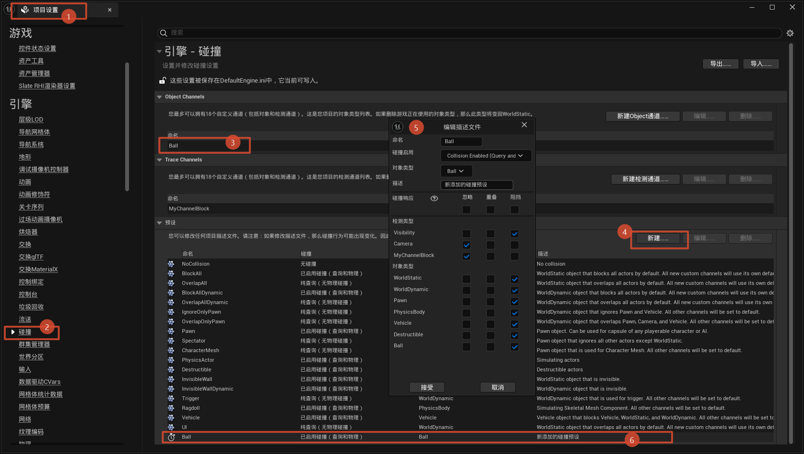

# 自定义碰撞通道与碰撞预设

第 16 章给子弹配碰撞用的是 C++ 逐通道设置：`SetCollisionEnabled`、`SetSimulatePhysics`、`SetCollisionResponseToChannel(ECC_Visibility, ECR_Ignore)` 一行行写死在构造函数里。能用，但有两个问题：**改一次参数要重编译**，以及**看不见全貌**——子弹到底对哪些通道是什么响应，得把代码读一遍才能拼出来。

这次把它们搬到项目设置里：新建一个自定义**物体通道** `Ball`、一个自定义**碰撞预设**（Profile），C++ 里只剩一行 `SetCollisionProfileName("Ball")`。顺带用 `SetNotifyRigidBodyCollision` 打开了模拟物理下的 Hit 事件，为后续"子弹命中处理"铺路。

## 一、碰撞配置的三层结构

理解这次重构的关键是把 UE 碰撞系统看成三层：

| 层 | 是什么 | 在哪配 |
|---|---|---|
| **通道层** | 物体的"身份牌"（Object 通道）和检测用的"尺子"（Trace 通道） | 项目设置 → 碰撞 → 通道 |
| **预设层** | 一整套碰撞配置的模板：启用模式 + 对象类型 + 对每个通道的响应 | 项目设置 → 碰撞 → 预设 |
| **实例层** | 组件套用某个预设，一键获得整套配置 | 组件细节面板 / C++ `SetCollisionProfileName` |

第 16 章的做法相当于**跳过预设层**，在实例层手搓每项配置；本章补上预设层后，实例层只剩一行代码。引擎自带的 `BlockAll`、`OverlapAll`、`Trigger` 等就是官方预制好的预设，自定义预设和它们平级。

## 二、新建物体通道：Ball

编辑器路径：**项目设置 → 引擎 → 碰撞 → 新建通道**。第 13 章建过 Trace 通道 `MyChannelBlock`，这次建的 `Ball` 是 **ObjectType（物体通道）**——两者回顾：

| | TraceType 射线通道 | ObjectType 物体通道 |
|---|---|---|
| 用途 | 给 LineTrace 用的"尺子" | 给物体归类用的"身份牌" |
| 谁在用 | 检测方（`LineTraceSingleByChannel` 的参数） | 被测物（组件的对象类型） |
| 蓝图里 | `TraceTypeQuery1` | `ObjectTypeQuery1` |

一句话：**尺子拿来量别人，身份牌挂在自己身上**。子弹是一个新种类的物体（而非一次新的检测），所以选 ObjectType。新建时默认响应选 Block。

落到配置文件 `Config/DefaultEngine.ini`：

```ini
+DefaultChannelResponses=(Channel=ECC_GameTraceChannel2,
                          DefaultResponse=ECR_Block, bTraceType=False,
                          Name="Ball")
```

对照第 13 章 `MyChannelBlock` 的那行：`bTraceType=False` 是唯一区别——False 是身份牌，True 是尺子。`DefaultResponse=ECR_Block` 表示其他物体对 Ball 默认阻挡。

::: warning 枚举值按添加顺序递增
自定义通道的枚举值（`ECC_GameTraceChannel1/2/3…`）按添加顺序编号，中途删改通道列表会整体错位——`ECC_GameTraceChannel2` 就不再是 Ball 了。详见[第 13 章的警告](/C++/13.LineTrace射线检测.md)。
:::

## 三、新建碰撞预设：Ball

编辑器路径：**项目设置 → 引擎 → 碰撞 → 预设 → 新建预设**。弹出的编辑对话框就是一张"碰撞配置总表"：



对照图逐项看：

| 设置项 | 本预设的值 | 含义 |
|---|---|---|
| 预设名称 | `Ball` | 代码/编辑器里引用它的名字 |
| 碰撞启用 | Query and Physics（查询和物理） | 既能被检测命中，又参与物理模拟 |
| 对象类型 | `Ball` | 组件的"身份牌"——上一节新建的物体通道 |
| 说明 | 新添加的碰撞预设 | HelpMessage，纯备注 |
| 碰撞响应表 | 见下 | 对每个通道 Block / Overlap / Ignore |

响应表里两处**自定义**响应，其余走默认（Block）：

- **Camera = Ignore**：子弹不挡相机，第三人称视角下镜头不会被飞过的球顶走；
- **MyChannelBlock = Ignore**：对第 13 章那条自定义射线通道隐形。

保存后 `DefaultEngine.ini` 多出的就是本章开头那张"总表"：

```ini
+Profiles=(Name="Ball",CollisionEnabled=QueryAndPhysics,bCanModify=True,
           ObjectTypeName="Ball",
           CustomResponses=((Channel="Camera",Response=ECR_Ignore),
                            (Channel="MyChannelBlock",Response=ECR_Ignore)),
           HelpMessage="新添加的碰撞预设")
```

第 16 章分散在构造函数里的各项设置，现在全部收拢在这一行 ini 里——这就是预设层的意义：**配置归配置文件，代码只引用名字**。想再调一个响应（比如让子弹也无视某类物体），在编辑器预设面板点一下即可，不用重编译 C++。

## 四、代码套用预设并开启 Hit 事件

```cpp
ABallProjectile::ABallProjectile()
{
    SphereComponent = CreateDefaultSubobject<USphereComponent>("Sphere Component");
    SphereComponent->SetSphereRadius(35.f);

    // 碰撞预设:设置我们自定义的碰撞预设
    SphereComponent->SetCollisionProfileName("Ball");
    // 模拟onHit
    // 物理通道必须开着
    SphereComponent->SetCollisionEnabled(ECollisionEnabled::QueryAndPhysics);
    SphereComponent->SetSimulatePhysics(true);   // 开启模拟物理
    SphereComponent->SetNotifyRigidBodyCollision(true);

    SetRootComponent(SphereComponent);
    // ...
}
```

两个新面孔：

### SetCollisionProfileName：一键套模板

一行顶过去的 N 行——预设里已经包含"启用模式 + 对象类型 + 全部通道响应"。注意它和后续两行 `SetCollisionEnabled` 的关系：预设先铺一套默认，后面的逐项调用再**覆盖**其中单项（这里 `QueryAndPhysics` 与预设值相同，等于双保险）。顺序上"先套预设、再单项微调"是惯用写法；反过来则会被预设整体覆盖回去。

### SetNotifyRigidBodyCollision：模拟物理下的 Hit 事件开关

对应编辑器里的 **Simulation Generates Hit Events**。默认关闭是出于性能考虑：模拟物理的物体每帧都在和其他物体接触，若默认全发 Hit 事件会刷出海量通知。所以**想响应物理碰撞（`OnComponentHit`），必须显式打开**——注释里写的"模拟onHit"就是这个意思。这是下一章做命中处理（掉血、特效）的前置开关。

## 五、常见坑

1. **预设名打错** → `SetCollisionProfileName("ball")` 不报错，静默回退默认预设，碰撞表现和预期完全不同；
2. **该建身份牌时建了尺子** → 新建通道时 TraceType 选成 True，组件的对象类型里选不到它，`ByObjectType` 也查不到；
3. **改了预设，场景里的组件没反应** → 运行中的组件套用的是预设**拷贝**，改预设后需要重新生成实例才生效；
4. **模拟物理下 OnHit 不触发** → 没开 `SetNotifyRigidBodyCollision(true)`（或编辑器未勾 Simulation Generates Hit Events）；
5. **删改通道列表后预设错乱** → 枚举值整体错位，预设里引用的通道可能已不是原来那条（第 13 章警告的预设版）；
6. **预设和代码单项设置打架** → 后执行的生效；排查时记得看调用顺序。

## 小结

- 碰撞配置三层结构：**通道（身份牌/尺子）→ 预设（配置模板）→ 组件（套用）**；第 16 章是跳过预设在实例层手搓，本章补齐了预设层；
- 新物体种类 → 新建 ObjectType 通道（`bTraceType=False`）；新检测手段 → TraceType 通道（第 13 章的 `MyChannelBlock`）；
- 自定义预设把碰撞配置收拢进 `DefaultEngine.ini` 一行，代码只留 `SetCollisionProfileName("Ball")`，调参不再重编译；
- 模拟物理下要响应碰撞必须 `SetNotifyRigidBodyCollision(true)`——Hit 事件默认只对显式开启的组件发放；
- 预设里 Visibility 未列入忽略（走默认 Block），第 16 章"子弹挡视线"的隐患仍在——要么在预设表里把它勾成 Ignore，要么保留第 16 章的代码方案，下一章做命中处理时可一并验证。
