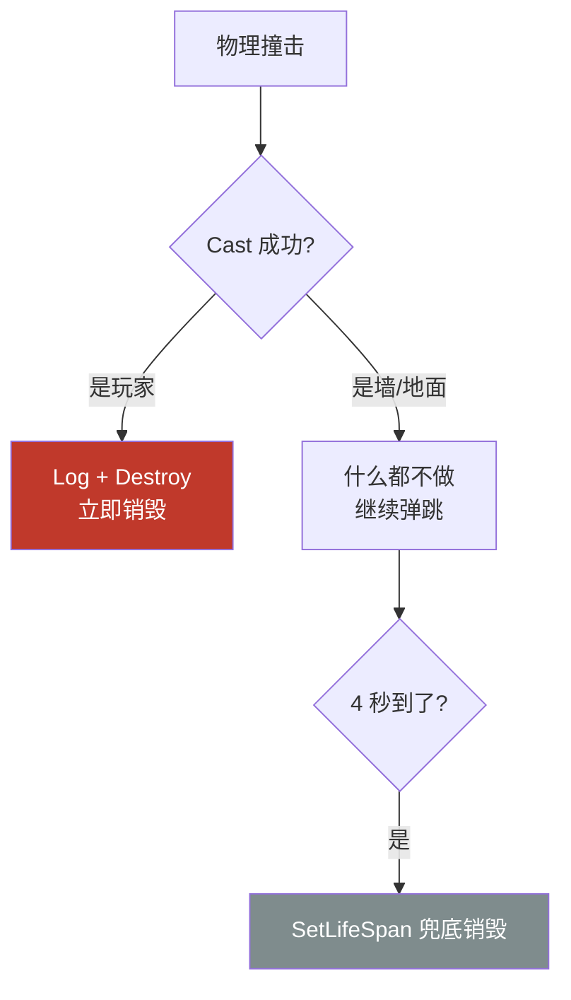

# 实战：子弹命中回调 OnComponentHit

第 17 章末尾用 `SetNotifyRigidBodyCollision(true)` 打开了模拟物理下的 Hit 事件开关，当时说"为命中处理铺路"——本章兑现：把 `OnComponentHit` 委托绑定到子弹自己的处理函数，撞到玩家就自我销毁。代码集中在 `BallProjectile.cpp` 的 `BeginPlay` 与 `OnHit`（源码在 `Source/MyThird/Projectile/`）。

先看全貌，两步就走完：

```cpp
void ABallProjectile::BeginPlay()
{
    Super::BeginPlay();

    // 动态委托绑定:模拟物理撞到东西时回调 OnHit
    SphereComponent->OnComponentHit.AddDynamic(this, &ABallProjectile::OnHit);
    SetLifeSpan(4.f);   // 第 16 章:生命周期兜底
}
```

## 一、OnComponentHit 是什么

`USphereComponent` 继承自 `UPrimitiveComponent`（第 15 章的组件速查表里"碰撞三事件"那一栏）：

| 事件 | 触发条件 | 对应编辑器开关 |
|---|---|---|
| `OnComponentHit` | **Block** 响应的物理碰撞（含模拟物理的撞击） | Simulation Generates Hit Events |
| `OnComponentBeginOverlap` | **Overlap** 响应的相互进入 | Generate Overlap Events |

子弹要的是"撞上"而不是"穿过"，所以走 Hit：碰撞预设 `Ball` 里对 Pawn 是默认 Block，加上第 17 章开的 `SetNotifyRigidBodyCollision(true)`，撞到东西引擎就会广播这个委托。两个条件缺一不可——**Block 决定"碰得上"，Notify 开关决定"喊不喊人"**。

## 二、绑定：AddDynamic 与 UFUNCTION

`OnComponentHit` 是一个**动态多播委托**（`FComponentHitSignature`）。"动态"意味着绑定不是存函数指针完事，而是把回调函数**按名字**登记进反射系统，运行时再按名字找到函数调用——这就对回调函数有一个硬性要求：

```cpp
// BallProjectile.h
// 必须标 UFUNCTION():AddDynamic 绑定要求函数能被反射系统按名字查找
UFUNCTION()
void OnHit(UPrimitiveComponent* HitComponent, AActor* OtherActor,
           UPrimitiveComponent* OtherComp, FVector NormalImpulse,
           const FHitResult& Hit);
```

`UFUNCTION()` 让这个函数进反射表，`AddDynamic` 才找得到它。忘了标，编译期就会报错拒绝——动态委托的绑定宏里带了静态断言（第 4 章反射体系的实战应用）。

绑定为什么放 `BeginPlay` 而不是构造函数？委托绑定属于"运行时行为"，构造函数只管搭骨架（建组件、配默认值）。放构造函数里某些场合也能跑，但 `AddDynamic` 是往委托列表里**添加**条目——CDO（类默认对象）、生成预览等都可能走构造函数，绑上去的时机不可控。惯例：**配置进构造函数，行为进 BeginPlay**。

::: warning 签名必须一字不差
动态委托按签名严格匹配，回调函数的参数类型、顺序、const 修饰必须和 `FComponentHitSignature` 完全一致，多一个少一个都是编译错误。
:::

## 三、OnHit 实现：撞到的是谁

```cpp
void ABallProjectile::OnHit(UPrimitiveComponent* HitComponent, AActor* OtherActor,
                            UPrimitiveComponent* OtherComp, FVector NormalImpulse,
                            const FHitResult& Hit)
{
    // 把撞到的 Actor 尝试转换成玩家角色类:转换成功说明命中玩家
    AMyThirdCharacter* Player = Cast<AMyThirdCharacter>(OtherActor);
    if (Player)
    {
        UE_LOG(LogTemp, Warning, TEXT("Hit"));
        Destroy();   // 命中玩家,子弹一次性消亡
    }
}
```

### 参数逐个看

| 参数 | 本例中的值 | 含义 |
|---|---|---|
| `HitComponent` | 自己的 SphereComponent | 被撞的组件（委托的发出者） |
| `OtherActor` | 玩家 / 墙 / 地面…… | 撞到的 Actor——**处理逻辑的核心输入** |
| `OtherComp` | 胶囊体 / 墙体网格 | 撞到的对方组件 |
| `NormalImpulse` | — | 法线方向冲量，可粗略当"撞得多狠"，做伤害衰减、撞击音量可用 |
| `Hit` | — | 完整命中信息（碰撞点、法线，第 13 章 LineTrace 用过同款结构） |

### Cast：从"是个 Actor"到"是玩家"

回调给的 `OtherActor` 是 `AActor*`——墙、地面、玩家、别的子弹，大家都是 Actor，光看类型什么都分不出来。`Cast<AMyThirdCharacter>` 就是问一句："你实际上是玩家角色（或其子类）吗？"

- 转换成功 → 得到非空指针，命中玩家；
- 转换失败 → 返回 `nullptr`，撞的是墙/地面等，`if` 直接跳过——子弹继续弹跳，不销毁。

注意 Cast 认**继承链**：玩家实际用的是蓝图子类 `BP_Player`（第 16 章"TSubclassOf"的同款逻辑），它继承自 `AMyThirdCharacter`，所以照样转换成功。判断"是不是某一类"永远用 Cast，不要比类名、不要 `GetClass() ==`（那只认精确类，子类全漏掉）。

配套细节：要用 `AMyThirdCharacter` 就得包含它的头文件，`BallProjectile.cpp` 顶部因此多了 `#include "MyThird/MyThirdCharacter.h"`。

### Destroy：一次性消亡

命中玩家后 `Destroy()`（第 9 章生命周期篇的终点站）。在 Hit 回调里销毁自己是安全的——引擎广播完委托、处理完本轮物理后再移除 Actor，不会出现"回调执行到一半世界塌了"。命中玩家走 Destroy，没命中走 `SetLifeSpan(4.f)` 兜底，两条销毁路径闭环：



## 四、常见坑

1. **回调没标 `UFUNCTION()`** → `AddDynamic` 编译报错（动态委托按名字查找，进不了反射表就绑不上）；
2. **第 17 章的开关没开** → 绑定得再对 `OnHit` 也一次不响：模拟物理下必须 `SetNotifyRigidBodyCollision(true)`；
3. **签名抄错** → 参数个数/类型/const 与 `FComponentHitSignature` 不一致，编译错误；
4. **想接 Hit 却配了 Overlap** → 预设里对目标通道是 Ignore/Overlap 时走的是 `OnComponentBeginOverlap`，`OnComponentHit` 不触发——Block 才有 Hit；
5. **用 `GetClass() ==` 判断玩家** → 蓝图子类 `BP_Player` 不等于 `AMyThirdCharacter`，永远判否；判断类别用 `Cast`；
6. **忘了包含角色头文件** → `Cast<AMyThirdCharacter>` 处报未定义类型，`#include "MyThird/MyThirdCharacter.h"` 补上；
7. **撞到任何东西都 Destroy** → 子弹沾墙就消失，"弹跳"白做了；先问"撞的是谁"再决定死不死。

## 小结

- 命中处理三件套：**Block 响应**（预设里配）+ **`SetNotifyRigidBodyCollision(true)`**（第 17 章）+ **`OnComponentHit.AddDynamic` 绑定**（本章），缺一不可；
- 动态委托靠反射按名字找回调，函数必须标 `UFUNCTION()`，签名必须与委托完全一致；绑定行为放 BeginPlay，配置才放构造函数；
- 分辨"撞到了谁"用 `Cast<AMyThirdCharacter>`：认继承链，蓝图子类照样命中；`nullptr` 就是没撞到玩家，什么都不做；
- 两条销毁路径闭环：命中玩家立即 `Destroy()`，始终没命中由 `SetLifeSpan(4.f)` 兜底；
- Hit（Block，撞上）与 Overlap（Overlap，穿过）是两套事件两套开关，别混搭。
