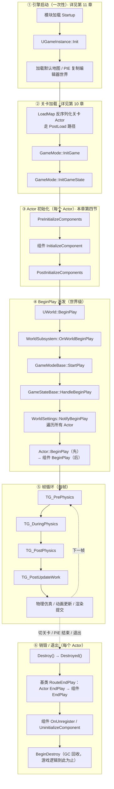
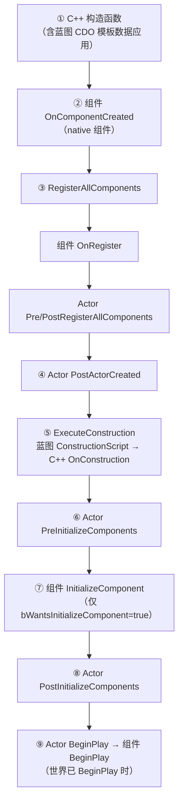

# 运行顺序与生命周期（常用篇）

写蓝图时"事件 BeginPlay / Event Tick"像是理所当然存在的，但它们**由谁、在什么时机、按什么顺序调用**，是 C++ 阶段必须搞清楚的事——搞不清就会出现"代码没跑"、"跑了但顺序不对"、"编辑器里跑了好多次"这类经典问题。

本篇讲两条主线：**UE 从启动到一帧的宏观运行顺序**，以及 **Actor 最常用的生命周期函数**。所有函数的全量查阅表（Actor / 组件 / GameMode / Controller / Pawn / GameInstance / 子系统）放在后面两篇：

> 📖 [第 10 章：查阅 · Actor 与组件生命周期全表](/C++/10.查阅-Actor与组件生命周期全表.md)
> 📖 [第 11 章：查阅 · 引擎启动与框架类生命周期](/C++/11.查阅-引擎启动与框架类生命周期.md)

以下顺序均已对照引擎 5.4 源码（`World.cpp` / `Actor.cpp` / `LevelActor.cpp`）核实。

---

## 一、一张图看懂运行顺序

单机（或 PIE）从启动到退出的完整链路：



| 阶段 | 详解位置 |
|---|---|
| ① 引擎启动、GameInstance、玩家登录链 | [第 11 章 · 引擎启动与框架类](/C++/11.查阅-引擎启动与框架类生命周期.md) |
| ② PostLoad 路径、③④ Actor/组件全表 | [第 10 章 · Actor 与组件生命周期全表](/C++/10.查阅-Actor与组件生命周期全表.md) |
| ③④⑥ Actor 常用函数逐个讲解 | 本章[第四节](#四actor-常用生命周期函数详解) |
| ⑤ Tick 与 TickGroup | 本章[第四节](#四actor-常用生命周期函数详解) |

运行时动态生成（`SpawnActor`）的顺序和上图③④略有不同（多了构造 / ConstructionScript 环节），单独画在[本章第五节](#五运行时-spawnactor-的完整顺序)。

> 记不住细节没关系，先记住一句话：**构造做配置、PostInitializeComponents 找自家组件、BeginPlay 找别人、Tick 做每帧**。

---

## 二、引擎启动到世界 BeginPlay

①②④阶段的主要角色是框架类，这里只讲链路，函数明细见第 11 章。

1. **引擎启动**：各模块按依赖加载（`StartupModule`）→ 创建 `UGameInstance` 并调用 `Init()`；
2. **加载地图**：`LoadMap` 反序列化关卡——**关卡里预先摆好的 Actor 走的是 `PostLoad` 路径**，不会触发 `PostActorCreated` 和蓝图 ConstructionScript（和编辑器里不同，详见第 10 章）；
3. **GameMode 就位**：`InitGame()`（GameMode 最先被调的初始化函数，适合读游戏全局配置）→ `InitGameState()`；
4. **玩家加入**（与 ③④ 并发进行）：`PreLogin` → `Login`（生成 PlayerController）→ `PostLogin` → `RestartPlayer` → 生成默认 Pawn → `Possess`，详见第 11 章；
5. **World BeginPlay**：即上图④——注意这条链是从 `UWorld::BeginPlay()` 一路调进 `GameMode->StartPlay()` 再**广播回所有 Actor** 的，所以**关卡里所有 Actor 的 BeginPlay 都晚于 GameMode 的 InitGame / InitGameState**。这是一个非常常用的依赖依据：想在 BeginPlay 里安全地找 GameMode / GameState？可以——它们早已初始化完毕。

---

## 三、关卡摆放 vs 运行时生成

同一个 Actor 类，两条出生路径走的函数不同，这是查阅频率最高的差异：

| | 关卡里摆好的（编辑器放置） | 运行时 `SpawnActor` 生成 |
|---|---|---|
| 构造函数 | ✅ | ✅ |
| `PostLoad` | ✅（从磁盘反序列化） | ❌ |
| `PostActorCreated` | ❌ | ✅ |
| 蓝图 ConstructionScript / `OnConstruction` | ❌（加载时不跑） | ✅（每次生成跑一次） |
| 组件 `InitializeComponent` / Actor `PostInitializeComponents` | ✅ | ✅ |
| `BeginPlay`（世界已开始播放后） | ✅ | ✅（生成后当帧触发） |

> 编辑器里拖动、改属性都会触发 ConstructionScript——但那是编辑器行为，别和运行时混淆。

---

## 四、Actor 常用生命周期函数详解

### 1. 构造函数 —— 只做配置

```cpp
AMyActor::AMyActor()
{
    PrimaryActorTick.bCanEverTick = false;  // 不需要每帧逻辑就关掉
    MyComponent = CreateDefaultSubobject<UMyComponent>(TEXT("MyComponent"));
}
```

- **能做**：`CreateDefaultSubobject` 创建组件、设默认值、关 Tick；
- **不能做**：`GetWorld()` 此时不可靠、别 `SpawnActor`、别读其它 Actor（它们可能还没生成）；
- **编辑器陷阱**：编辑器加载类、CDO 构造、放置 Actor 时都会执行构造函数——**它不仅在游戏运行时被调用**，所以里面绝不能放"游戏逻辑"。

### 2. PostInitializeComponents —— 组件齐全了

```cpp
void AMyActor::PostInitializeComponents()
{
    Super::PostInitializeComponents();  // 不调会直接 Fatal 报错
    MyComponent->DoSomething();         // 此时自有组件已 InitializeComponent 完毕
}
```

时机：所有组件创建、注册、初始化完成之后，`BeginPlay` 之前。适合做**依赖自家组件**的初始化。注意此时**其它 Actor 未必初始化完**，跨 Actor 的引用留给 BeginPlay。

### 3. BeginPlay —— 世界开始播放

```cpp
void APlayerCharacter::BeginPlay()
{
    Super::BeginPlay();   // ← 坑见下
    // 安全地：找 GameMode / GameState / 其它 Actor、绑定委托、开局逻辑
}
```

- 世界级触发链：`UWorld::BeginPlay → GameMode::StartPlay → GameState::HandleBeginPlay → WorldSettings::NotifyBeginPlay → 逐个 Actor DispatchBeginPlay`；
- **源码级大坑：组件的 BeginPlay 是在 `AActor::BeginPlay()` 的基类实现里派发的**。你若忘了调 `Super::BeginPlay()`，**所有组件的 BeginPlay 都不会执行**（移动组件、动画蓝图全部罢工，且没有明显报错）；
- 因此 Actor 与其组件的 BeginPlay 顺序是：**Actor 先（`Super::BeginPlay()` 之前的代码）、组件们随后、Actor 里 `Super` 之后的代码最后**。

### 4. Tick —— 每帧

```cpp
void AMyActor::Tick(float DeltaTime)
{
    Super::Tick(DeltaTime);
    // 每帧逻辑；DeltaTime 受时间膨胀（TimeDilation）影响
}
```

- 默认开启（`PrimaryActorTick.bCanEverTick = true`），**不需要就关**，省下每帧的调度开销；
- 运行时开关：`SetActorTickEnabled(false)` / `PrimaryActorTick.SetTickInterval(0.5f)`（每 0.5 秒一次，省性能的常用手段）；
- 多个 Tick 的先后由 **TickGroup** 决定（预物理 / 物理中 / 后物理 / 帧末），同组内顺序不保证——跨 Actor 的 Tick 顺序依赖是坏味道，用委托/事件替代。

### 5. EndPlay —— 离场清理

```cpp
void AMyActor::EndPlay(const EEndPlayReason::Type EndPlayReason)
{
    // 解绑委托、关计时器、清理外部资源
    Super::EndPlay(EndPlayReason);
}
```

五种触发原因（`EngineTypes.h`），排查"为什么 EndPlay 跑了"时对号入座：

| Reason | 含义 |
|---|---|
| `Destroyed` | 被 `Destroy()` 销毁 |
| `LevelTransition` | 切换关卡 |
| `EndPlayInEditor` | PIE 结束 |
| `RemovedFromWorld` | 所在子关卡被流式卸载 |
| `Quit` | 退出游戏 |

内含顺序：Actor 的 `EndPlay` 先执行，随后其**组件的 EndPlay 在基类实现里逐个触发**——和 BeginPlay 同构，同样别忘 `Super::EndPlay()`。

### 6. Destroyed / BeginDestroy —— 销毁的两站

```cpp
void AMyActor::Destroyed()
{
    // Super::Destroyed() 内部会触发 EndPlay 链
    Super::Destroyed();
}
```

- `Destroyed`：`Destroy()` 调用链上的游戏逻辑层终点（其基类实现第一行就 `RouteEndPlay`，见总览图⑥）；
- `BeginDestroy`：之后对象进入 GC 回收队列，属于引擎层——**游戏逻辑别写到这**，写也只是"通常还能跑"。

---

## 五、运行时 SpawnActor 的完整顺序

世界已在播放时 `SpawnActor` 生成一个 Actor，完整链条（对照 `Actor.cpp` 源码注释，顺序权威）：



要点：

- **延迟生成**：`SpawnActorDeferred` 会停在⑤之前，等你配置完属性后调 `FinishSpawning` 才继续——适合"生成前必须设参数"的场景；
- 第 1 章的角色、第 3 章的自定义组件，走的都是这条链；蓝图侧对应 Event Graph 里的 Construct / BeginPlay / Tick / EndPlay 事件。

---

## 小结

- 宏观链：**引擎启动 → LoadMap（PostLoad）→ GameMode Init → 组件初始化 → World BeginPlay 广播 → Tick 循环 → EndPlay/Destroy**；
- `Super::BeginPlay()` 不调 = 组件全不启动；`Super::PostInitializeComponents()` 不调 = 直接 Fatal；
- 关卡摆放走 `PostLoad`，运行时生成走 `PostActorCreated + ConstructionScript`；
- 全量函数表见 [第 10 章](/C++/10.查阅-Actor与组件生命周期全表.md)（Actor/组件）与 [第 11 章](/C++/11.查阅-引擎启动与框架类生命周期.md)（框架类）。
