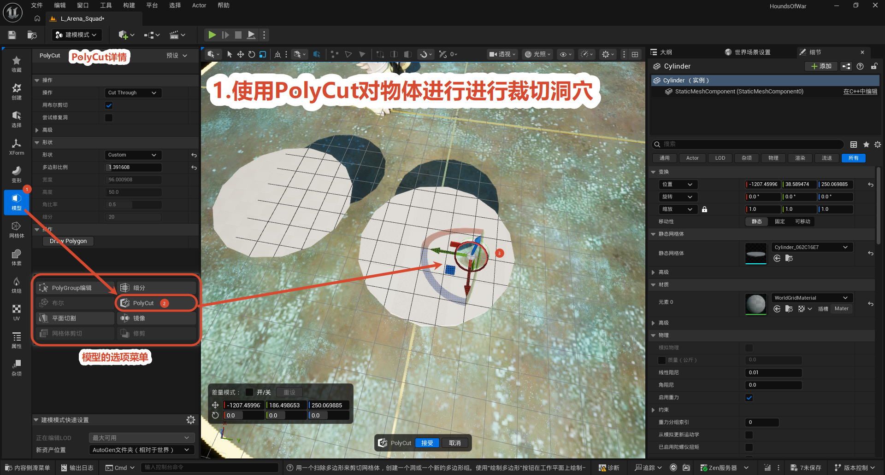
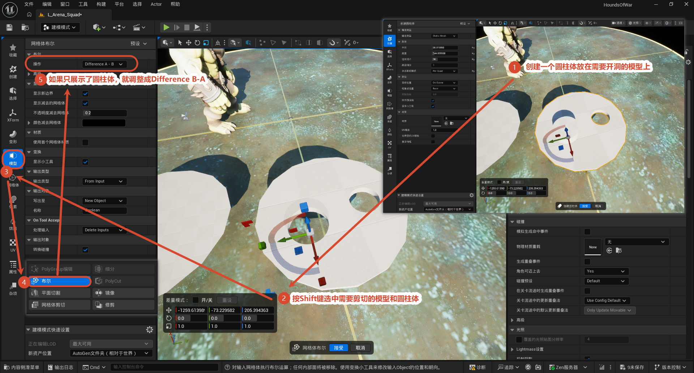
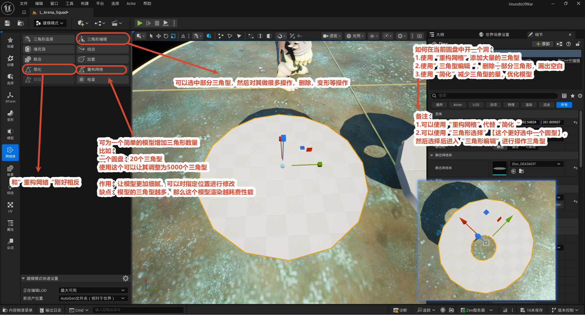

# UE5 建模模式

**建模模式 (Modeling Mode)** 是 UE5 内置的网格体编辑工具集（顶部工具栏「建模模式」下拉切换，快捷键 **Shift + 5**；若没有该入口，需在插件 (Plugins) 中启用 **ModelingToolsEditorMode** 后重启）。本节以「**在物体上开洞**」这个高频需求为例，记录三种常用做法：**PolyCut 多边形切割**、**布尔运算 (Boolean)**、**三角形编辑 (Triangle Edit)**，最后给出三者选型对比。

> 建模模式编辑的对象是**静态网格体资产**而不是关卡里的 Actor 实例——接受操作后会在内容浏览器生成新资产，默认存放在 **AutoGen 文件夹**（相对于当前世界），可在左下角「建模模式快速设置」里修改「新资产位置」。

---

## 方法一：PolyCut（多边形切割）

**目的：** 用一个「扫掠多边形」直接在网格体上剪切出洞。不需要额外创建工具物体，选中目标单体即可完成，是三种方法里最快捷的一种。

**操作步骤：**

1. 选中要开洞的物体 → 切换到**建模模式 (Modeling Mode)**。
2. 左侧工具分类进入**模型 (Model)** → 选择 **PolyCut**（同一菜单里还有 PolyGroup 编辑、细分、布尔、平面切割、镜像、网格体剪切、修剪等工具）。
3. 点击 **绘制多边形 (Draw Polygon)** 按钮，在视口的工作平面上画出洞的形状。
4. 拖动出现的**变换小工具（Gizmo）**（三向箭头 + 旋转环），调整切割轮廓的位置与角度，让轮廓对准要开洞的地方。
5. 确认参数：操作方式选 **Cut Through（切割穿透）**，并勾选**用布尔剪**；形状为 `Custom`（自定义绘制）。
6. 点击视口底部的 **接受 (Accept)** 完成切割，**取消 (Cancel)** 放弃。

**PolyCut 详情面板常用参数：**

| 参数 | 说明 |
| --- | --- |
| 操作方式：Cut Through | 穿透切割，形成通孔 |
| 用布尔剪 | 内部用布尔运算处理，保证洞口边缘干净 |
| 尝试修复洞 | 切割出现破面/缺口时尝试自动修补 |
| 形状：Custom | 使用「绘制多边形」画出的自定义轮廓（也可选预设形状） |
| 宽度 / 高度 / 角比率 / 细分 | 控制切割形状的尺寸与轮廓精度（细分越高边缘越圆滑） |

> 工具底部提示原文：「用一个扫除多边形来剪切网格体，创建一个洞或一个新的多边形组。使用『绘制多边形』按钮在工作平面上绘制……」

---

## 方法二：布尔运算（Boolean）

**目的：** 用一个**工具物体**（本例为圆柱体）从目标模型上「减」出一块，得到洞。适合洞的形状规则、需要精确控制位置和大小的场景。

**操作步骤：**

1. 建模模式 → **创建 (Create)** 分类 → **圆柱体**，设置半径、高度（如半径 50.9、高度 154.6），把圆柱体放到需要开洞的模型上，让其**穿过**模型表面 ①。
2. 按住 **Shift** 依次点选「目标模型 + 圆柱体」，把两个物体同时选中 ②。
3. 左侧分类切换到 **模型 (Model)** ③ → 点击 **布尔 (Boolean)** 工具 ④。
4. 运算类型选 **Difference A - B（差集）**；如果预览反了（只剩下一个圆柱体），改成 **Difference B - A** ⑤ 即可。
5. 视口里可直接拖**变换小工具**微调圆柱体（减去体）的位置和朝向；「不透明度减去网格体 0.2」让工具物体半透明，方便看清穿插情况。
6. 点击 **接受 (Accept)**——`On Tool Accept` 设为 **Delete Inputs** 时会自动删除作为工具的圆柱体，输出开好洞的新网格体。

**网格体布尔面板常用参数：**

| 参数 | 说明 |
| --- | --- |
| 布尔：Difference A - B | 差集运算，从 A 里减去 B（结果反了就换 B - A） |
| 显示新边界 / 显示减去网格体 | 预览开关，高亮显示切缝和减去体 |
| 不透明度减去网格体 | 工具物体的预览透明度（默认 0.2） |
| On Tool Accept：Delete Inputs | 接受后删除输入物体（工具圆柱体），保持场景干净 |
| 写出至：New Object | 结果输出为新网格体资产 |

---

## 方法三：三角形编辑（Triangle Edit）

**目的：** 直接进入网格体的**三角形层级**，把洞所在位置的面选中后删除。不需要工具物体、不做任何运算，最直接也最灵活——洞的形状完全由你选中的面决定，还可以顺带对局部面做挤出、插入边环等细加工。

**操作步骤：**

1. 选中要开洞的物体 → 建模模式 → **模型 (Model)** 分类 → **三角形编辑 (Triangle Edit)**。
2. 在详情面板切换**选择方式**（点击 / 框选 / 套索），选中洞所在位置的所有三角形面（选中的面会高亮）。
3. 点击 **删除 (Delete)** 按钮，选中的三角形被移除，形成洞。
4. 需要的话继续对洞口边缘的面做**挤出 (Extrude)**、**插入边环**等修整。
5. 点击 **接受 (Accept)** 输出结果。

> 与「多边形组编辑 (PolyGroup Edit)」的区别：三角形编辑在**最细的三角形层级**选择和操作；多边形组编辑把相邻共面的三角形当成一个「多边形组」整体处理，选面更快，但洞的边缘只能沿组边界走。想要完全自由地控制洞的范围，用三角形编辑。

---

## 三种方法对比

| | PolyCut | 布尔运算 | 三角形编辑 |
| --- | --- | --- | --- |
| 需要额外工具物体 | 否 | **是**（圆柱等减去体） | 否 |
| 洞的形状 | 自由绘制 / 预设形状 | 由工具物体决定（规则形状） | 由选中的面决定 |
| 操作难度 | 低，最快 | 中（要管两个物体的选中顺序） | 高（要手动选面） |
| 适用场景 | 快速开不规则洞 | 规则洞、需精确定位尺寸 | 粗暴删面，或需兼顾周边拓扑加工 |

> 经验：临时验证想法用 **PolyCut** 一分钟出结果；正式关卡里要规则井口、窗洞用**布尔**；要沿地形/曲面开随形的洞、或删面后还要继续编辑，用**三角形编辑**。三种方法输出都会生成新网格体资产，记得按命名规范（`SM_` 前缀）重命名后再入关卡。
