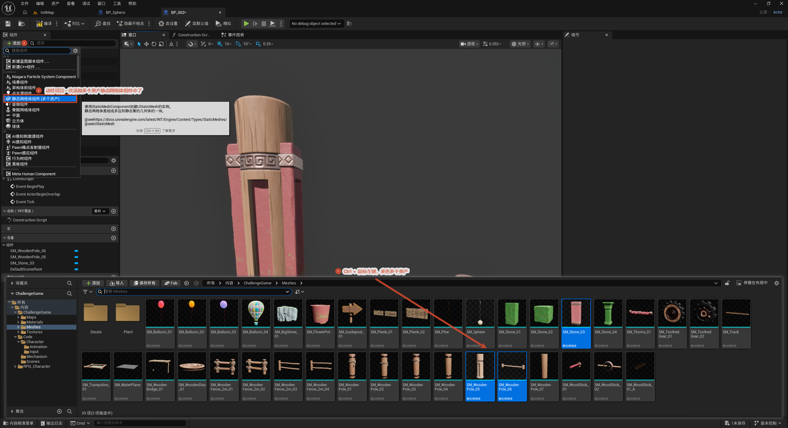
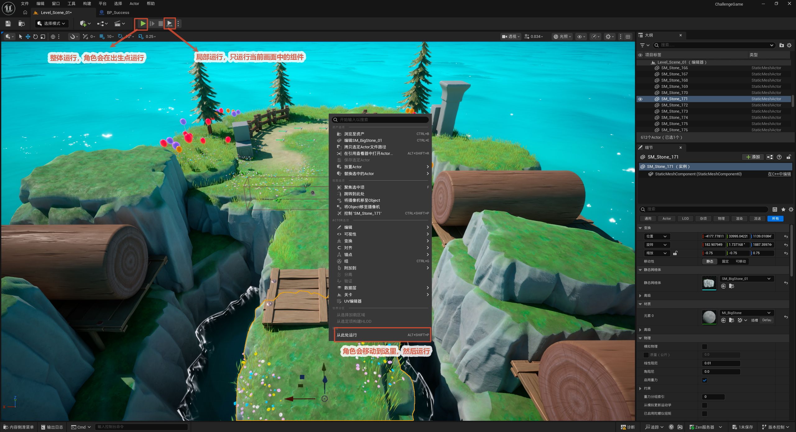
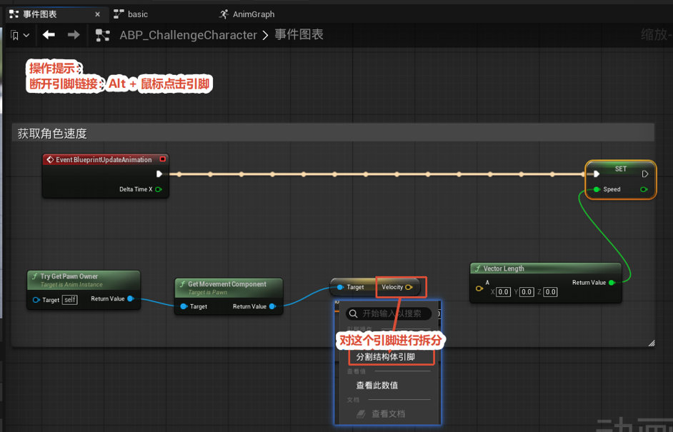

# UE5 编辑器

本节先给出贯穿整个工程的 **UE5 资产命名规范**（各类资产的前缀约定），再介绍编辑器里三个很实用但不太显眼的操作，最后附上一份按场景分类的**常用快捷键速查表**。命名规范统一了前缀，让内容浏览器里的资产一眼可辨；三个小操作分别解决「一次给蓝图加多个网格体」「从任意位置直接运行游戏测试」「蓝图引脚的断线 / 拆分 / 查值」这三个高频需求；快捷键表覆盖视口导航、变换工具、蓝图编辑、内容浏览器和运行测试这几类日常操作，熟悉它们可以显著加快搭建与调试的速度。

---

## 资产命名规范

UE5 采用「**前缀 + 描述性名称**」的方式命名资产：前缀代表资产类型，名称用 **PascalCase**（每个单词首字母大写、不留空格、不加分隔符）。这样在内容浏览器里一眼就能看出每个资产是什么，也避免不同类型的资产混在一起难以检索。本工程就严格遵循了这套约定，例如 `BP_Cube`、`SM_Stone_03`。

**蓝图（最重要的一类）：**

| 前缀 | 类型 | 示例 |
| --- | --- | --- |
| `BP_` | 蓝图类（Blueprint Class） | `BP_Cube`、`BP_ChallengeCharacter` |
| `WBP_` | 控件蓝图 / UMG 界面（Widget Blueprint） | `WBP_MainMenu`、`WBP_HUD` |
| `ABP_` | 动画蓝图（Animation Blueprint） | `ABP_Player` |
| `BPI_` | 蓝图接口（Blueprint Interface） | `BPI_Interactable` |
| `BPC_` | 蓝图组件（Blueprint Component） | `BPC_Health` |

**网格体 / 材质 / 贴图：**

| 前缀 | 类型 | 示例 |
| --- | --- | --- |
| `SM_` | 静态网格体（Static Mesh） | `SM_Stone_03`、`SM_WoodenPole_05` |
| `SK_` | 骨骼网格体（Skeletal Mesh） | `SK_Player` |
| `M_` | 材质（Material） | `M_Water` |
| `MI_` | 材质实例（Material Instance） | `MI_Water_Blue` |
| `MF_` | 材质函数（Material Function） | `MF_RoundCorner` |
| `T_` | 贴图（Texture） | `T_Stone_D`（D=漫反射）、`T_Stone_N`（N=法线） |

**动画 / 特效：**

| 前缀 | 类型 | 示例 |
| --- | --- | --- |
| `A_` / `Anim_` | 动画序列（Anim Sequence） | `A_Jump_Start`、`A_Jump_Loop` |
| `BS_` | 混合空间（Blend Space） | `BS_Locomotion` |
| `NS_` | Niagara 特效系统 | `NS_Fire` |
| `NE_` | Niagara 发射器 | `NE_Sparks` |

**增强输入（本工程使用）：**

| 前缀 | 类型 | 示例 |
| --- | --- | --- |
| `IA_` | 输入动作（Input Action） | `IA_Move`、`IA_Jump` |
| `IMC_` | 输入映射上下文（Input Mapping Context） | `IMC_Default` |

**其他常用：**

| 前缀 | 类型 | 示例 |
| --- | --- | --- |
| `L_` / `MAP_` | 关卡 / 地图（Level） | `L_InitMap` |
| `DT_` | 数据表（Data Table） | `DT_Item` |
| `E_` | 枚举（Enum） | `E_MovementState` |
| `S_` | 结构体（Struct） | `S_WeaponData` |

> 命名小贴士：名称要能体现用途，避免 `BP_New`、`BP_1` 这类无意义命名；同类资产保持前缀与风格一致，方便日后检索和团队协作。本工程后续所有章节创建的资产都应遵循上表的前缀约定。

---

## 一次添加多个静态网格体资产

**目的：** 给蓝图 Actor 一次性添加多个静态网格体组件，而不是一个一个地添加、再分别指定网格体。

**操作：**

1. 打开目标蓝图 → 在**组件 (Components)** 面板点 **添加 (+)** → 搜索并选择 **静态网格体组件（多个资产）(Static Mesh Component - Multiple Assets)**。
2. 在弹出的资产选择窗口（或内容浏览器）里，按住 **Ctrl + 鼠标左键** 多选需要的网格体资产（如 `SM_Stone_03`、`SM_WoodenPole_05` 等）。
3. 确认后，选中的每个网格体会各自作为一个静态网格体组件添加进来。

> 这个组件本质还是 `UStaticMeshComponent`，提示信息里会给出官方文档链接（`docs.unrealengine.com/.../StaticMeshes`），区别只在于它允许在添加时一次选多个资产，省去逐个添加的重复操作。

## 从此处运行（局部测试）

**目的：** 跳过「角色从默认出生点出场」，直接从当前选中的物体位置开始运行游戏，方便就近测试某个机关或某段关卡逻辑。

**操作：** 在视口里选中目标 Actor（如 `SM_Stone_171`）→ **鼠标右键** → 在弹出的上下文菜单里选 **从此处运行 (Play From Here)**，快捷键 **Alt + Shift + P**。

**与整体运行的区别：**

- **整体运行（顶部绿色播放按钮 / Alt + P）**：角色从项目设置的默认出生点出场，跑完整套流程。
- **从此处运行（Alt + Shift + P）**：运行后角色会被放到你选中的位置附近，先就位再开始跑，适合快速验证局部交互。

> 选中物体后，右键菜单里还能顺手用 **将摄像机移至此处**、**聚焦选中项** 等选项把视角对准目标，配合「从此处运行」调试体验更顺。

---

## 引脚操作（蓝图节点）

图中演示的是一条「动画蓝图里取移动速度并写入 Speed 变量」的节点链：`事件更新动画 (Event Blueprint Update Animation)` → `Try Get Pawn Owner` → `Get Movement Component` → `Velocity` → `Vector Length` → `SET Speed`。下面以这条链为例，介绍三个引脚上的高频小操作。

- **断开连线：Alt + 点击引脚**。在任意引脚上按住 Alt 并点击，可一次性断开连在该引脚上的**所有**连线；只想断单根线，也可以用 Alt + 拖动那根连线。

- **拆分结构体引脚：右键 → 分割结构体引脚 (Split Struct Pin)**。像 `Velocity` 这种 Vector（向量）/ Rotator（旋转）/ 结构体类型的输出引脚，右键选「分割结构体引脚」后会被拆成 X / Y / Z 三个独立引脚，方便单独取某一个分量（例如只取速度的 Z 分量做下落判断）。

- **查看数值：右键引脚 → 查看此数值 (Watch this Value)**。运行时在数据引脚上右键选「查看此数值」，当前值会实时显示在节点旁，是验证节点链是否算对的最直观方式。

> 这三条和下面「蓝图编辑器」快捷键表里的 Alt 断线、Ctrl 移线是对应关系——前者是「点击 / 菜单」式操作，后者是「拖动」式操作，按习惯选一种即可。

---

## 常用快捷键速查表

> 说明：W / E / R / 空格 这一组**在鼠标空闲时**是变换工具切换，但**按住鼠标右键（飞行模式）时** WASD 会变成摄像机移动。下面分开列出，避免混淆。

### 视口导航

| 操作 | 快捷键 / 鼠标 |
| --- | --- |
| 旋转视角 | 鼠标右键拖动 |
| 平移视角 | 鼠标中键拖动 |
| 前进 / 后退（缩放） | 鼠标滚轮 |
| 前后移动摄像机 | 鼠标左键 + 右键同时按住拖动 |
| 飞行移动（前后左右） | 按住右键 + W / A / S / D |
| 上升 / 下降 | 按住右键 + E / Q（或 Ctrl / 空格） |
| 聚焦选中物体 | F |
| 框选物体 | 鼠标左键拖动画框 |

### 选择 / 变换（鼠标空闲时）

| 操作 | 快捷键 |
| --- | --- |
| 移动模式 | W |
| 旋转模式 | E |
| 缩放模式 | R |
| 三种工具循环切换 | 空格键 |
| 加选 / 减选物体 | Shift + 鼠标左键 |
| 多选（离散） | Ctrl + 鼠标左键 |
| 复制并移动物体 | Alt + 鼠标左键拖动 |
| 复制选中物体 | Ctrl + D（或 Ctrl + W） |
| 删除物体 | Delete |
| 全选 | Ctrl + A |
| 编组 / 取消编组 | Ctrl + G / Shift + G |
| 吸附到地面 | End |
| 对齐到网格（开关） | 按住鼠标右键点对应吸附项，或状态栏切换 |

### 编辑器通用

| 操作 | 快捷键 |
| --- | --- |
| 保存当前关卡 / 资产 | Ctrl + S |
| 保存全部 | Ctrl + Shift + S |
| 撤销 / 重做 | Ctrl + Z / Ctrl + Y |
| 复制 / 粘贴 | Ctrl + C / Ctrl + V |
| 查找（内容浏览器） | Ctrl + F |
| 打开 / 关闭内容浏览器面板 | Ctrl + 空格 |

### 蓝图编辑器

| 操作 | 快捷键 |
| --- | --- |
| 呼出节点添加菜单 | 右键点击空白处 |
| 从引脚拖出到空白松手 | 只显示该类型可接的节点 |
| 添加注释框 | C |
| 断开连线 | Alt + 鼠标左键拖动连线 |
| 移动已有连线 | Ctrl + 鼠标左键拖动连线 |
| 复制 / 粘贴节点 | Ctrl + C / Ctrl + V |
| 删除节点 | Delete |
| 编译蓝图 | 左上角 Compile 按钮（蓝图面板内） |

### 运行 / 播放

| 操作 | 快捷键 |
| --- | --- |
| 整体运行（PIE） | Alt + P |
| 从此处运行 | Alt + Shift + P |
| 停止运行 | Esc（或顶部停止按钮） |
| 弹出玩家、自由查看 | F8（再按一次 / 占用重新进入） |
| 游戏视图（隐藏编辑器图标） | G |
| 沉浸模式（视口全屏） | F11 |

> 小贴士：F8 在 PIE（编辑器内运行）时最常用——按下后把玩家「弹出」，可以用飞行模式穿过场景、贴着机关检查碰撞和触发，调试交互逻辑时比反复停止/运行高效得多。
