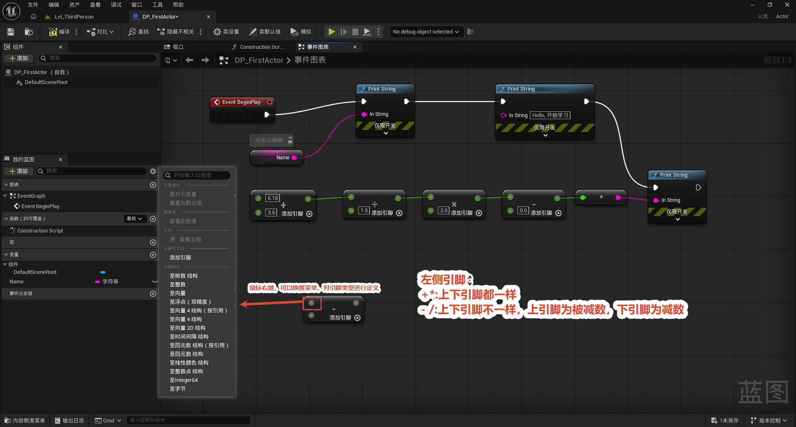
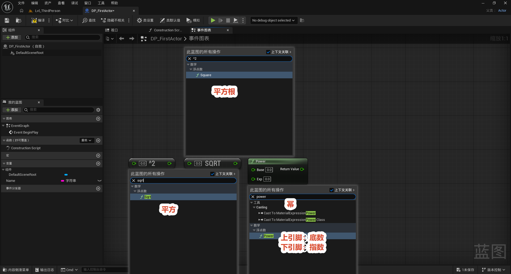
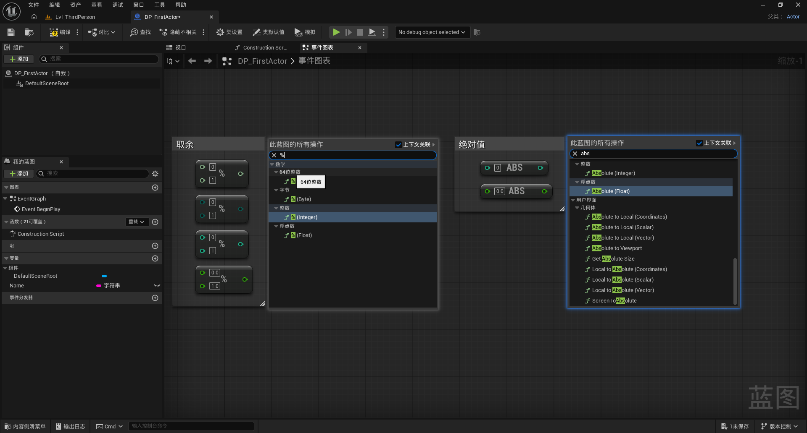
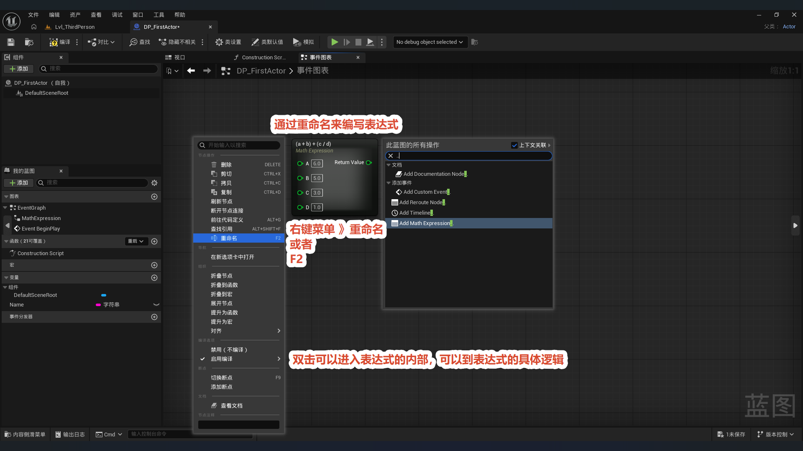
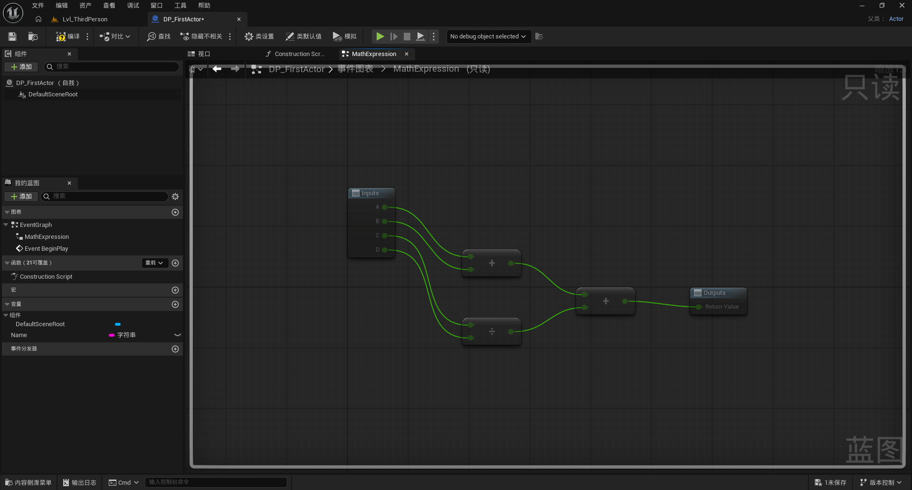
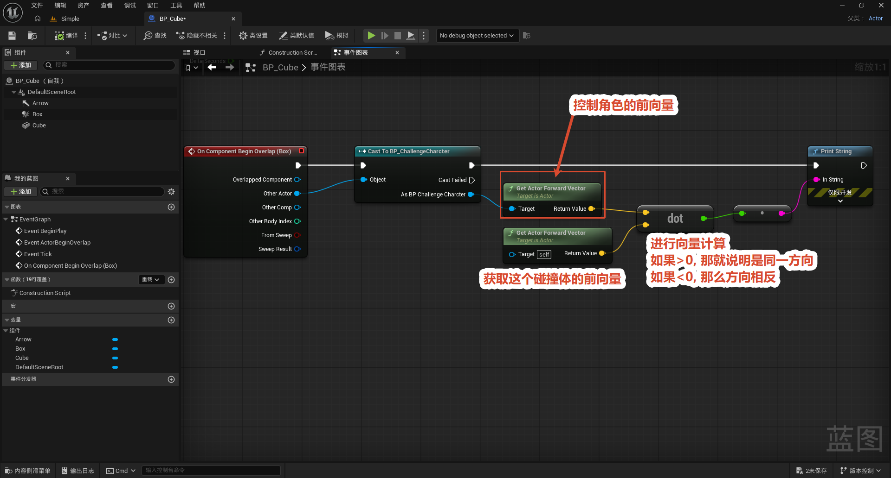

# 数学知识

本节整理 UE5 蓝图中常用的**数学节点**。做交互逻辑时几乎离不开计算：判断方向、控制数值范围、驱动动画曲线、做计时计数……这些都靠数学节点完成。蓝图把常见运算封装成一个个可视化节点，输入引脚（绿色）接数值、输出引脚返回结果，连线即运算。下面按「四则运算 → 乘方 → 取余与绝对值 → 表达式 → 向量点积」的顺序逐一说明，并在最后给出一个用点积判断碰撞方向的实际案例。

## 四则运算节点

蓝图里最基本的四个运算节点，对应数学里的加、减、乘、除：

- **`+`（加）**：把所有输入引脚相加。
- **`-`（减）**：用第一个引脚减去后面的引脚。
- **`×`（乘）**：把所有输入引脚相乘。
- **`÷`（除）**：用第一个引脚除以后面的引脚。

这四个节点都是绿色的浮点引脚，底部都有一个 **「添加引脚（Add Pin）」**，点击就能继续增加输入，把一连串数值串成一次运算，而不必堆叠好几个节点。

**关键区别 —— 交换律：**

- **加法和乘法满足交换律**：`A + B = B + A`、`A × B = B × A`，所以两个输入引脚**不分先后**，地位完全相同，谁接 A、谁接 B 结果都一样。
- **减法和除法不满足交换律**：`A - B ≠ B - A`、`A ÷ B ≠ B ÷ A`，所以输入引脚**有先后之分**——上面的引脚是「被减数 / 被除数」，下面的引脚是「减数 / 除数」，接反了结果就错了。

**典型用法：** 把多个数值串起来做综合计算。例如图中先用 `+` 把两个数相加，再把结果依次送进 `÷`、`×`、`-` 做后续运算，最终结果接到 Print String 打印出来调试。

## 乘方运算

当需要算平方、开方、任意次幂时，用下面三个节点：

- **平方根（Square Root / SQRT）**：对输入开平方，即 √x。例如 √9 = 3。只有一个输入引脚。
- **平方（Square）**：对输入求平方，即 x²。例如 3² = 9。只有一个输入引脚。
- **幂 / 乘方（Power）**：求任意次幂，即 base^exp。有 **Base（底数）** 和 **Exp（指数）** 两个输入引脚。例如 2³ = 8。

**三者的关系：** 平方（Square）其实是 Power 指数固定为 2 的特例；平方根（Square Root）则是平方的逆运算，等价于指数取 0.5（即 x^0.5）。需要固定求平方 / 开方时用专用节点更直观，需要任意指数时用 Power。

## 取余与绝对值

两个常用的「整型化」运算：

- **取余（Modulo / `%`）**：返回两数相除的**余数**，即 `A % B`。例如 `7 % 3 = 1`（因为 7 = 2 × 3 + 1，余 1）。有 A、B 两个输入引脚。
- **绝对值（Absolute / `abs`）**：返回数值的绝对值 `|x|`，即把负数变成正数、正数不变。例如 `|-5| = 5`、`|5| = 5`。只有一个输入引脚。

**典型用法：**
- 取余常用来做**周期性 / 循环计数**：比如「每触发 5 次做一件事」，就让计数器对 5 取余，结果为 0 时执行；也常用于把连续坐标网格化、判断奇偶。
- 绝对值常用来**求距离、忽略方向比较大小**：两点坐标相减后取绝对值就是距离，无论谁减谁结果都为正。

## 表达式（Math Expression）节点

当一串运算比较复杂时，连一堆 `+`、`-`、`×`、`÷` 节点会让图面很乱。**数学表达式（Math Expression）节点**可以把一整条公式写进一个节点里，相当于一个小型「计算器」。

- **创建方法：** 在蓝图空白处右键，直接输入一条公式即可生成节点（或搜索 "Math Expression"）。例如输入 `(a + b) + (c / d)`。
- **自动生成引脚：** 节点会扫描公式里出现的**变量名**，自动为每个变量生成一个输入引脚。上面这条公式里有 a、b、c、d 四个变量，于是节点左侧就出现 A、B、C、D 四个输入引脚，右侧输出一个 Return Value。
- **使用方式：** 把具体数值或变量连到对应引脚上，节点会按公式整体求值并输出结果。

### 表达式节点内部

**双击**表达式节点，会打开它的**内部图**（只读）。可以看到 UE 其实把你写的公式自动拆解成了一组基础运算节点：例如 `(A + B) + (C / D)` 被拆成了一个算 `A + B` 的加法节点、一个算 `C / D` 的除法节点，再用一个加法节点把两段结果合起来。

也就是说，表达式节点本质上是**一组基础运算节点的打包封装**——对外只暴露输入变量和最终结果，对内自动展开成等价的节点图。它的好处是图面简洁、公式一目了然，适合写较复杂的复合公式。

## 向量点积：判断与碰撞物体的方向

这是数学节点最经典的实战用法之一：**用点积（Dot Product）判断两个朝向是同向还是反向**。

**点积的数学含义：** 两个向量 A、B 的点积为 `A · B = |A| × |B| × cos(θ)`，其中 θ 是它们的夹角。由于 `Get Actor Forward Vector` 取出的前向量都是**单位向量**（长度为 1），所以点积的结果就等于 `cos(θ)`，直接反映两向量夹角的大小关系。

根据点积结果的正负即可判断方向：

- **结果 > 0**：夹角小于 90°，两朝向**方向相近 / 同向**。
- **结果 = 0**：夹角等于 90°，两朝向**垂直**。
- **结果 < 0**：夹角大于 90°，两朝向**方向相反**。

**图中的实现流程：**

1. 用一个**碰撞 / 重叠事件**（如 On Component Begin Overlap）触发，拿到与之发生碰撞的 Other Actor。
2. 用 **Cast To 角色**（如 BP_ChallengeCharacter）把 Other Actor 转成具体类型，方便取它的前向量。
3. **Get Actor Forward Vector** 分别取出**角色的前向量**（接点积的 A）和**这个碰撞体自身的前向量**（接点积的 B）。
4. 接入 **Dot Product（点积）** 节点，输出一个浮点值，接到 Print String 打印出来观察。

正如图中注释所写：**「进行向量计算，如果 > 0，那就说明是同一方向；如果 < 0，那么方向相反。」** 这套判断在机关设计中非常实用——例如只让角色从正面（或背面）触发某个机关、根据相对朝向播放不同的动画或音效。
