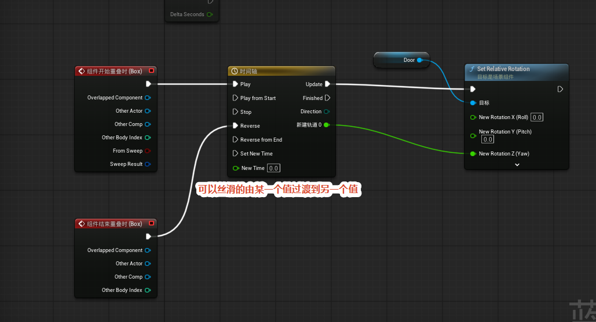
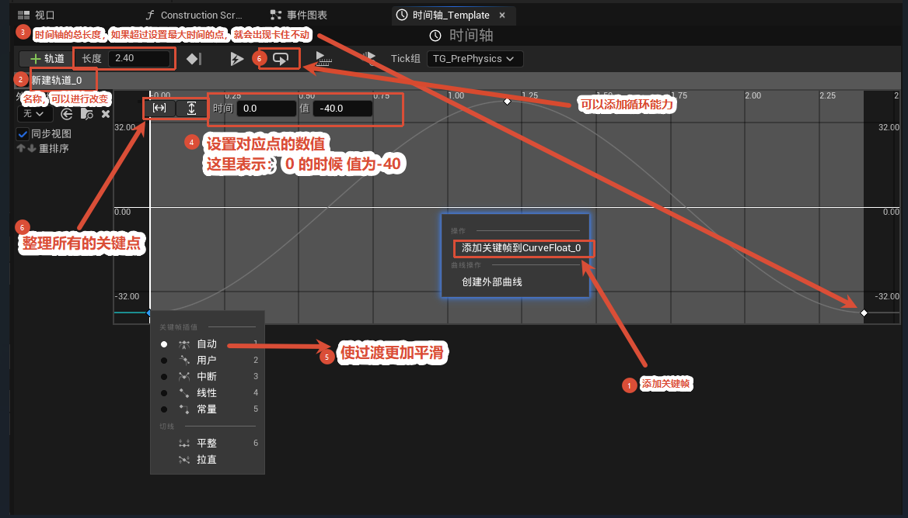
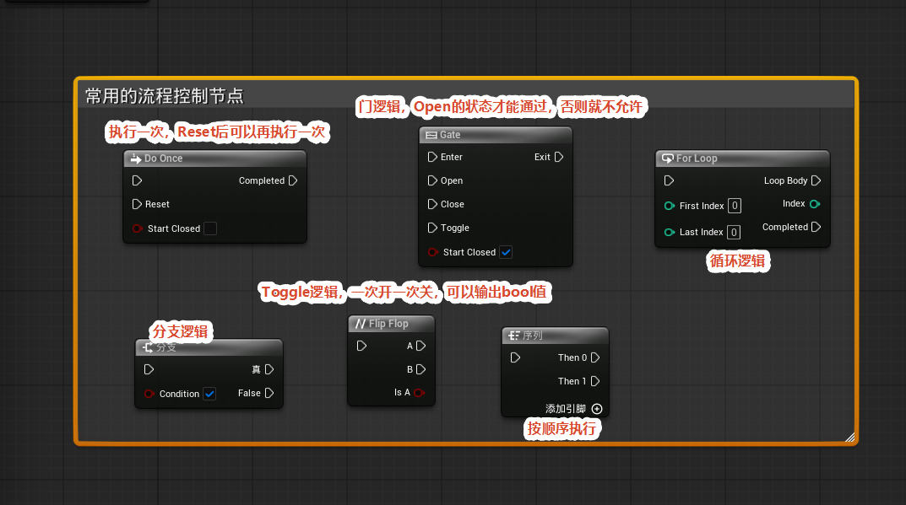

# 特殊节点

本节介绍 UE5 蓝图中两类常用的"特殊节点"：**时间轴（Timeline）节点**与**流程控制（Flow Control）节点**。时间轴节点用于在一段时间内把数值平滑地从一个值过渡到另一个值，常配合碰撞事件驱动门、机关等动画；流程控制节点则用来组织执行流的顺序、循环、分支和开关。掌握这两类节点是搭建交互逻辑的基础。

## 时间轴节点

时间轴（Timeline）节点在蓝图里显示为一个黄色节点，左侧为输入引脚，右侧为输出引脚。它的作用是在设定的时长内，把一个数值丝滑地从一个值过渡到另一个值，因此非常适合做开门/关门、平台升降这一类需要平滑过渡的动画。

**输入引脚：**

- Play（播放）：从当前位置正向播放。
- Play from Start（从开始播放）：从时间轴起点开始正向播放。
- Stop（停止）：停止播放。
- Reverse（反向）：从当前位置反向播放。
- Reverse from End（从结束反向）：从时间轴结尾开始反向播放。
- Set New Time（设置新时间）：配合 New Time 引脚把播放头跳到指定时刻。

**输出引脚：**

- Update（更新）：播放过程中每一帧持续触发，通常在这里读取当前插值并驱动目标。
- Finished（完成）：播放到结尾时触发一次。
- Direction（方向）：输出当前是正向还是反向的枚举值。

**典型用法：** 用「组件开始重叠时」事件连到 Play 触发播放，让门平滑打开；用「组件结束重叠时」事件连到 Reverse 反向播放，让门平滑关闭。Update 输出的值接到 Set Relative Rotation（设置相对旋转）这类节点上，就能驱动 Actor 的旋转，实现触发后平滑开启/关闭的效果。

## 时间轴设置

双击时间轴节点会打开**时间轴编辑器**面板，在这里设定轨道、关键帧和播放参数。

- **长度（Length）**：时间轴的总时长，单位为秒。例如设为 1.00 表示动画持续 1 秒。
- **Tick 组**：控制时间轴更新所属的 Tick 组，影响它与其他逻辑的执行先后顺序。
- **轨道（Track）**：每条轨道对应一个输出值（浮点轨道、颜色轨道等）。可以添加多条轨道，分别驱动不同属性，例如一条驱动门的旋转、一条驱动灯的亮度。
- **关键帧（Key）**：在时间画布上**右键**即可在该时刻新建关键帧（时间点），关键帧之间会自动插值形成平滑曲线，菱形图标代表关键帧。
- **顶部控制栏**：提供播放、暂停、停止、循环等按钮，以及一根可拖动的时间游标（白色竖线），拖动它可以实时预览某一时刻的插值结果，方便调试曲线形状。

## 流程控制节点

流程控制节点用来组织执行流的顺序、循环、分支和开关，是搭逻辑时最常用的一组节点。

- **Do Once（执行一次）**：整个运行期间只执行一次，之后再次触发会被忽略。带有 Reset 引脚，调用后可以重置，使其能够再执行一次。可勾选 "Start Closed（开始关闭）" 决定初始状态。

- **Gate（门）**：相当于一道可控的闸门。只有在 Open 状态下输入信号才能从 Exit 通过；Close 之后输入会被挡住。提供 Open、Close、Toggle 等控制引脚，同样可勾选 "Start Closed"。

- **For Loop（循环）**：通过 First Index / Last Index 设定循环范围，每轮触发一次 Loop Body 引脚并输出当前的 Index，全部循环结束后从 Completed 引脚继续往下执行。

- **Branch（分支）**：根据 Condition（布尔值）的真假分流——为真走 True，为假走 False，相当于代码里的 if。

- **Flip Flop（切换）**：每次触发在 A、B 两个输出之间交替，并输出一个 bool 值表示当前是否为 A。常用于开关类逻辑，比如灯的开/关来回切换。

- **Sequence（序列）**：按顺序依次触发 Then 0、Then 1 等输出引脚，可通过 "添加引脚" 增加更多顺序分支。注意它是在同一帧内依次调用，并不是延时执行。
